[TOC]

# 1.环境依赖

1. 准备Java 8环境 参考资料：https://blog.csdn.net/star0311/article/details/52102526 需要保证命令行执行java -version能显示出java当前版本号（1.8.0以上）
2. 生成Android签名，需要下载安装Android Studio https://developer.android.google.cn/studio
3. 从腾讯交付对接的同学处，获取**未签名**的安装包apk（注：一定要使用未签名的版本，如果使用已签名的版本做重签名，重签名操作可能会被手机厂商检测到而导致安装失败）

# 2.准备Android 签名

1. 打开Android Studio，在菜单栏中选中Build->Generate Signed Bundle/Apk

   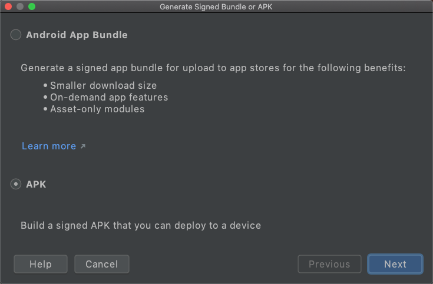

2. 选中Apk选项，点击Next

   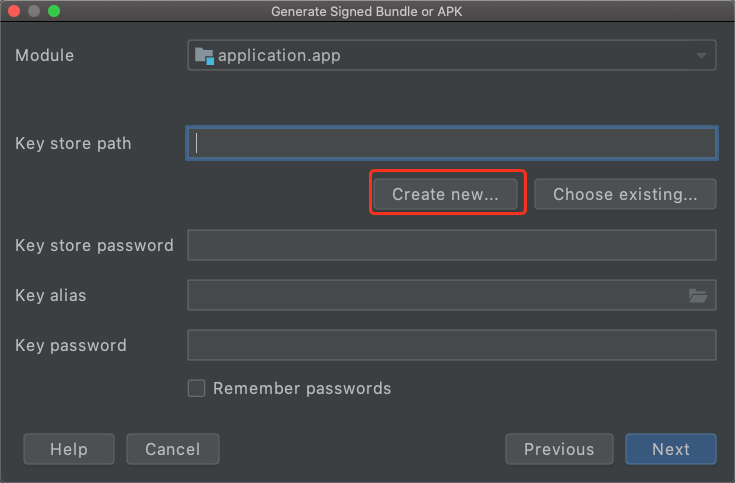

3. 选择Create new，生成新的签名

   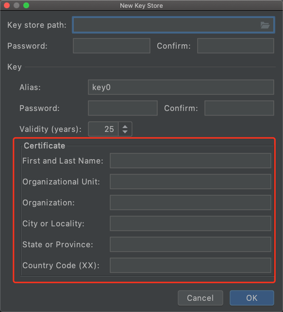

从上往下介绍：

Key store path:签名保存的路径

Password Confirm:签名的密码

Alias:签名的别名

Password Confirm:别名的密码

红色的Certificate为公司信息，选择其中一项或多项填写即可

例如，我们生成一个测试签名

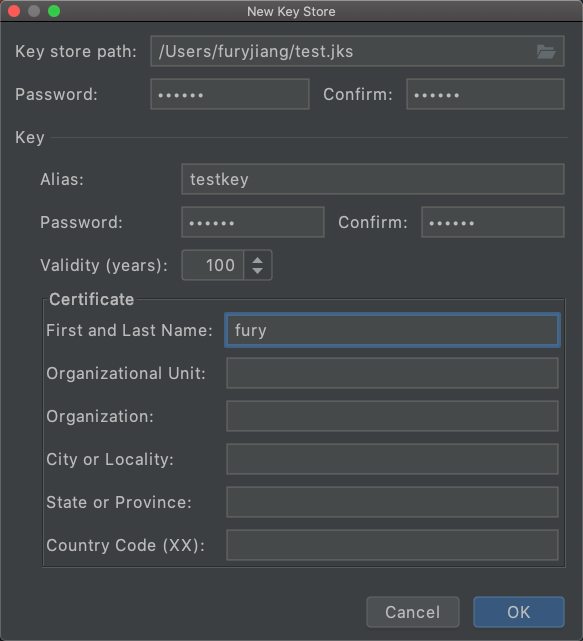

4. 点击OK，完成签名生成，可以忽略类似提示，也可以根据提示使用keytool命令迁移到PKCS12格式

   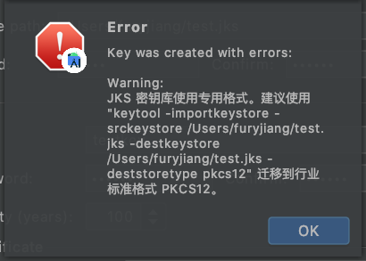

   在/Users/furyjiang目录下，看到了我们刚刚生成的签名文件test.jks，则签名生成已经成功

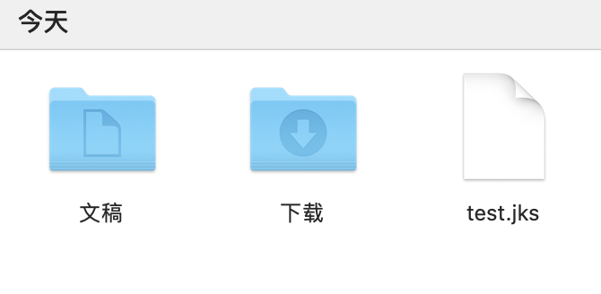

# 3.获取签名脚本

检查签名脚本，如果你使用的是Windows系统，签名脚本应包含

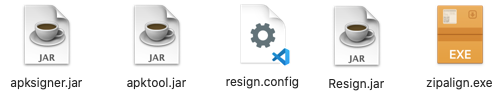

如果使用的是Mac系统，签名脚本应包含

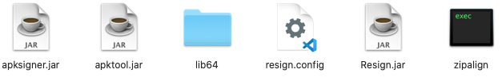

# 4.使用签名脚本

我们使用Mac系统演示，Windows系统的使用方式完全一样

1. 拷贝签名文件，和待重签名的apk文件到脚本同级目录

   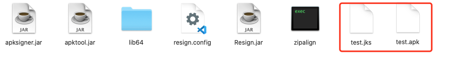

2. 编辑resign.config文件，填写签名文件的密码、别名、别名密码等信息

   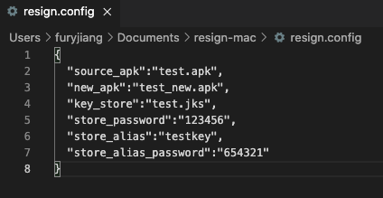

说明：

- source_apk: 待签名的apk文件名
- new_apk: 签名后，新生成的apk文件名
- key_store:你的签名文件名
- store_password:签名密码
- store_alias:签名别名
- store_alias_password:签名别名密码

填写完毕后，保存resign.config文件

打开命令行，cd到签名脚本同级目录，执行 java -jar Resign.jar 等待程序执行完成

注意，如果您使用的是Windows命令行，出现了程序执行卡在某个步骤，请参考这里解决：https://blog.csdn.net/qq_34254642/article/details/104641591

最终会提示ALL SUCCESS!

我们的文件夹内，会多出一个重签名之后的新安装包test_new.apk

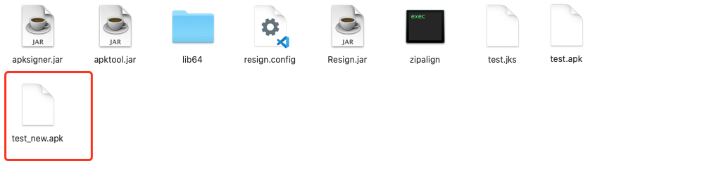

至此，签名就顺利完成了	