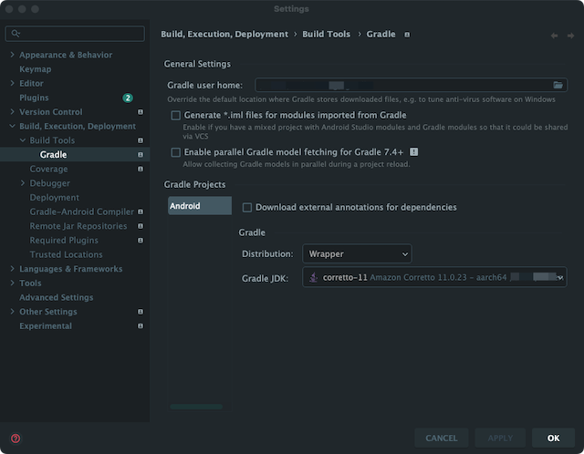
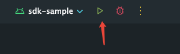
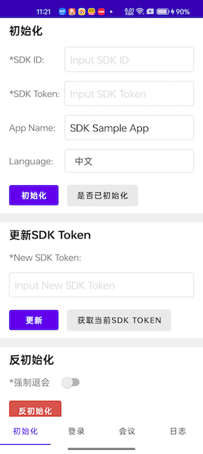

# 环境要求
- Android Studio版本不低于`Flamingo | 2022.2.1`
- Java version不低于8，不高于15


# 运行步骤
  1. 解压SDK包后基本目录结构如下所示，使用Android Studio打开解压后的`SDKSample/Android`目录
```
  .
  ├── SDK
  │   └── repo
  └── SDKSample
      └── Android
```
  2. 点击`Android Studio` -> `Settings` -> `Build, Execution, Deployment` -> `Build Tools` -> `Gradle`，修改`Gradle JDK`，使用环境准备中符合条件的JDK

      

  3. 点击`Run 'sdk-sample'`

      

  4. 运行结果如图

      


# SDK Sample工程结构说明
```
.
├── build.gradle             // 项目级构建脚本
├── gradle
│   └── wrapper
├── gradle.properties
├── gradlew
├── gradlew.bat
├── local.properties
├── sdk-sample               // 存放sdk-sample应用代码和资源的主模块。
│   ├── build.gradle         // 模块级构建脚本
│   ├── proguard-rules.pro   // 混淆规则文件
│   └── src                  // 源码和资源文件目录
└── settings.gradle          // 定义项目包含哪些模块
```