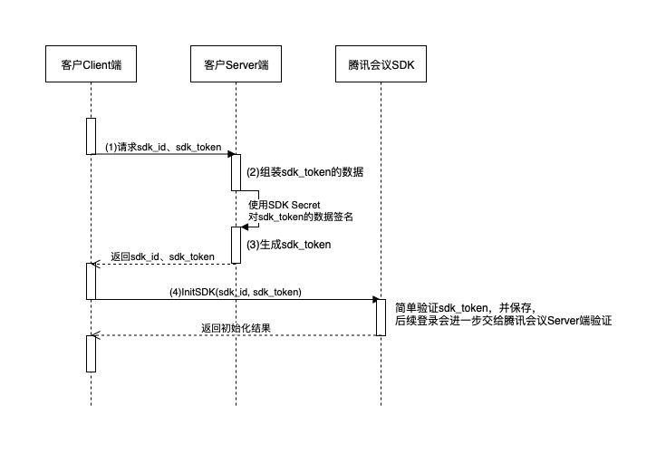

# 1. SDK 整体的基本时序步骤
1. 获取SDK实例（各端代码方式略有不同）

2. SDK初始化
    
    
    
    1. 接入方客户端从接入方服务端或者本地自己的缓存获取初始化的相关参数。
    2. 调用`TMSDK.initialize`进行SDK初始化，并在参数中设置回调代理`SDKCallback`
    3. 响应SDK初始化回调`SDKCallback.onSDKInitializeResult`，**回调结果成功才表示初始化完成**
    
3. 登录
    1. 获取`AccountService`实例
    2. 设置回调代理`setAuthenticationCallback`
    3. 调用`AccountService.login`进行登录
    4. 响应登录回调`AuthenticationCallback.onLogin`，**回调结果成功表示登录成功**
    
4. 入会
    1. 获取`PreMeetingService`实例
    2. 设置回调代理`setPreMeetingCallback`
    3. 调用`PreMeetingService.joinMeeting`进行入会
    4. 响应入会回调`PreMeetingCallback.onJoinMeeting`，回调结果成功表示入会成功

# 2. 初始化相关说明

## 2.1 初始化参数如何获取

* SaaS SDK的情况下，初始化函数中`sdk_id`和`sdk_token`这两个参数，是接入方的客户端从接入方的服务端获取的。
* `sdk_token`是用来验证SDK的使用者所属的机构的凭证，因此跟使用的用户账号无关，所以，在确保安全的前提下，可以在客户端自己账号登录之前去向服务端获取。
* `sdk_token`不包含用户的账户信息，因此客户端切换账户时，可以不用更新`sdk_token`。
* `sdk_token`的有效期内，在客户端运行的生命周期里，只用服务端获取一次`sdk_token`，甚至可以缓存到本地，下次启动时直接读取，减少从服务端请求。
* `sdk_token`有效期失效后，SDK会退出账号的登录态，并通过`onResetSDKState`回调（code:-1019）通知接入方重新获取并更新`sdk_token`。
* 私有化SDK的情况下，初始化函数中参数`server_host`和`org_domain`只能选一个，两个都填写的话，后者覆盖前者。这个参数也建议从接入方的服务端获取。

## 2.2 初始化时机
* 因为初始化会议SDK会需要一段时间，原则上，初始化时机越早越好
* 尽量在程序一启动的时候就初始化SDK。如果能在登录接入方自己账号系统之前初始化更好。
* 如果初始化没有完成回调，后续登录等操作会被阻塞。

## 2.3 注意事项
* `sdk_token`应由Server端来生成，Client端`不可以`持有SDK Secret来生成Token，否则`存在安全风险`

* `sdk_token`有效期为使用SDK的有效周期，过期后，即使已经登录了，SDK也将无法使用，并会踢出登录，SDK也提供了相应接口更新`sdk_token`。

* `sdk_token`过期时间可以设置的尽量长一些，远大于客户端平时运行的时长，避免用户在使用的过程中因过期而自动退出登录状态。

* 接入时，请务必响应`sdk_token`过期的`onResetSDKState`回调，并在收到回调后重新获取新的`sdk_token`，通过调用`refreshSDKToken`函数更新`sdk_token`值。

# 3. 登录相关说明

## 3.1 登录参数如何获取

* 包含`id_token`的`sso_url`参数，是接入方的客户端从接入方的服务端获取的。
* 因为`id_token`跟登录的账号有关，所以要在接入方客户端自己账号登录之后向服务端获取。切换账号后，也要重新获取新账号的`sso_url`

## 3.2 登录时机

* 启动后调用登录需要满足两个条件：
   1. SDK初始化成功，并收到初始化成功的回调之后
   2. 接入方客户端的用户账号已完成登录，并拉取到对应的登录参数
* 需要登录的三种情况：
   1. 启动后的第一次登录：需要初始化完成后调用，如果上次运行App时已经登录过相同账号，这次登录会走快速登录逻辑，时间更短。
   2. 切换账号时：需要先调用登出的接口，然后再调用登录接口，此时不会走快速登录逻辑。
   2. SDK Token失效且在已登录状态中：此时登录状态会被踢出，需要调用`refreshSDKToken`更新SDK Token后，重新调用登录。

## 3.3 注意事项
- `id_token`应由Server端来生成，Client端`不可以`持有ID Secret来生成Token，否则`存在安全风险`**
- `id_token`有效期仅在登录时验证用到，如果过期，将不能进行登录操作。但登录以后不受影响。
- 在收到`onLogin`回调前，调用`logout`函数会取消登录过程。
- 调用`logout`后，请不要在收到`onLogout`回调之前，调用`login`函数。
- 已登录某个账号，再次调用`login`重复登录相同账号，回调会是登录成功，而再次登录不同账号，则会回调提示账号登录冲突
- 如果要切换账户，必须先调`logout`，然后在`onLogout`的回调后再调用`login`。不切换账户的情况，不用调`logout`。
- 未登录时调用`logout`，会回调success。
- 平时退出App不用调用`logout`，这样下次启动程序后调用`login`针对相同账户可以快速登录。 
- 在同类设备登录相同账号，会将本设备的账号踢出

# 4. 入会相关

## 4.1 入会时机

* 必须同时满足以下三个条件：
  1. 已初始化（收到初始化成功的回调之后）
  2. 已登录完成（收到登录成功的回调之后）
  3. 当前不在会议中

* 入会的途径有两种：
  1. 接入方根据自己业务的要求，调用`joinMeeting`接口进行入会
  2. 用户在SDK内的界面上操作界面进行入会
* 以上两种方式入会，接入方都会收到SDK的`onJoinMeeting`回调通知。

## 4.2 注意事项

* 同账号在其他设备上入会，会将当前会议踢出。
* 接入方程序退出之前，如果正在会议中，记得要调用退出会议接口进行离会。

