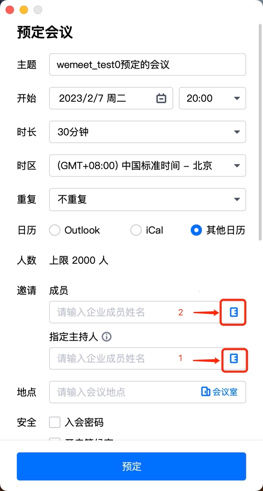
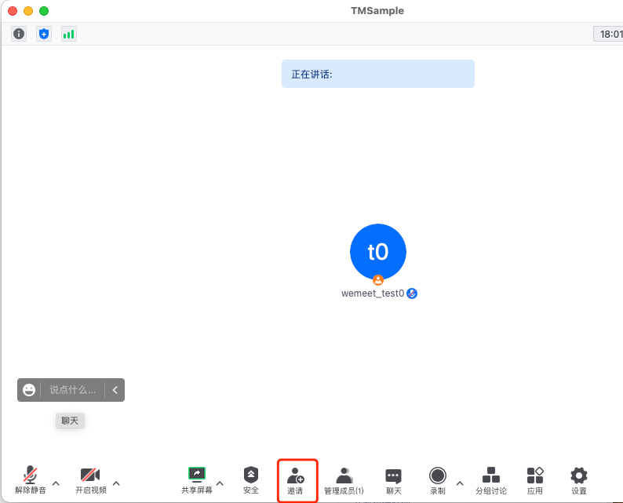
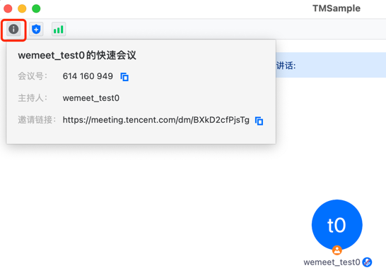
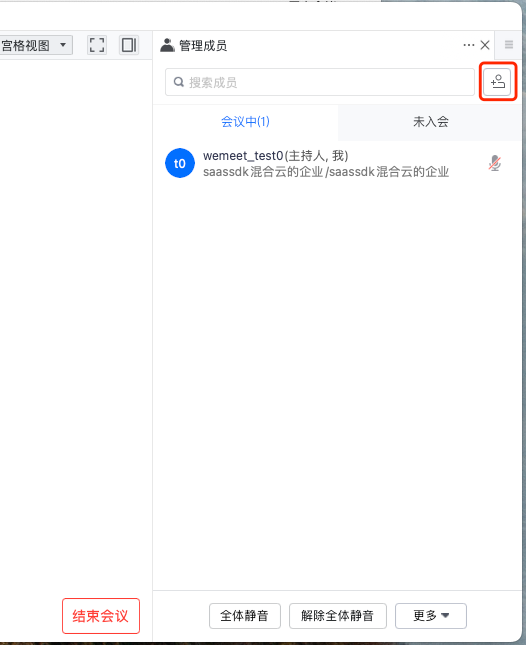
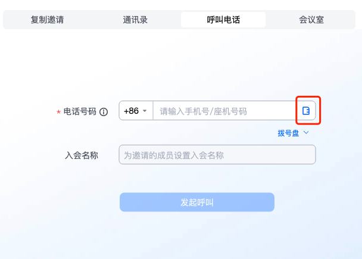
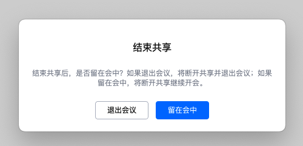

- [文档修订记录](#文档修订记录)
- [1. SDK使用说明](#1-sdk使用说明)
  * [1.1 获取SDK实例方法](#11-获取sdk实例方法)
  * [1.2 获取Service方法](#12-获取service方法)
  * [1.3 SDK基本调用快速入门](#13-sdk基本调用快速入门)
- [2. TMSDK 说明](#2-tmsdk-说明)
  * [2.1 TMSDK 成员函数](#21-tmsdk-成员函数)
    + [getSDKVersion](#getsdkversion)
    + [setCallback](#setcallback)
    + [initialize](#initialize)
    + [uninitialize](#uninitialize)
    + [isInitialized](#isinitialized)
    + [refreshSDKToken](#refreshsdktoken)
    + [getCurrentSDKToken](#getcurrentsdktoken)
    + [showLogs](#showlogs)
    + [collectLogFiles](#collectlogfiles)
    + [activeUploadLogs](#activeuploadlogs)
    + [setProxyInfo](#setproxyinfo)
    + [getProxyInfo](#getproxyinfo)
    + [handleSchema](#handleschema)
    + [addUsersWithParam](#adduserswithparam)
    + [parseMeetingInfoUrl](#parsemeetinginfourl)
    + [getAccountService](#getaccountservice)
    + [getPreMeetingService](#getpremeetingservice)
    + [getInMeetingService](#getinmeetingservice)
  * [2.2 SDKCallback 回调代理](#22-sdkcallback-回调代理)
    + [onSDKInitializeResult](#onsdkinitializeresult)
    + [onSDKUninitializeResult](#onsdkuninitializeresult)
    + [onSDKError](#onsdkerror)
    + [onResetSDKState](#onresetsdkstate)
    + [onShowLogsResult](#onshowlogsresult)
    + [onActiveUploadLogsResult](#onactiveuploadlogsresult)
    + [onSetProxyResult](#onsetproxyresult)
    + [onHandleSchemaResult](#onhandleschemaresult)
    + [onAddUsersResult](#onaddusersresult)
    + [onParseMeetingInfoUrl](#onparsemeetinginfourl)
- [3. AccountService 说明](#3-accountservice-说明)
  * [3.1 AccountService 成员函数](#31-accountservice-成员函数)
    + [setCallback](#setcallback-1)
    + [login](#login)
    + [loginByJSON](#loginbyjson)
    + [logout](#logout)
    + [isLoggedIn](#isloggedin)
    + [jumpUrlWithLoginStatus](#jumpurlwithloginstatus)
    + [getUrlWithLoginStatus](#geturlwithloginstatus)
  * [3.2 AuthenticationCallback 回调代理](#32-authenticationcallback-回调代理)
    + [onLogin](#onlogin)
    + [onLogout](#onlogout)
    + [onJumpUrlWithLoginStatus](#onjumpurlwithloginstatus)
- [4. PreMeetingService 说明](#4-premeetingservice-说明)
  * [4.1 PreMeetingService 成员函数](#41-premeetingservice-成员函数)
    + [setCallback](#setcallback-2)
    + [joinMeeting](#joinmeeting)
    + [joinMeetingByJSON](#joinmeetingbyjson)
    + [quickMeeting](#quickmeeting)
    + [quickMeetingByJSON](#quickmeetingbyjson)
    + [showPreMeetingView](#showpremeetingview)
    + [showHistoricalMeetingView](#showhistoricalmeetingview)
    + [showMeetingDetailView](#showmeetingdetailview)
    + [showJoinMeetingView](#showjoinmeetingview)
    + [showScheduleMeetingView](#showschedulemeetingview)
    + [showUploadLogsView](#showuploadlogsview)
    + [showMeetingSettingView](#showmeetingsettingview)
    + [showScreenCastView](#showscreencastview)
    + [decodeUltrasoundScreenCastCode](#decodeultrasoundscreencastcode)
    + [startScreenCast](#startscreencast)
    + [queryMeetingInfo](#querymeetinginfo)
    + [queryLocalRecordInfo](#querylocalrecordinfo)
    + [transcode](#transcode)
    + [showRecordFolder](#showrecordfolder)
    + [enableAddressBookCallback](#enableaddressbookcallback)
    + [enableRingInvitationView](#enableringinvitationview)
    + [handleRingInvitation](#handleringinvitation)
    + [openQRCodeUrl](#openqrcodeurl)
    + [discoverNearScreenCastCode](#discoverNearScreenCastCode)
  * [4.2 PreMeetingCallback 回调代理](#42-premeetingcallback-回调代理)
    + [onJoinMeeting](#onjoinmeeting)
    + [onActionResult](#onactionresult)
    + [onShowAddressBook](#onshowaddressbook)
    + [onRingInvitationEvent](#onringinvitationevent)
    + [onOpenQRCodeUrlResult](#onopenqrcodeurlresult)
- [5. InMeetingService 说明](#5-inmeetingservice-说明)
  * [5.1 InMeetingService 成员函数](#51-inmeetingservice-成员函数)
    + [setCallback](#setcallback-3)
    + [leaveMeeting](#leavemeeting)
    + [enableInviteCallback](#enableinvitecallback)
    + [enableMeetingInfoCallback](#enablemeetinginfocallback)
    + [enableInviteUsersCallback](#enableinviteuserscallback)
    + [bringInMeetingViewTop](#bringinmeetingviewtop)
    + [switchPIPModel](#switchpipmodel)
    + [getCurrentMeetingInfo](#getcurrentmeetinginfo)
    + [enableCustomOrgInfo](#enablecustomorginfo)
    + [setCustomOrgInfo](#setcustomorginfo)
    + [manipulateWindow](#manipulatewindow)
    + [switchCaption](#switchcaption)
    + [updateCaptionSettings](#updatecaptionsettings)
    + [getScreenShareInfo](#getscreenshareinfo)
    + [getMeetingWindowInfo](#getmeetingwindowinfo)
    + [setLeaveCastRoomActionType](#setLeaveCastRoomActionType)
    + [switchLayout](#switchLayout)
    + [subscribeInMeetingActionEvent](#subscribeInMeetingActionEvent)
    + [configPipButtonAction](#configpipbuttonaction)
    + [showScreenShareView](#showscreenshareview)
  * [5.2 InMeetingCallback 回调代理](#52-inmeetingcallback-回调代理)
    + [onLeaveMeeting](#onleavemeeting)
    + [onInviteMeeting](#oninvitemeeting)
    + [onShowMeetingInfo](#onshowmeetinginfo)
    + [onInviteUsers](#oninviteusers)
    + [onSwitchPiPResult](#onswitchpipresult)
    + [onPipModeChanged](#onpipmodechanged)
    + [onQueryCustomOrgInfo](#onquerycustomorginfo)
    + [onActionResult](#onactionresult-1)
    + [onCaptionSwitchChanged](#oncaptionswitchchanged)
    + [onCaptionSettingChanged](#oncaptionsettingchanged)
    + [onAudioStatusChanged](#onAudioStatusChanged)
    + [onVideoStatusChanged](#onVideoStatusChanged)
    + [onAudioOutputDeviceChanged](#onAudioOutputDeviceChanged)
    + [onShowScreenShareView](#onshowscreenshareview)

- [6. 错误码](#6-错误码)


# 文档修订记录
| 日期         | SDK版本    | 修改内容                                                                                                                                  |
|------------|----------|---------------------------------------------------------------------------------------------------------------------------------------|
| 2021-7-18  | 2.18.0   | 第一版初稿                                                                                                                                 |
| 2021-8-6   | 2.18.0   | 对错误码做了统一描述                                                                                                                            |
| 2021-8-18  | 2.18.0   | 新增接口：设置会议信息和邀请信息回调接口                                                                                                                  |
| 2021-8-26  | 2.18.0   | 接口调整：登录时如果账号已登录是否强制让对方下线                                                                                                              |
| 2021-8-30  | 2.18.0   | 接口调整：入会和离会回调接口增加meeting_code字段                                                                                                        |
| 2021-10-9  | 2.18.1   | 新增接口：获取登录态URL、显示历史会议列表、显示历史会议详情页                                                                                                      |
| 2021-10-20 | 2.18.2   | 新增接口：显示加入会议界面、显示预定会议界面、显示会议设置界面、相关回调                                                                                                  |
| 2022-02-23 | 3.0.102  | 新增接口：新增会中窗口置顶(BringInMeetingViewTop)接口                                                                                                |
| 2022-03-03 | 3.0.102  | 修改登出接口说明                                                                                                                              |
| 2022-04-08 | 3.0.102  | 新增关于登录登出最佳实践和注意事项的说明                                                                                                                  |
| 2022-05-12 | 3.0.106  | 新增接口：新增入会(joinMeetingByJSON)接口                                                                                                        |
| 2022-05-13 | 3.0.106  | 新增接口：桌面端新增设置代理(setProxyInfo)接口                                                                                                        |
| 2022-08-02 | 3.6.100  | 新增接口：新增处理Schema(handleSchema)接口，更新showPreMeetingView函数，新增可选参数                                                                         |
| 2022-08-30 | 3.6.200  | 新增接口：新增处理最小化悬浮窗(switchPipModel)接口、支持初始化设置英文、更新新版的打开会议详情页接口(showMeetingDetailView)、新增查询会议信息接口(QueryMeetingInfo)、新增快速会议接口(QuickMeeting) |
| 2022-09-26 | 3.6.203  | 新增接口：quickMeetingByJSON；quickMeeting和JoinMeeting接口添加meeting_window_title参数                                                            |
| 2022-11-18 | 3.6.300  | 新增接口：新增获取当前会议状态信息(getCurrentMeetingInfo)接口，移动端新增设置代理(setProxyInfo)接口                                                                  |
| 2023-02-06 | 3.6.401  | 新增接口：新增添加选人相关接口，以及组织架构相关接口                                                                                                            |
| 2023-02-22 | 3.12.100 | 新增接口：新增反初始化(uninitialize)接口**beta版本**，本地录制相关接口，解析入会短链接接口，收集日志文件的接口                                                                    |
| 2023-02-24 | 3.6.401  | 新增回调：新增会中通用动作和接口回调onActionResult函数                                                                                                    |
| 2023-04-10 | 3.12.100 | 修改会中通用动作和接口回调onActionResult函数，返回值msg统一为JSON串                                                                                          |
| 2023-05-19 | 3.12.100 | 由于反初始化(uninitialize)接口在macOS和iOS平台上功能表现不稳定，暂不支持在macOS和iOS平台上接入反初始化接口                                                                  |
| 2023-06-10 | 3.12.201 | 添加投屏接口                                                                                                                                |
| 2023-07-31 | 3.12.300 | 添加字幕接口，查询代理接口，查询屏幕共享接口，查询会中窗口信息接口                                                                                                     |
| 2023-07-31 | 3.12.300 | 添加隐私授权未授权错误码                                                                                                                          |
| 2023-09-01 | 3.12.400 | 添加自定义响铃邀请相关接口：EnableRingInvitationView，OnRingInvitationEvent，HandleRingInvitation                                                     |
| 2023-10-23 | 3.12.402 | 接口调整：decodeUltrasoundScreenCastCode接口支持返回rooms_name；startScreenCast接口支持设置user_display_name和meeting_window_title                       |
| 2023-11-14 | 3.12.403 | 新增接口：setLeaveCastRoomActionType可设置共享屏幕入会结束共享是否展示对话框                                                                                   |
| 2023-11-20 | 3.12.404 | 新增接口：switchLayout(切换布局），subscribeInMeetingActionEvent（订阅/退订会中事件）。bringInMeetingViewTop函数支持移动端                                         |
| 2023-12-12 | 3.21.100 | 新增接口：showUploadLogsView 显示上传日志页面；activeUploadLogs 主动上传日志接口；openQRCodeUrl接受扫码信息接口                                                      |
| 2023-12-12 | 3.21.100 | 接口调整：会中动作回调onActionResult()新增云录制状态变更事件类型; getCurrentMeetingInfo接口增加字段host_user_id，表示主持人的user_id                                       |
| 2023-12-12 | 3.21.100 | 新增接口：onAudioStatusChanged（麦克风状态回调）；onVideoStatusChanged（摄像头状态回调）；onAudioOutputDeviceChanged（音频输出设备变化回调，仅支持移动端）|
| 2024-02-01 | 3.21.200 | -1018 错误码从"登录网络错误" 改为 "通用网络错误"|
| 2023-02-01 | 3.21.200 | 接口调整：leaveMeeting 参数调整，废弃 end_meeting 参数，改为 leave_meeting_type 参数，支持多端离会|
| 2023-02-02 | 3.21.200 | 新增接口：新增设置SDK回调代理(TMSDK.setCallback)接口|
| 2023-05-07 | 3.21.303 | 新增错误码：[-1067]--安全验证失败，需要用户验证通过后才能登录 |
| 2024-05-08 | 3.24.100 | 新增接口：登录(loginByJSON)接口 |
| 2024-08-19 | 3.24.200 | Mac和iOS端支持反初始化（uninitialize）接口 |
| 2024-10-24 | 3.24.300 | 新增错误码：[-1070]--重复调用初始化(初始化已完成)；移动端新增接口：configPipButtonAction(设置关闭悬浮窗时的行为)；回调InMeetingCallback.onPipModeChanged的data字段新增参数back_to_meeting，新增接口：discoverNearScreenCastCode(获取近场投屏码） |
| 2024-10-28 | 3.24.300 | 新增接口：桌面端新增接口：showScreenShareView(打开屏幕共享窗口) |


# 1. SDK使用说明

<font color="red">**参考前必看:**</font>

1. 以下接口方法格式为`伪代码`，起示意作用，为了表示各端统一的接口形式。
2. 因为代码风格各端各不相同，具体接口命名风格可参考各端SDK接口代码定义和SDK包中的Demo代码工程样例源代码。
3. 必须在主线程调用SDK的各个函数
4. 对于废弃的函数，会在本文档中标注：【废弃】，并在程序中保持一年以上，之后会在合适时间从程序中移除废弃已久的函数，并在[废弃接口列表](./DeprecatedList.md)文档中记录。


## 1.1 获取SDK实例方法
``` 
tm_sdk = TMSDK.getInstance()
```

## 1.2 获取Service方法
```
account_service = tm_sdk.getAccountService()        //获取AccountService
pre_meeting_service = tm_sdk.getPreMeetingService() //获取PreMeetingService
in_meeting_service = tm_sdk.getInMeetingService()   //获取InMeetingService
```

## 1.3 SDK基本调用快速入门
1. 获取SDK实例
2. SDK初始化
    1. 调用`TMSDK.initialize`函数进行SDK初始化，并在参数中设置回调代理`SDKCallback`
    2. 响应SDK初始化回调`SDKCallback.onSDKInitializeResult`，**回调结果成功才表示初始化完成**
3. 登录
    1. 获取`AccountService`实例
    2. 调用`AccountService.setAuthenticationCallback`函数设置回调代理`AuthenticationCallback`
    3. 调用`AccountService.login`函数进行登录
    4. 响应登录回调`AuthenticationCallback.onLogin`，**回调结果成功表示登录成功**
4. 入会
    1. 获取`PreMeetingService`实例
    2. 调用`PreMeetingService.setPreMeetingCallback`函数设置回调代理`PreMeetingCallback`
    3. 调用`PreMeetingService.joinMeeting`函数进行入会
    4. 响应入会回调`PreMeetingCallback.onJoinMeeting`，**回调结果成功表示入会成功**
5. SDK反初始化(beta版本)
    1. 调用`TMSDK.uninitialize`函数可以完成SDK反初始化操作。**注意反初始化并非必须调用的，除非在当前进程生命周期中还需要重新初始化SDK**
    2. 响应SDK反初始化回调`SDKCallback.onSDKUninitializeResult`，**回调结果成功才表示反初始化完成**


# 2. TMSDK 说明

> 如无特殊说明，以下API默认为全平台（`Windows`/`macOS`/`Linux`/`Android`/`iOS`）可用。有平台限制的接口将会单独标注。

## 2.1 TMSDK 成员函数

### getSDKVersion
* 函数形式：**string getSDKVersion()**
* 函数说明：获取当前SDK版本号。
* 返回值说明：版本号信息
* 参数说明：无


### setCallback
* 函数形式：**void setCallback(SDKCallback callback)**
* 可用版本：>= 3.21.200
* 函数说明：设置回调代理`SDKCallback`，通过该接口设置的回调代理与通过initialize设置的回调代理相同，重复调用会覆盖原有回调代理的值。
* 注意：会议SDK在Android平台上为多进程架构，会议功能运行在独立进程上，当接入应用的主进程发生崩溃时，会议进程将保持存活，依然处于已初始化完成状态，主进程重启后无需要调用initialize方法初始化，此时需要调用setCallback设置回调，否则调用与该回调相关的接口（如showLogs）将收不到回调。
* 返回值说明：无
* 参数说明：

|参数名 |参数类型 |参数必填 |参数默认值 |参数说明 |
|---|---|---|---|---|
| callback   | **SDKCallback** | 是    | (无)   | SDK回调代理，接入方实现该代理，用来响应SDK回调，具体描述`见下文` |


### initialize
* 函数形式：**void initialize(InitParam init_param, SDKCallback callback)**
* 函数说明：
  * 初始化SDK并设置回调代理，通过`SDKCallback.onSDKInitializeResult`回调来返回初始化结果。
  * 初始化成功后，重复调用无效。
  * 除`getSDKVersion`之外，在调用的所有接口函数之前，`必须第一个先调用该函数`。
  * 按照个保法要求，App需要在用户同意了隐私协议之后才可以调用该初始化函数。
* 返回值说明：无
* 参数说明：

| 参数名        | 参数类型            | 参数必填 | 参数默认值 | 参数说明                                 |
|------------|-----------------|------|-------|--------------------------------------|
| init_param | **InitParam**   | 是    | (无)   | 初始化参数                                |
| callback   | **SDKCallback** | 是    | (无)   | SDK回调代理，接入方实现该代理，用来响应SDK回调，具体描述`见下文` |

**`InitParam`数据结构**

|产品 |属性 |类型 |必填 |默认值 |说明 |
|---|---|---|---|---|---|
|公有云SDK专用 |sdk_id |string |必填 |(无) |SDK ID |
|公有云SDK专用|sdk_token |string |必填 |(无) |SDK Token |
|私有化SDK专用 |server_host |string |必填，二选一 |(无) |私有化服务器地址，格式为：{protocol}://{domain}:{port}，protocol默认为http；port默认为29666; 如需配置两个域名，请用';'分隔 |
|私有化SDK专用|org_domain |string |必填，二选一 |(无) |组织机构域，如填写，SDK则会通过`org_domain`从公有云服务上获取私有化服务器地址，并覆盖`server_host`的值 |
|通用 |data_path |string |否 |`tmsdkapp.exe`同级目录 | 仅`Windows`/`Linux`支持:自定义SDK数据存储路径，里面包括日志目录。 |
|通用 |app_name |string |否 |网络会议 | 指定显示的品牌名称 |
|公有云SDK专用 |app_icon |string |否 |(无) |  用来指定窗口图标对应的文件绝对路径（仅windows端）|
|公有云SDK专用 |prefer_language |string |否 |zh-cn | 指定SDK的语言（仅支持zh-cn，en-us，如传入其它值则显示为zh-cn，3.6.200及以上版本可用） |
|通用 |proxy_info |string |否 |(无) | 用于初始化时设置网络代理，内容为json串，格式可参考setProxyInfo接口。如果使用了此参数，则必须拿到设置代理的回调后再调用登录接口（3.12.200以及以上版本可用） |


### uninitialize
* 函数形式：**void uninitialize(string param)**
* 可用版本与平台：
  * 版本 >= 3.12.100: `Windows` / `Android` / `Linux`
  * 版本 >= 3.24.200: `Mac` / `iOS`   
* 函数说明：
  * 反初始化函数用来停止SDK功能并释放SDK资源，让SDK回到初始化之前的状态。
  * 反初始化调用的结果，通过`SDKCallback.onSDKUninitializeResult`回调来获取。
  * 反初始化成功后，之前初始化函数传入的参数都会被清除，设置的回调代理都会无效。
  * 反初始化成功后，方可再次调用初始化函数，反初始化过程中调用初始化函数会回调初始化失败。
  * 如果正在会议中，将根据反初始化函数参数中force值决定是否强制反初始化：
    - 如果参数force==true：先强制退会再反初始化，并先回调`InMeetingCallback.onLeaveMeeting`
    - 如果参数force==false：不强制退会，则回调反初始化失败
  * 反初始化时SDK内部会自动调用logout，接入方如果已登录，在收到反初始化回调前，会收到`AuthenticationCallback.onLogout`的回调。

* 调用限制：
  * 只有在SDK初始化成功之后，才可以调用反初始化函数。
  * 如果在SDK初始化过程中，即初始化成功回调之前，调用反初始化函数，则反初始化会失败。
  * 对于Mac、iOS端，如果目前正在登录中、入会中和离会中这些中间状态，调用反初始化函数，则反初始化会失败
  * 如果没有初始化或者已经反初始化成功，再次调用反初始化函数将不做任何事情，也无任何回调响应。

* 返回值：无
* 参数说明：参数为`json`字符串，当前支持的配置有：

| Key | 类型 | 默认值 | 说明 |
| --- | --- | --- | --- |
| force | bool | false | 是否强制反初始化，如果在会议中是否强制离会。 |

* param示例：
```json5
{
  "force": true
}
```


### isInitialized
* 函数形式：**bool isInitialized()**
* 函数说明：判断是否已初始化SDK成功。
* 返回值说明：是否已经初始化SDK
* 参数说明：无


### refreshSDKToken
* 函数形式：**int refreshSDKToken(string new_sdk_token)**
* 函数说明：更新SDK Token，替换掉过期或快过期的SDK Token。
* 返回值说明：处理结果的错误码，0表示成功；其他值表示失败，如：**-1008**表示**无效参数**。详情参考`6. 错误码`章节。
* 参数说明：

| 参数名           | 参数类型   | 参数必填 | 参数默认值 | 参数说明       |
|---------------|--------|------|-------|------------|
| new_sdk_token | string | 是    | (无)   | 新SDK Token |


### getCurrentSDKToken
* 函数形式：**string getCurrentSDKToken()**
* 函数说明：获取当前SDK Token的值。
* 返回值说明：当前的SDK Token值
* 参数说明：无


### showLogs
* 函数形式：**void showLogs()**
* 函数说明：帮助用户获取日志，移动端会对日志目录打包，并打开系统的分享；桌面端会打开日志文件夹。调用结果通过`SDKCallback.onShowLogsResult`回调通知。
* 返回值说明：无
* 参数说明：无
* 各终端平台下的日志路径：

| 终端 | 日志路径 |
| ------ | ------ |
| Windows |`tmsdkapp.exe`同级目录或者是接入方设置的自定义数据目录下 |
| Linux | 接入方设置的自定义数据目录下 |
| MacOS | ~/Library/Containers/{宿主App的BundleID}/Data/Library/Global/Logs |
| iOS | {宿主App沙盒路径}/AppData/Library/Application Support/{宿主App的BundleID}/Global/Logs |
| Android | /Data/Data/{宿主App的PackageName}/Global/Logs |


### collectLogFiles
* 函数形式：**string[] collectLogFiles(int begin_time, int end_time)**
* 可用版本：>= 3.12.100
* 函数说明：根据开始和结束时间，返回会议SDK的日志文件路径的列表
* 返回值说明：类型是字符串数组，表示日志文件绝对路径的列表，每个小时1个日志文件，所以多个日志文件
* 参数说明：

| 参数名        | 参数类型 | 参数说明            |
|:-----------|------|-----------------|
| begin_time | int  | 日志文件的开始时间戳，单位：秒 |
| end_time   | int  | 日志文件的结束时间戳，单位：秒 |


### activeUploadLogs
* 函数形式：**activeUploadLogs(int begin_time, int end_time, string description)**
* 可用版本：>= 3.21.100
* 函数说明：
  * 主动上传日志，通过接口`SDKCallback.onActiveUploadLogsResult`回调通知返回结果；
  * 只上传开始和结束时间期间的日志，开始时间和结束时间的最大间隔为24h
  * 限制最大传输压缩后的文件1G，30min上传不成功则返回失败回调通知
  * 当前接口函数不支持重复调用，前次调用没有回调onActiveUploadLogsResult之前调用直接返回`kTMSDKErrorActionConflict`
* 返回值说明：无
* 参数说明：

| 参数名         | 参数类型   | 参数必填 | 参数默认值 | 参数说明                                       |
|:------------|--------|------|-------|--------------------------------------------|
| begin_time  | int    | Y    | --    | 日志文件的开始时间戳（单位秒）向上取整点时间戳                    |
| end_time    | int    | Y    | --    | 日志文件的结束时间戳（单位秒）向下取整点时间戳                    |
| description | string | N    | 空     | 上传的描述信息, 最大支持100个中文字符长度，两个英文字符等于一个中文字符，非必填 |


### setProxyInfo
* 函数形式：**void setProxyInfo(string proxy_info)**
* 可用版本：桌面端 >= 3.0.106，移动端 >= 3.6.300
* 函数说明：设置代理接口，通过JSON字符串传递代理配置参数；调用结果通过`SDKCallback.onSetProxyResult`回调通知。
* 返回值说明：无
* 参数说明：
  * proxy_info 是以JSON串的格式输入,JSON中字段的类型需与下面表格中保持一致:
  * 除非必填字段外，其他字段可不传
  * protocol为string类型，可设置为SOCKS5或者http两种协议
  * agent_typ为int类型，0，全局，1，仅媒体，2，除媒体外
  * 注意事项：
      1. setProxyInfo要在初始化回调`onSDKInitializeResult`返回成功以后才能使用。
      2. 登录`login`要在`onSetProxyResult`返回成功以后调用，登录成功后无法调用`setProxyInfo`。

| 属性         | 类型     | 必填  | 默认值     | 说明  |
|------------|--------|-----|---------|-----|
| enable     | bool   | 是   | SDK默认设置 | 开关  |
| agent_type | int    | 否   | SDK默认设置 | 模式  |
| protocol   | string | 否   | http    | 协议  |
| ip         | string | 是   | (空)     | ip  |
| port       | string | 是   | (空)     | 端口  |
| username   | string | 否   | (空)     | 用户名 |
| password   | string | 否   | (空)     | 密码  |

* 设置代理参数实例:
```json5
  {
    "enable": true,
    "agent_type": 0, 
    "protocol" : "SOCKS5",
    "ip" :  "127.0.0.1",
    "port" : "8866", 
    "username" : " ",
    "password" : ""
   }
```


### getProxyInfo
* 函数形式：**string getProxyInfo()**
* 可用版本：>= 3.12.300
* 函数说明：查询代理信息，返回代理信息的JSON字符串，如果未初始化会返回空字符串
* 返回值说明：参见`setProxyInfo`接口参数格式


### handleSchema
* 函数形式：**void handleSchema (string schema_url)**
* 可用版本：>= 3.6.100
* 函数说明：带有复合功能接口(一键跳转包含登录、入会能力)，通过解析schema_url不同页面跳转指定界面，
           schema_url格式是否符合格式标准通过`SDKCallback.OnHandleSchemaResult`回调，
           user_code登录结果通过`AuthenticationCallback.onLogin`回调，
           meeting_code入会结果通过`PreMeetingCallback.onJoinMeeting`回调。
* 返回值说明：无
* 参数说明：参数带有user_code且SDK已登录，按照已登录用户跳转；参数带有user_code且SDK未登录，按照user_code用户跳转。
  
|参数名 |参数类型 |参数必填|参数默认值| 参数说明 |
|---|---|---|---|---|
| schema_url | string | 是 |（无）| 参数：{{protocol://}page/页面?meeting_code=&user_code=&};`{protocol://}为可选填,为URL Scheme的注册协议名称;页面目前支持inmeeting`|

* user_code获取说明: 以企业21539303为例：SSOURL+id_token拼接访问获取，得到链接
  https://meeting.tencent.com/open-platform/sso?redirect_uri=wemeet%3A%2F%2Fauth%2F%sso%3Fsso_auth_code%3D4989455f6fd6f1e9c9083d3c5253a48d&corp_id=215319303
  user_code为4989455f6fd6f1e9c9083d3c5253a48d
* 入参示例：
```
    示例1：page/inmeeting?meeting_code=842385127&user_code=4989455f6fd6f1e9c9083d3c5253a48d
```
```
    示例2：testapp://page/inmeeting?meeting_code=842385127&user_code=4989455f6fd6f1e9c9083d3c5253a48d; 其中testapp为URL Scheme注册协议名称
```


### addUsersWithParam
* 函数形式：**void addUsersWithParam(string json_param)**
* 可用版本：>= 3.6.401
* 可用平台：**Linux暂不支持**
* 函数说明：
  - 添加人员操作，接入方可以邀请人加入预定会议、或邀请人员加入会议，添加的结果通过`SDKCallback.onAddUsersResult`回调通知给接入方
  - 当使用SDK的预定会议界面时，并在`PreMeetingCallback.onShowAddressBook`回调中，可通过该函数添加主持人和成员
  - 当会议中时，可通过该函数邀请呼叫人员入会，一般在`InMeetingCallback.onInviteUsers`回调中使用
* 返回值说明：无
* 参数说明：
  - json_param格式：
  ```json5
  {
    "users": ["user1_id","user2_id","user3_id","user4_id"],
    "user_type":2
  }
  ```
  - users：表示新增的用户id列表，**不能包含已有用户id**，此用户id是客户侧账户体系中的用户唯一标识
  - user_type：表示添加用户场景类型
  
| user_type | 说明                                                                                        |
|-----------|-------------------------------------------------------------------------------------------|
| 1         | 预定会议添加主持人，响应`PreMeetingCallback.onShowAddressBook`回调时使用。（仅使用SDK的预定会议界面时有效，接入方自定义预定会议界面无效） |
| 2         | 预定会议添加成员，响应`PreMeetingCallback.onShowAddressBook`回调时使用。（仅使用SDK的预定会议界面有时效，接入方自定义预定会议界面无效）  |
| 3         | 会中添加会议成员，可在响应`InMeetingCallback.onInviteUsers`回调时使用，也可独立使用。 （仅会议中时有效）                     |


### parseMeetingInfoUrl

- 函数形式：**void parseMeetingInfoUrl(string schema_url)**
- 可用版本：>= 3.12.100
- 函数说明：用户通过入会短链获取对应的会议信息，调用结果通过`SDKCallback.onParseMeetingInfoUrl`回调通知。
- 返回值说明：无
- 参数说明：

| 参数名 | 参数类型 | 参数必填 | 参数默认值 | 参数说明 |
| ------ | -------- | -------- | ---------- | -------- |
| param  | string   | 是       | (无)       | 入会短链 |


### getAccountService

* 函数形式：**AccountService getAccountService()**
* 函数说明：获取SDK`AccountService`的对象实例。
* 返回值说明：`AccountService`的对象实例
* 参数说明：无


### getPreMeetingService
* 函数形式：**PreMeetingService getPreMeetingService()**
* 函数说明：获取SDK`PreMeetingService`的对象实例。
* 返回值说明：`PreMeetingService`的对象实例
* 参数说明：无


### getInMeetingService
* 函数形式：**InMeetingService getInMeetingService()**
* 函数说明：获取SDK`InMeetingService`的对象实例。
* 返回值说明：`InMeetingService`的对象实例
* 参数说明：无


## 2.2 SDKCallback 回调代理

SDKCallback 需实现以下成员函数：

### onSDKInitializeResult
* 函数形式：**void onSDKInitializeResult(int code, string msg)**
* 说明：调用SDK初始化的结果回调

|参数名 |参数类型 | 参数说明 |
|---|---|---|
| code | int | SDK初始化结果码 |
| msg | string | SDK初始化结果信息 |


### onSDKUninitializeResult
- 函数形式：**void onSDKUninitializeResult(int code, string msg)**
- 可用版本：>= 3.12.100
- 说明：调用反初始化函数之后的结果回调。

| 参数名 | 参数类型 | 参数说明                                                   |
| ------ | -------- | ---------------------------------------------------------- |
| code   | int      | 结果码：0表示成功；其他值表示失败，详情参考`6. 错误码`章节 |
| msg    | string   | 反初始化结果字符串描述                      |


### onSDKError
* 函数形式：**void onSDKError(int code, string msg)**

|参数名 |参数类型 | 参数说明 |
|---|---|---|
| code | int | 错误码 |
| msg | string | 错误信息 |


### onResetSDKState
* 函数形式：**void onResetSDKState(int code, string msg)**
* 可用版本：>= 2.18.2
* 说明：发生错误，需要重置状态
* 详细说明：错误码与对应说明见下表

|code | 说明 |
|---|---|
| -1019 | 登录时sdktoken过期或使用时sdktoken失效，需要refreshSDKToken、重新登录后再继续使用 |
| -1020 | 会议进程退出，需要重新走一遍初始化和登录流程 |
| -1057 | Mac 进程通信管道启动超时，一般是是程序存在卡顿导致的， 出现后可以尝试重新走一遍初始化和登录流程|
| -1058 | Mac 进程通信管道建立连接失败 ，出现后需要排查本地是否已存在相同 BundleID 的程序正在运行 SDK ，如不存在，请上传日志并反馈 |

|参数名 |参数类型 | 参数说明 |
|---|---|---|
| code | int | 错误码 |
| msg | string | 错误信息 |


### onShowLogsResult
* 函数形式：**void onShowLogsResult(int code, string msg)**
* 可用版本：>= 2.18.2
* 说明：调用`showLogs`的结果回调

|参数名 |参数类型 | 参数说明 |
|---|---|---|
| code | int | 打开日志文件夹结果码 |
| msg | string | 打开日志文件夹结果信息 |


### onActiveUploadLogsResult
* 函数形式：**void onActiveUploadLogsResult(int code, string msg)**
* 可用版本：>= 3.21.100
* 说明：调用`TMSDK.activeUploadLogs`函数的回调

| 参数名  | 参数类型   | 参数说明        |
|------|--------|-------------|
| code | int    | 错误码         |
| msg  | string | json格式的错误信息 |

* msg详细示例：
```json5
{
    "unique_id":"2023.10.23-W999999999-4ae4dd4c3a5c6ae4b2e45844755f0d02-meeting",
    "description": "upload log success"
}
```

其中`unique_id`是日志上传结果返回的唯一索引，用于后台进行唯一检索； `description`用来描述上传结果成功或者失败原因


### onSetProxyResult
* 函数形式：**void onSetProxyResult(int code, string msg)**
* 可用版本：>= 3.0.106
* 说明：代理设置接口`setProxyInfo`的回调
* 详细说明：当code为-1024，表示无效json串，需要检测`setProxyInfo`传入的json串是否符合格式标准；当code为-1025，表示ip代理设置失败，需要检"ip+端口+用户名+密码"是否配置正确

|参数名 |参数类型 | 参数说明 |
|---|---|---|
| code | int | 错误码 |
| msg | string | 错误信息 |


### onHandleSchemaResult
* 函数形式：**void onHandleSchemaResult(int code, string msg)**
* 可用版本：>= 3.6.100
* 说明：调用`TMSDK.handleSchema`函数的回调

| 参数名  | 参数类型   | 参数说明        |
|------|--------|-------------|
| code | int    | 错误码         |
| msg  | string | 解析参数schema_url结果回调 |


### onAddUsersResult
* 函数形式：**void onAddUsersResult(int user_type, int code, string msg)**
* 可用版本：>= 3.6.401
* 可用平台：**Linux暂不支持**
* 说明：调用`TMSDK.addUsersWithParam`函数的回调

| 参数名       | 参数类型   | 参数说明                                            |
|-----------|--------|-------------------------------------------------|
| user_type | int    | 同`TMSDK.addUsersWithParam`函数参数中的`user_type`字段含义 |
| code      | int    | 错误码                                             |
| msg       | string | 错误信息                                            |


### onParseMeetingInfoUrl
- 函数形式：**void onParseMeetingInfoUrl(int code, string msg)**
- 可用版本：>= 3.12.100
- 说明：通过入会短链获取对应的会议信息的回调。

| 参数名 | 参数类型 | 参数说明                                                   |
| ------ | -------- | ---------------------------------------------------------- |
| code   | int      | 结果码：0表示成功；其他值表示失败，详情参考`6. 错误码`章节 |
| msg    | string   | 入会短链对应的会议信息，JSON字符串                         |

- msg 会议信息内容
```json5
{
    "meeting_id": "...", //会议标识号
    "current_sub_meeting_id": "...", //当前子会议 ID（进行中 / 即将开始）
    "begin_time": 1629194320, // 会议开始时间戳
    "meeting_code": "..." //会议号
}
```


# 3. AccountService 说明

AccountService用来管理账户的登录、登出和账户信息，在所有会议的操作之前，都必须先登录成功。该实例是通过`TMSDK.getAccountService()`获得。

## 3.1 AccountService 成员函数

### setCallback
* 函数形式：**void setCallback(AuthenticationCallback callback)**
* 函数说明：设置回调代理`AuthenticationCallback`，重复调用会覆盖原有回调代理的值。
* 返回值说明：无
* 参数说明：

|参数名 |参数类型 |参数必填 |参数默认值 |参数说明 |
|---|---|---|---|---|
|callback |AuthenticationCallback |是 |(无) |接入方实现的回调代理实例 |


### login
* 函数形式：**void login(string sso_url)**
* 函数说明：发起登录请求，登录结果会在回调`AuthenticationCallback.onLogin`返回。
* 返回值说明：无
* **最佳实践和注意事项**：
  - 在收到`onLogin`该回调前，调用`logout`函数会取消登录过程。
  - 如果要切换账户，必须先调`logout`，然后在`onLogout`的回调后再调用`login`进行新账号登录。
  - 平时退出应用程序，不切换账户的情况，不用调用`logout`，这样下次启动程序后，调用`login`针对相同账户可以快速登录。
  - 已登录某个账号，再次调用`login`重复登录相同账号，回调会是登录成功，而再次登录不同账号，则会回调提示账号登录冲突
  - 登录之后不能再设置代理，具体参考`setProxyInfo`介绍

* 参数说明：

|参数名 |参数类型 |参数必填 |参数默认值 |参数说明 |
|---|---|---|---|---|
|sso_url |string |是 |(无) |单点登录的URL地址，由接入方的服务端生成并返回给接入方客户端 |


### loginByJSON
* 函数形式：**void loginByJSON(string login_json)**
* 可用版本：>=3.24.100
* 函数说明：发起登录请求，登录结果会在回调`AuthenticationCallback.onLogin`返回。
* 返回值说明：无
* **最佳实践和注意事项**：
  - 在收到`onLogin`该回调前，调用`logout`函数会取消登录过程。
  - 如果要切换账户，必须先调`logout`，然后在`onLogout`的回调后再调用`loginByJSON`进行新账号登录。
  - 平时退出应用程序，不切换账户的情况，不用调用`logout`，这样下次启动程序后，调用`loginByJSON`针对相同账户可以快速登录。
  - 已登录某个账号，再次调用`loginByJSON`重复登录相同账号，回调会是登录成功，而再次登录不同账号，则会回调提示账号登录冲突
  - 登录之后不能再设置代理，具体参考`setProxyInfo`介绍

* login_json参数说明：

|参数名 |参数类型 |参数必填 |参数默认值 |参数说明 |
|---|---|---|---|---|
|login_type |int |是 |(无) |登录类型。0:SSOURL登录（当前仅支持SSOURL登录） |
|force_kick_other_device |bool |否 |true |是否强制登录（当有同端已经登录时，会将该端踢出登录），默认值是强制登录。注意：已经开启了同端不互踢的企业，无论force_kick_other_device值为true或false都不会将已登录的设备踢出 |
|login_params |string |是 |(无) |登录参数，具体描述见下文 |

* login_params参数说明：

当`login_type`为**0**时，`login_params`的格式为：

|参数名 |参数类型 |参数必填 |参数默认值 |参数说明 |
|---|---|---|---|---|
|sso_url |string |否 |(无) |单点登录的URL地址，由接入方的服务端生成并返回给接入方客户端。选择SSOURL登录时需要填写 |

* login_json详细示例： 
```json5
{
    "login_type": 0,
    "force_kick_other_device":true,
    "login_params": {
        "sso_url":"xxx"
    }
}
```


### logout
* 函数形式：**void logout()**
* 函数说明：发起登出请求，登出结果会在回调`AuthenticationCallback.onLogout`返回。
* 返回值说明：无
* **最佳实践和注意事项**：
  - 调用`logout`后，请不要在收到`onLogout`回调之前，调用`login`函数。
  - 如果要切换账户，必须先调`logout`，然后在`onLogout`的回调后再调用`login`。不切换账户的情况，不用调`logout`。
  - 未登录时调用`logout`，会回调success。
  - 平时退出App不用调用`logout`，这样下次启动程序后调用`login`针对相同账户可以快速登录。    
* 参数说明：无


### isLoggedIn
* 函数形式：**bool isLoggedIn()**
* 函数说明：判断是否已登录
* 返回值说明：是否已登录
* 参数说明：无


### jumpUrlWithLoginStatus
* 函数形式：**void jumpUrlWithLoginStatus(string target_url)**
* 函数说明：带登录态去打开目标地址，该地址必须是会议相关的、并支持登录态方式的页面，必须登录成功才可调用。
* 返回值说明：无
* 参数说明：

|参数名 |参数类型 |参数必填 |参数默认值 |参数说明 |
|---|---|---|---|---|
|target_url | string | 是 | (无) | 要跳转的目标URL地址，该地址对应页面必须是会议相关的地址，比如云录制页 |


### getUrlWithLoginStatus
* 函数形式：**string getUrlWithLoginStatus(string target_url)**
* 可用版本：>= 2.18.1
* 函数说明：获取一个带登录态的URL链接，该地址必须是会议相关的、并支持登录态方式的页面，必须登录成功才可调用。
* 返回值说明：一个带登录态的URL链接
* 参数说明：

|参数名 |参数类型 |参数必填 |参数默认值 |参数说明 |
|---|---|---|---|---|
|target_url | string | 是 | (无) | 要访问的目标URL地址，该地址对应页面必须是会议相关的地址，比如云录制页 |


## 3.2 AuthenticationCallback 回调代理

AuthenticationCallback 需实现以下成员函数：

### onLogin
* 函数形式：**void onLogin(int code, string msg)**
* 说明：账户登录的回调。

|参数名 |参数类型 |参数说明 |
|---|---|---|
| code | int | 结果码：0表示成功；其他值表示失败，详情参考`6. 错误码`章节 |
|msg |string |结果信息 |


### onLogout
* 函数形式：**void onLogout(int type, int code, string msg)**
* 说明：账户登出的回调。

|参数名 |参数类型 |参数说明 |
|---|---|---|
|type |int |登出类型：1、手动登出；2、强制登出（同端登录被踢） |
|code |int |结果码：0表示成功；其他值表示失败，详情参考`6. 错误码`章节|
|msg |string |结果信息 |


### onJumpUrlWithLoginStatus
* 函数形式：**void onJumpUrlWithLoginStatus(int code, string msg)**
* 说明：带登录态跳转的回调。

|参数名 |参数类型 |参数说明 |
|---|---|---|
|code |int |结果码：0表示成功；其他值表示失败，详情参考`6. 错误码`章节|
|msg |string |结果信息 |


# 4. PreMeetingService 说明
用来管理会议前相关的操作和数据的获取，包括入会、快速会议、预定会议、投屏、获取会议列表等等。该实例是通过`TMSDK.getPreMeetingService()`获得。

## 4.1 PreMeetingService 成员函数

### setCallback
* 函数形式：**void setCallback(PreMeetingCallback callback)**
* 函数说明：设置回调代理`PreMeetingCallback`，重复调用会覆盖原有回调代理的值。
* 返回值说明：无
* 参数说明：

|参数名 |参数类型 |参数必填 |参数默认值 |参数说明 |
|---|---|---|---|---|
|callback |PreMeetingCallback |是 |(无) |接入方实现的回调代理实例 |


### joinMeeting
* 函数形式：**void joinMeeting(JoinParam param)**
* 函数说明：
  * 发起入会请求，结果会在回调`PreMeetingCallback.onJoinMeeting`返回。登录完成后，才可调用。
  * 如果想使用JoinParam参数中缺省的默认值，请使用`joinMeetingByJSON`函数
* 返回值说明：无
* 参数说明：

|参数名 |参数类型 |参数必填 |参数默认值 |参数说明 |
|---|---|---|---|---|
|param |**JoinParam** |是 |(无) |入会参数 |

* JoinParam格式

|属性 |类型 |必填 |默认值 | 说明                                                                              |
|---|---|---|---|---------------------------------------------------------------------------------|
|meeting_code |string |是 |(无) | 会议号                                                                             |
|user_display_name |string |否 |账户的用户名 | 用户在会议中的显示名称，不填则为默认的用户名称                                 |
|password |string |否 |(空) | 会议密码                                                                            |
|invite_url |string |否 |腾讯会议默认URL链接 | 自定义URL链接                                                                        |
|mic_on |bool |否 |SDK本地设置 | 是否开启麦克风                                                                         |
|camera_on |bool |否 |SDK本地设置 | 是否开启摄像头                                                                         |
|speaker_on |bool |否 |SDK本地设置 | 是否开启扬声器(仅移动端)                                                                   |
|face_beauty_on |bool |否 |SDK本地设置 | 是否开启美颜                                                                          |
|meeting_window_title |string |否 |(空) | 会中窗口标题，如果是空则以initialize接口的app_name为准，长度限制36（标准ASCII码算1，其它算2），超过会截断。3.6.300及以后支持 |


### joinMeetingByJSON
* 函数形式：**void joinMeetingByJSON(string json_param)**
* 可用版本：>=3.0.106
* 函数说明：发起入会请求，结果会在回调`PreMeetingCallback.onJoinMeeting`返回。登录完成后，才可调用。
* 返回值说明：无
* 参数说明：
  * JSON中字段与JoinParam中的参数相对应
  * JSON中字段的类型需与上面表格JoinParam中参数类型要求一致
  * 除非必填字段外，其他字段可不传，SDK将自动使用默认值。
  * meeting_code必须是string类型。
* json参数示例：
```
{
    "meeting_code":"872951439",
    "user_display_name":"用户名",
    "password":"8888",
    "invite_url":"邀请链接",
    "camera_on":true,
    "mic_on":true,
    "speaker_on":true,
    "face_beauty_on":true,
    "meeting_window_title":"会中窗口"
}
```


### quickMeeting
* 函数形式：**void quickMeeting()**
* 可用版本：>= 3.6.200
* 函数说明：快速会议，不支持重复调用，需要在回调之后onJoinMeeting，才能发起第二次调用；
* 返回值说明：无，通过回调PreMeetingCallback的onJoinMeeting回调结果
* 参数说明：无


### quickMeetingByJSON
* 函数形式：**void quickMeetingByJSON(string json_param)**
* 可用版本：>= 3.6.300
* 函数说明：快速会议，不支持重复调用，需要在回调之后onJoinMeeting，才能发起第二次调用；
* 返回值说明：无，通过回调PreMeetingCallback的onJoinMeeting回调结果
* 参数说明：
  * json_param必须是json标准字符串，可以包含一下字段，其他字段会自动忽略
  * meeting_window_title，会中窗口标题，如果不传或者为空，则以initialize接口的app_name为准，长度限制36（标准ASCII码算1，其它算2），超过会截断
* 参数示例：
```
{
    "meeting_window_title":"会中窗口"
}
```


### showPreMeetingView
* 函数形式：**void showPreMeetingView(int style)**
* 函数说明：显示SDK自带的会前界面。登录完成后，才可调用。
* 版本说明：3.21.200及以后版本仅支持展示多Tab样式的会前界面，不会受style参数值的影响。
* 返回值说明：无
* 参数说明：

  |参数名 |参数类型 |参数必填 |参数默认值 |参数说明 |
  |---|---|---|---|---|
  |style |int |否 |0 |面板样式：<br>0: 经典样式<br>1: 多Tab样式 |


### showHistoricalMeetingView
* 函数形式：**void showHistoricalMeetingView()**
* 可用版本：>= 2.18.1
* 函数说明：显示用户历史会议界面。登录完成后，才可调用。
* 返回值说明：无
* 参数说明：无


### showMeetingDetailView
- 函数形式：**void showMeetingDetailView(string meeting_id, string current_sub_meeting_id, string start_time, bool is_history)**
- 可用版本：>= 3.6.200
- 函数说明：
  - 显示某一个具体会议的界面。
  - 登陆完成后，才可调用。
  - 如果输入错误的meeting_id或者current_sub_meeting_id，会议页面中有的字段则会显示’-‘；
  - 如果输入错误的start_time可能导致页面加载失败，设置准确的start_time参数接口执行效率更高；
  - 该接口回调详见4.2中onActionResult说明
- 返回值说明：无
- 参数说明：

| 参数名                 | 参数类型 | 参数必填 | 参数默认值 | 参数说明                                                     |
| ---------------------- | -------- | -------- | ---------- | ------------------------------------------------------------ |
| meeting_id             | string   | 是       | (无)       | 会议标识号                                                   |
| current_sub_meeting_id | string   | 是       | (无)       | 非周期性会议时值为0；周期会议时，可以通过腾讯会议“查询用户的会议列表”的REST APis获取 |
| start_time             | string   | 是       | (无)       | 会议开始时间戳(单位秒)；如：2022-01-01 00:00:00时间戳1640966400。注意：该参数传入不正确，可能导致页面加载失败 |
| is_history             | bool     | 否       | true       | 控制展示会议还是会后会议详情页面，如果为true，展示会后会议详情页面；如果为false，展示会议详情页面； |


### showJoinMeetingView
* 函数形式：**void showJoinMeetingView()**
* 可用版本：>= 2.18.2
* 函数说明：显示加入会议界面。登录完成后，才可调用。
* 返回值说明：无
* 参数说明：无


### showScheduleMeetingView
* 函数形式：**void showScheduleMeetingView(int meeting_type)**
* 可用版本：>= 2.18.2
* 函数说明：显示预定会议会议界面。登录完成后，才可调用。
* 返回值说明：无
* 参数说明：

|参数名 |参数类型 |参数必填 |参数默认值 |参数说明 |
|---|---|---|---|---|
|meeting_type | int | 是 |(无)| 会议类型，0:普通会议；1:在线大会 |


### showUploadLogsView
* 函数形式：**void showUploadLogsView()**
* 可用版本：>= 3.21.100
* 函数说明：
  * 显示上传日志界面。
  * 初始化完成后，才可调用。
  * 通过`PreMeetingCallback.onActionResult`回调操作结果，`action_type`参数是`ShowUploadLogsView`
* 返回值说明：无
* 参数说明：


### showMeetingSettingView
* 函数形式：**void showMeetingSettingView()**
* 可用版本：>= 2.18.2
* 函数说明：显示设置管理界面。初始化后，才可调用。
* 返回值说明：无
* 参数说明：无


### showScreenCastView
* 函数形式：**void showScreenCastView()**
* 函数说明：显示SDK自带的投屏码输入界面。登录完成后，才可调用。
* 可用平台：**Linux暂不支持**
* 返回值说明：无
* 参数说明：无


### decodeUltrasoundScreenCastCode
* 函数形式：**void decodeUltrasoundScreenCastCode()**
* 可用版本：>= 3.12.201
* 可用平台：`Windows`/`macOS`，其他平台暂不支持
* 函数说明：
- 获取超声波投屏码
- Mac端需要麦克风权限
- 需要登录完成，不可在会中调用
- 因为设备和环境等原因，可能获取不到
- 该接口回调详见4.2中onActionResult说明
* 参数说明：无
* `PreMeetingCallback.onActionResult`回调说明：

|参数名 |参数类型 |参数说明 |
|---|---|---|
|action_type |int |这处为`decodeUltrasoundScreenCastCode` |
|code |int |结果码：0表示成功；其他值表示失败，详情参考`6. 错误码`章节|
|msg |string |结果的JSON信息，示例如下 |

msg内容示例：
```json5
{
    "data": {
          "rooms_code": "ABCDEF",
          "rooms_name": "RoomsName"
     },
     "description": ""
}
```


### startScreenCast
* 函数形式：**void startScreenCast(string json_param)**
* 可用版本：>= 3.12.201
* 可用平台：**Linux暂不支持**
* 函数说明：
  - 开始投屏，如调用成功会自动入会，然后弹出投屏选择界面
  - Mac端需要屏幕录制权限
  - 需要登录完成，不可在会中调用
  - 该接口回调详见4.2中onActionResult说明; 调用该接口需要同时监听onActionResult和onJoinMeeting的回调
  - onActionResult的回调主要监测通过投屏码查询会议码成功失败，不能代表是否成功入会投屏，成功入会投屏需要叠加onJoinMeeting成功的回调
  - windows端在3.21.300之后新增了扩展屏投屏失败的错误回调，错误码为-1066，表示权限不够安装扩展屏驱动失败
  - user_display_name和meeting_window_title这两个参数是3.12.402新增，不传值或者值为空字符就展示默认值
* 参数说明：
  * JSON中字段如下表
  * 除非必填字段外，其他字段可不传，SDK将自动使用默认值

| 参数名                 | 参数类型 | 参数必填 | 参数默认值 | 参数说明                |
| ---------------------- | -------- | -------- | ---------- |---------------------|
| rooms_code             | string   | 是       | (无)       | 投屏码（共享码）            |
| password               | string   | 否       | (无)       | 密码，如果rooms没开启密码，可以不填 |
| enable_second_monitor  | bool     | 否       | false      | 是否使用扩展屏，仅桌面端有效      |
| user_display_name      | string   | 否       | (无)       | 设置投屏入会参会者昵称         |
| meeting_window_title   | string   | 否       | (无)       |  设置投屏入会会议窗口标题  |
* json参数示例：
```
{
    "rooms_code":"ABCDEF",
    "password":"8888",
    "enable_second_monitor":true,
    "user_display_name":"nick_name",
    "meeting_window_title":"网络会议"
}
```
* `PreMeetingCallback.onActionResult`回调说明：

|参数名 |参数类型 |参数说明 |
|---|---|---|
|action_type |int |这处为`startScreenCast` |
|code |int |结果码：0表示成功；其他值表示失败，详情参考`6. 错误码`章节|
|msg |string |错误说明 |


### queryMeetingInfo
* 函数形式：**void queryMeetingInfo(string param)**
* 可用版本：>= 3.6.200
* 函数说明：查询会议信息，通过回调`PreMeetingCallback.onActionResult`的查询结果，`action_type`参数是`QueryMeetingInfo`
* 返回值说明：无
* 参数说明：

|参数名 |参数类型 |参数必填 |参数默认值 |参数说明 |
|---|---|---|---|---|
|param | string | 是 |(无)| json字符串，例如，{"meeting_id": ["111", "222", "333"]}，一次请求的meeting_id数组长度不大于5个 |

* `PreMeetingCallback.onActionResult`回调说明：

|参数名 |参数类型 |参数说明 |
|---|---|---|
|action_type |int |这处为`QueryMeetingInfo` |
|code |int |结果码：0表示成功；其他值表示失败，详情参考`6. 错误码`章节|
|msg |string |结果的JSON信息，示例如下 |

msg内容示例：
```json5
{
    "meeting_info": [
        {
            "meeting_id": "111",
            "meeting_status": 0 
        },
        {
            "meeting_id": "111",
            "meeting_status": 0
        }
    ]
}
```
其中`meeting_status`字段说明：

| 名称 | 数值 | 说明 |
|---  |---   |---  |
| kMeetingStateUnknown | -1 | 未知状态 |
| kMeetingStateNotStarted | 0 | 待开始，当前时间在会议开始时间之前 |
| kMeetingStateCancel | 1 | 用户取消 |
| kMeetingStateStarted | 2 | 会议进行中 |
| kMeetingStateDeleted | 3 | 会议被删除 |
| kMeetingStateReadyToBeStarted | 4 | 会议开始时间到了，无人入会 |
| kMeetingStateNone | 6| 当前时间在会议结束时间之后，并且无人在会议中 |
| kMeetingStateRecycled | 7| 会议失效 |


### queryLocalRecordInfo
* 函数形式：**void queryLocalRecordInfo(string meeting_id, string sub_meeting_id)**
* 可用版本：>= 3.12.100
* 可用终端：Windows & MacOS
* 函数说明：查询会议本地录制信息；结果通过`PreMeetingCallback.onActionResult`回调返回结果，`action_type`参数是`QueryLocalRecordInfo`
* 返回值说明：无
* 参数说明：

| 参数名                 | 参数类型 | 参数必填 | 参数默认值 | 参数说明                                                     |
| ---------------------- | -------- | -------- | ---------- | ------------------------------------------------------------ |
| meeting_id             | string   | 是       | (无)       | 会议标识号                                                   |
| sub_meeting_id         | string   | 是       | (无)       | 非周期性会议时值为0；周期会议时，可以通过腾讯会议“查询用户的会议列表”的REST APIs获取 |

* `PreMeetingCallback.onActionResult`回调说明：

|参数名 |参数类型 |参数说明 |
|---|---|---|
|action_type |int |这处为`QueryLocalRecordInfo` |
|code |int |结果码：0表示成功；其他值表示失败，详情参考`6. 错误码`章节|
|msg |string |结果的JSON信息，示例如下 |

msg内容示例：
```json5
[
  {
    "full_path": "full_path", 
    "title": "double_click_to_convert_01", 
    "create_time": "1676544908",
    "transcode_state": 3, 
    "path_id": "14cf419233978ffa371fb3f3c6bf8c2e7e876e86a102f74079053dd165dab810"
  }
 ]
```

其中`transcode_state`字段说明：

| 名称 | 数值 | 说明 |
|---  |---   |---  |
| kTranscodeStateUnknow | 0 | 未知状态 |
| kTranscodeStateSuccess | 1 | 转码成功 |
| kTranscodeStateTranscoding | 2 | 转码中 |
| kTranscodeStateFail | 3 | 转码失败 |


### transcode
* 函数形式：**void transcode(string path_id)**
* 可用版本：>= 3.12.100
* 可用终端：Windows & MacOS
* 函数说明：
  - 对本地录制文件进行转码操作
  - 可以通过调用`queryLocalRecordInfo`获取转码状态，在JSON中的`transcode_state`字段
* 返回值说明：无
* 参数说明：`queryLocalRecordInfo`接口返回数据中的“path_id”字段


### showRecordFolder
* 函数形式：**void showRecordFolder(string path_id)**
* 可用版本：>= 3.12.100
* 可用终端：Windows & MacOS
* 函数说明：打开会议本地录制文件所在文件夹
* 返回值说明：无
* 参数说明：`queryLocalRecordInfo`接口返回数据中的“path_id”字段


### enableAddressBookCallback
* 函数形式：**void enableAddressBookCallback(bool enable, bool show)**
* 可用版本：>= 3.6.401
* 可用平台：**Linux暂不支持**
* 函数说明：
  * SDK预定会议界面中，开启定制化通讯录的回调。
  * 当用户在SDK预定会议界面中，点击通讯录选人按钮来邀请成员和主持人时，发起`PreMeetingCallback.onShowAddressBook`回调。
  * 需在界面显示之前设置，在初始化后登录之前设置最优；
* 返回值说明：无
* 参数说明：参数为True，在预定会议选人以及邀请会议时会调用宿主应用设置的通讯录页面。


| 参数名    | 参数类型 | 参数必填 | 参数默认值 | 参数说明                                                           |
|--------|------|------|-------|----------------------------------------------------------------|
| enable | bool | 是    | (无)   | 是否开启回调。开启后，当用户在SDK预定会议界面中，点击通讯录选人按钮来邀请成员和主持人时，发起回调通知接入方展示定制通讯录 |
| show   | bool | 是    | (无)   | 是否还显示SDK的通讯录。<br>如果enable为false，则show在SDK中被强制设置为true。          |

* 开启回调后，点击下图红框的按钮会触发SDK回调： 



### enableRingInvitationView
* 函数形式：**void enableRingInvitationView(bool enable)**
* 可用版本：>= 3.12.400
* 可用平台：**Linux暂不支持**
* 函数说明：设置是否显示SDK的响铃邀请界面
* 返回值说明：无
* 参数说明：

| 参数名    | 参数类型 | 参数必填 | 参数默认值 | 参数说明 |
|--------|------|------|-------|------------------------|
| enable | bool | 是    | (无)   | 是否显示SDK的响铃邀请界面 |

* 设置不展示SDK的响铃邀请界面后，下图的响铃邀请界面将不再展示：


### handleRingInvitation
* 函数形式：**void handleRingInvitation(bool accept, string invite_id, Callback complete)**
* 可用版本：>= 3.12.400
* 可用平台：**Linux暂不支持**
* 函数说明：
  * 处理响铃邀请
  * 操作结果由`Callback`回调`complete`参数带回，回调可能会异步执行。签名详情见回调说明。
  * 当前暂不支持并发调用，在前一次调用的回调`complete`未返回时，后续调用将直接触发`kTMSDKErrorDuplicatedCall`错误回调。
* 返回值说明： 无
* 参数说明


|参数名 |参数类型 | 参数必填 | 参数默认值 | 参数说明               |
|---|---|------|-------|--------------------|
|accept |bool | 是    | 无     | true接受响铃邀请，false拒绝响铃邀请 |
|invite_id |string | 是    | 无     | 响铃邀请的唯一标识 |
|complete |Callback | 否    | 空     | 操作结束回调block，可以为空   |

* 回调说明：

`Callback`签名：**void (\*)(int code, string msg)**

|参数名 |参数类型 |参数说明 |
|---|---|---|
|code |int |操作结果错误码，0表示成功 |
|msg |string |操作出错时包含错误信息，操作成功时值为空 |


### openQRCodeUrl

- 函数形式：**void openQRCodeUrl( string url_string)**
- 可用版本：>= 3.21.100
- 函数说明：集成方App上层实现打开摄像头扫描二维码功能，将扫描到的会议二维码内容（一般为URL），通过该函数打开。执行结果通过`PreMeetingCallback.onOpenQRCodeUrlResult`回调通知。
- 参数说明：扫描二维码后要被打开的URL


### discoverNearScreenCastCode

* 函数形式：**void discoverNearScreenCastCode(string json_param)**
* 可用版本：>= 3.24.300
* 可用平台：`Windows`/`macOS`/`ios`/`Android`
* 函数说明：
  - 桌面端支持超声波&蓝牙发现投屏码，移动端只支持蓝牙发现投屏码
  - 需要在设置页面勾选蓝牙和超声波投屏开关
  - 超声波搜索需要Mac端开启麦克风权限
  - 因为设备和环境等原因，可能获取不到
  - 调用接口后会进行投屏码扫描，当搜索列表变化或者搜索完成时会触发回调
  - 该接口回调详见4.2中onActionResult说明
* 返回值说明：无
* 参数说明：

| 参数名    | 参数类型 | 参数必填 | 参数默认值 | 参数说明 |
|--------|------|------|-------|------------------------|
| start | bool | 是    | (无)   | true开启近场发现扫描，false关闭近场发现扫描 |


* `PreMeetingCallback.onActionResult`回调说明：

|参数名 |参数类型 |参数说明 |
|---|---|---|
|action_type |int |这处为`discoverNearScreenCastCode` |
|code |int |结果码：0表示成功；其他值表示失败，详情参考`6. 错误码`章节|
|msg |string |结果的JSON信息，示例如下 |

msg内容示例：
```json5
{
  "rooms_list":[
    {
      "rooms_code": "ABCDEF",
      "rooms_name": "RoomsName"
    },
    {
      "rooms_code": "ABCDEF",
      "rooms_name": "RoomsName"
    }
  ],
  "bluetooth_state":0,//0开启且已授权，1开启未授权，2开关已关闭
  "ultrasound_state":0,//0开启且已授权，1开启未授权，2开关已关闭
  "scan_state":1//1:扫描中，2:扫描结束
}
```


## 4.2 PreMeetingCallback 回调代理

PreMeetingCallback 需实现以下成员函数：

### onJoinMeeting
* 函数形式：**void onJoinMeeting(int code, string msg, string meeting_code)**
* 说明：入会的回调。

|参数名 |参数类型 | 参数说明                             |
|---|---|----------------------------------|
|code |int | 结果码：0表示成功；其他值表示失败，详情参考`6. 错误码`章节 |
|msg |string | 结果信息                             |
|meeting_code | string | 要加入会议的会议号                        |


### onActionResult
* 函数形式：**void onActionResult(int action_type, int code, string msg)**
* 可用版本：>= 2.18.2
* 说明：各种行为操作的通知回调。

|参数名 |参数类型 |参数说明 |
|---|---|---|
|action_type |int |表示何种行为操作，详情参考下表 |
|code |int |结果码：0表示成功；其他值表示失败，详情参考`6. 错误码`章节|
|msg |string |结果信息 |

其中`action_type`值对应的含义如下：

| 名称 | 行为操作的枚举值 | 说明 | msg值说明                                   |
|---|---|---|------------------------------------------|
| ShowPreMeetingView | 0    | 打开会前界面的回调 | 结果的说明文字                                  |
| ShowScreenCastView | 1    | 打开无线投屏界面的回调 | 结果的说明文字                                  |
| ShowHistoricalMeetingView | 2    | 打开历史会议界面的回调| 结果的说明文字                                  |
| ShowMeetingDetailView | 3    | 打开某一会议详情的回调 | 结果的说明文字                                  |
| ShowJoinMeetingView | 4    | 打开加入会议界面的回调 | 结果的说明文字                                  |
| ShowScheduleMeetingView | 5    | 打开预定会议界面的回调 | 结果的说明文字                                  |
| ShowMeetingSettingView | 6    | 打开会议设置界面的回调 | 结果的说明文字                                  |
| ClosePreMeetingView | 7    | 关闭会前界面的回调 | 结果的说明文字                                  |
| QueryMeetingInfo | 8    | 调用`PreMeetingService.queryMeetingInfo`查询会议信息的回调 | 回调的JSON数据，格式参考`queryMeetingInfo`函数说明     |
| InviteUsers | 9   | 预定会议邀请用户的回调(私有化专用) | --                                       |
| QueryLocalRecordInfo |10 | 调用`PreMeetingService.queryLocalRecordInfo`查询会议本地录制信息的回调 | 回调的JSON数据，格式参考`queryLocalRecordInfo`函数说明 |
| Transcode | 11   | 转码回调 | --                                       |
| DecodeUltrasoundScreenCastCode | 12   | 获取超声波投屏码回调 | 回调的JSON数据，格式参考`decodeUltrasoundScreenCastCode`函数说明                     |
| StartScreenCast | 13   | 投屏回调 | 回调的JSON数据，格式参考`startScreenCast`函数说明                                       |
| ShowUploadLogsView | 14   | 打开日志上传页面 |结果的说明文字                                       |
| DiscoverNearScreenCastCode | 15   | 获取近场投屏码回调 |回调的JSON数据，格式参考`discoverNearScreenCastCode`函数说明                                       |


### onShowAddressBook
* 函数形式：**void onShowAddressBook(int user_type, string json_data)**
* 可用版本：>= 3.6.401
* 可用平台：**Linux暂不支持**
* 说明：
  * 用户在SDK界面中打开通讯录的回调，可用作接入方定制通讯录的通知。
  * 在`PreMeetingService.enableAddressBookCallback`函数参数enable设置为true的情况下，在SDK预定会议界面中，用户点击通讯录邀请成员、指定主持人时，会收到该回调。
  * 接入方响应回调后，可展示自定义通讯录，在自定义通讯录中添加成员要通知到SDK时，可调用`TMSDK.addUsersWithParam`函数来实现。

| 参数名       | 参数类型   | 参数说明                                                                         |
|-----------|--------|------------------------------------------------------------------------------|
| user_type | int    | 1：SDK预定会议界面中，点击`指定主持人`下的通讯录按钮的回调<br>2：SDK预定会议界面中，点击`成员`下的通讯录按钮的回调<br>对应关系如下图 |
| json_data | string | 预定会议中已经选择的用户id的列表，JSON格式字符串                                                  |


* json_data示例：
```json5
{
    "users": ["user1_id","user2_id","user3_id","user4_id"]
}
```

### onRingInvitationEvent
* 函数形式：**void onRingInvitationEvent(int ring_state, string ring_info)**
* 可用版本：>= 3.12.400
* 可用平台：**Linux暂不支持**
* 说明：
  * 用户在收到响铃邀请时的回调，可用作接入方定制响铃邀请界面的通知。
  * 接入方响应回调后，可展示自定义响铃邀请界面，在处理响铃邀请要通知到SDK时，可调用`PreMeetingService.handleRingInvitation`函数来实现。
* 参数说明： 

| 参数名       | 参数类型   | 参数说明 |
|-----------|--------|------------|
| ring_state | int    | 当前响铃状态 |
| ring_info | string | 当前响铃信息 |

其中`ring_state`值对应的含义如下：

| 枚举值 | 说明 |
|---|---|
| 1    | 开始响铃 |
| 2    | 邀请人取消响铃 |
| 3    | 响铃超时|
| 4    | 响铃被当前端同意 |
| 5    | 响铃被当前端拒绝 |
| 6    | 响铃被其他端同意 |
| 7    | 响铃被其他端拒绝 |

`ring_info`响铃信息json格式示例：
```json5
{
  "headline": "headline",  //会议标题
  "user_id": "000",  //会议邀请人的user_id
  "meeting_code": "111",  //会议号
  "meeting_id": "222",  //会议id
  "invite_id": "333"  //本次邀请的唯一标识
}
```

### onOpenQRCodeUrlResult

- 函数形式：**void onOpenQRCodeUrlResult(int code,string url,string msg)**
- 可用版本：>= 3.21.100
- 说明：客户调用了`openQRCodeUrl`接口后的回调
- 参数说明

| 参数名  | 参数类型   | 参数说明            |
|------|--------|-----------------|
| code | int    | 当前打开二维码URL的枚举状态 |
| url  | string | 当前需要被打开的Url     |
| msg  | string | 返回结果说明          |

`code`字段在错误码章节可见，具体：

| code 枚举值 | 说明              |
|----------|-----------------|
| 0        | 成功              |
| -1063    | Url 不在白名单中，无法打开 |
| -1064    | 当前在会中，不能打开Url   |
| -1065    | 当前未登录，不能打开Url   |


# 5. InMeetingService 说明

用来管理会议中的操作和界面的控制。该实例是通过`TMSDK.getInMeetingService()`获得。

## 5.1 InMeetingService 成员函数

### setCallback
* 函数形式：**void setCallback(InMeetingCallback callback)**
* 函数说明：设置回调代理`InMeetingCallback`，重复调用会覆盖原有回调代理的值。
* 返回值说明：无
* 参数说明：

|参数名 |参数类型 |参数必填 |参数默认值 |参数说明 |
|---|---|---|---|---|
|callback |InMeetingCallback |是 |(无) |接入方实现的回调代理实例 |


### leaveMeeting
* 函数形式：
  - **void leaveMeeting(int leave_meeting_type) [>= 3.21.200]**
  - **void leaveMeeting(bool end_meeting) [< 3.21.200]**  
* 函数说明：发起离会请求，结果会在回调`InMeetingCallback.onLeaveMeeting`返回。
* 返回值说明：无
* 参数说明：

|参数名 |参数类型 |参数必填 |参数默认值 |参数说明 |
|---|---|---|---|---|
|leave_meeting_type |int |否 |0 | 0、所有设备离开会议<br>1、结束会议（结束会议，仅当前账户是会议主持人时，该参数才有效。当非主持人时，调用结束会议等同于所有设备离开会议）<br>2、仅当前设备离开会议 （当非多端入会场景时，调用仅当前设备离开会议等同于离开会议 |


### enableInviteCallback
* 函数形式：**void enableInviteCallback(bool enable, bool show)**
* 函数说明：设置是否使用邀请回调，如果使用，点击会议中界面下方工具栏上的邀请按钮，会触发`InMeetingCallback.onInviteMeeting`回调，并回调会议信息。
           该接口入会之前设置有效，建议初始化回调之后，登录之前设置。
* 返回值说明：无
* 参数说明：

| 参数名    | 参数类型 | 参数必填 | 参数默认值 | 参数说明                                                   |
|--------|------|------|-------|--------------------------------------------------------|
| enable | bool | 否    | false | 是否开启回调                                                 |
| show   | bool | 是    | true  | 是否还显示SDK的邀请页面。<br>如果enable为false，则show在SDK中被强制设置为true。 |

* 开启回调后，点击下图红框的按钮会触发SDK回调： 




### enableMeetingInfoCallback
* 函数形式：**void enableMeetingInfoCallback(bool enable, bool show)**
* 函数说明：设置是否使用会议信息回调，如果使用，点击会议title后面(i)信息按钮，会触发`InMeetingCallback.onShowMeetingInfo`回调，并回调会议信息。
* 返回值说明：无
* 参数说明：

| 参数名    | 参数类型 | 参数必填 | 参数默认值 | 参数说明                                                     |
|--------|------|------|-------|----------------------------------------------------------|
| enable | bool | 否    | false | 是否开启回调                                                   |
| show   | bool | 是    | true  | 是否还显示SDK的会议信息页面。<br>如果enable为false，则show在SDK中被强制设置为true。 |

* 开启回调后，鼠标移动或点击下图红框的按钮会触发SDK回调： 




### enableInviteUsersCallback
* 函数形式：**void enableInviteUsersCallback(bool enable, bool show)**
* 可用平台：**Linux暂不支持**
* 函数说明：
   * 设置是否使用添加成员的回调，如果使用，点击会议中界面成员列表上的添加成员按钮，会触发`InMeetingCallback.onInviteUsers`回调，并回调会中成员列表信息（users）和场景类型（user_type）。
   * 设置接口要早于点击会中界面成员列表添加按钮，建议初始化回调之后登录之前设置。
* 返回值说明：无
* 参数说明：

| 参数名    | 参数类型 | 参数必填 | 参数默认值 | 参数说明                                                    |
|--------|------|------|-------|---------------------------------------------------------|
| enable | bool | 否    | false | 是否开启回调                                                  |
| show   | bool | 是    | true  | 是否还显示SDK的通讯录页面。<br>如果enable为false，则show在SDK中被强制设置为true。 |

* 开启回调后，点击如下两种场景红框的按钮会触发SDK回调： 

  场景一：会中管理成员邀请成员入会， InMeetingCallback.onInviteUsers回调中user_type值为3。



  场景二：会中呼叫电话（PSTN）邀请成员入会，InMeetingCallback.onInviteUsers回调中user_type值为4。

  


### bringInMeetingViewTop
* 函数形式：**void bringInMeetingViewTop()**
* 可用版本：桌面端：>= 3.0.102; 移动端：>= 3.12.404
* 函数说明：
  * 桌面端: 将会中窗口置顶，如果当前没有会中窗口，则不做任何操作。没有回调。
  * 移动端: 会切到会中界面，如果不在会议中，则不做任何操作。没有回调。
* 返回值说明：无
* 参数说明：无


### switchPIPModel
* 函数形式：**void switchPIPModel(bool isEnterPip)**
* 可用版本：>= 3.6.200
* 适用平台：android & ios
* 函数说明：进入悬浮窗或者退出悬浮窗状态，结果会在回调`InMeetingCallback.onSwitchPiPResult`返回。
* 返回值说明：无
* 参数说明：

|参数名 |参数类型 |参数必填 |参数默认值 |参数说明 |
|---|---|---|---|---|
|isEnterPip |bool |是 |true or false | false 退出悬浮窗状态；true 进入悬浮窗状态  |


### getCurrentMeetingInfo
* 函数形式：**string getCurrentMeetingInfo()**
* 可用版本：>= 3.6.300
* 函数说明：获取当前会议状态信息
* 返回值说明：
  * 未初始化前不可调用，非法调用返回空字符串。
  * 初始化未登录调用时，msg返回错误信息，code返回-1006。
  * 调用成功后，code返回0，data中返回当前会议的信息。
* 示例：
```json5
{
    "code": 0, 
    "data": {"is_in_meeting": 1, "meeting_id": "14926328509621455953", "meeting_code": "193146629", "host_user_id": "...",
    "is_multi_device_in_meeting": 1},
    "msg": ""
}
```
|名称 |说明 |
|:--|--|
|code  |接口调用状态码，成功调用时返回0|
|data  |接口未成功调用时不返回data信息；接口正常调用时返回的当前会议状态信息，其中包括：<br>is_in_meeting: 1代表在会中，0代表不在会中. <br>meeting_id和meeting_code分别是会议的Id信息和Code信息;<br>host_user_id表示主持人的user_id，只支持查询本企业内的主持人; **[>= 3.21.100]**<br>is_multi_device_in_meeting: 1代表在有多个设备在会中，0代表只有当前设备在会中 **[>= 3.21.200]**|
|msg   |接口未成功调用时返回错误信息，接口成功调用时返回空字符串|
* 参数说明：无


### enableCustomOrgInfo
* 函数形式：**void enableCustomOrgInfo(bool enable)**
* 可用版本：>= 3.6.401
* 函数说明：
  * 设置是否开启自定义组织架构信息
  * 如果开启，SDK将在需要的时候，通过回调方式向接入方查询相关用户的组织架构信息，并展示在界面上。
  * 相应回调是`InMeetingCallback.onQueryCustomOrgInfo`
* 返回值说明：无
* 参数说明：enable表示是否开启该功能


### setCustomOrgInfo
* 函数形式：**void setCustomOrgInfo(string json_param)**
* 可用版本：>= 3.6.401
* 函数说明：
  * 对相关成员设置自定义的组织架构信息
  * 调用时机：一般在`InMeetingCallback.onQueryCustomOrgInfo`回调中获取需要设置组织架构信息的用户id列表，然后调用该函数告知SDK。
  * 结果：回调在`InMeetingCallback.onActionResult`中，`action_type`参数此次是`SetCustomOrgInfo`对应的枚举值1000
* 返回值说明：无
* 参数说明：JSON字符串，格式如下示例

```json5
{
    "users": {
        "user1_id": {"org_name": "部门1"},
        "user2_id": {"org_name": "部门2"},
        "user3_id": {"org_name": "部门1"}
    }
}
```

- `InMeetingCallback.onActionResult`回调说明：

| 参数名      | 参数类型 | 参数说明                                                |
| ----------- | -------- | ------------------------------------------------------- |
| action_type | int      | 此处为`SetCustomOrgInfo`对应的枚举值1000                |
| code        | int      | 结果码：0表示成功；其他表示失败，详情参考`6.错误码`章节 |
| msg         | string   | 结果信息，格式为JSON串，示例如下                        |

msg内容示例:


```json5
{
    "description": "action success" //结果描述
}
```

### manipulateWindow
* 函数形式：**void manipulateWindow(string action_param)**
* 可用版本：>= 3.12.201
* 适用平台：Windows & macOS & Linux
* 函数说明：
  * 操作会中窗口，当前版本支持【全屏】和【退出全屏】
  * 调用时机：只能在会中调用，且处于悬浮窗和屏幕共享时不支持调用
  * 结果：操作结果通过`InMeetingCallback.onActionResult`事件回调，`action_type`参数对应的枚举值1001
* 返回值说明：无
* 参数说明：

|参数名 |参数类型 |参数必填 |参数默认值 | 参数说明                                               |
|---|---|---|---|----------------------------------------------------|
|action_param |string |是 |无 | 为JSON字符串: `{"action":0}` 进入全屏；`{"action":1}` 退出全屏 |


### switchCaption
* 函数形式：**void switchCaption(bool open, Callback complete)**
* 可用版本：>= 3.12.300
* 可用平台：**Linux暂不支持**
* 函数说明：
  * 开关会议中字幕展示组件。
  * 调用时机：只能在会中调用。
  * 操作结果由`Callback`回调`complete`参数带回，回调可能会异步执行。签名详情见回调说明。
  * 当前暂不支持并发调用，在前一次调用的回调`complete`未返回时，后续调用将直接触发`kTMSDKErrorDuplicatedCall`错误回调。
* 返回值说明：无
* 参数说明：

|参数名 |参数类型 | 参数必填 | 参数默认值 | 参数说明               |
|---|---|------|-------|--------------------|
|open |bool | 是    | 无     | true打开字幕，false关闭字幕 |
|complete |Callback | 否    | 空     | 操作结束回调block，可以为空   |

* 回调说明：

`Callback`签名：**void (\*)(int code, string msg)**

|参数名 |参数类型 |参数说明 |
|---|---|---|
|code |int |操作结果错误码，0表示成功 |
|msg |string |操作出错时包含错误信息，操作成功时值为空 |


### updateCaptionSettings
* 函数形式：**void updateCaptionSettings(string json_setting, Callback complete)**
* 可用版本：>= 3.12.300
* 可用平台：**Linux暂不支持**
* 函数说明：
  * 更新字幕相关设置选项。当前支持设置“源语言”、“翻译目标语言”、“是否双语展示”。
  * 调用时机：只能在会中调用。部分设置项需要主持人才能调用修改。
  * 操作结果由`Callback`回调`complete`参数带回，回调可能会异步执行。签名详情见回调说明。
  * 参数`json_setting`可以同时携带多种设置调用，每个设置项之间彼此独立执行调用，因此可能存在一部分设置修改成功，一部分设置修改失败的情形，具体细节见回调错误说明。
  * 当前暂不支持并发调用，在前一次调用的回调`complete`未返回时，后续调用将直接触发`kTMSDKErrorDuplicatedCall`错误回调。
* 返回值说明：无
* 参数说明：

|参数名 |参数类型 | 参数必填 | 参数默认值 |参数说明 |
|---|---|------|-------|---|
|json_setting |string | 是    | 无     |json格式，见后文字幕设置项格式说明 |
|complete |Callback | 否    | 空     |操作结束回调block，可以为nil。详细说明见回调说明部分 |

`json_setting`字幕设置项json格式示例：
```json5
{
  // 源语言设置
  "source_language": "zh",
  // 目标语言设置
  "target_language": "en",
  // 双语展示
  "simultaneous_display": true
}
```

如果某个设置项key不存在于输入json字符串中，那相对应的设置项不会被修改。

源语言和目标语言设置值为字符串，当前后台支持相关设置：
* 源语言：空字符串=不修改设置；`mx`=自动识别；`zh`=中文；`en`=英文；`ja`=日语。
* 翻译目标语言：空字符串=不修改设置；`NO_TRANSLATE`=不翻译；`zh`=中文；`en`=英文；`ja`=日语。

> **注意**：不是所有的源语言和目标语言设置组合都被支持，例如当源语言设置为英文时，目标语言日语当前是不受支持的。此组合支持情况由后台管理。尝试设置不受支持的语言将会返回错误。

* 回调说明：

`Callback`签名：**void (\*)(int code, string msg)**

|参数名 |参数类型 | 参数说明                                   |
|---|---|----------------------------------------|
|code |int | 操作结果错误码，0表示成功                          |
|msg |string | 操作成功时值为空, 操作出错时为包含错误信息的JSON字符串，具体格式见后文 |

当`code != 0`（即操作失败）时，`msg`格式（json）有两种情况：

1. 通用失败，回调函数参数`code`为错误码，`msg`对象包含一个`error`节点携带错误信息描述：
```json5
// 当用户未入会时，code=kTMSDKErrorNotInMeeting，此时msg为通用错误描述：
{
  "error": "user not in meeting"
}
```

2. 子设置项有部分内容（或全部）设置失败，此时回调函数参数`code`错误码固定为`kTMSDKErrorInnerCallError`，msg以json对象格式返回具体出错的子设置项信息：
```json5
{
  "source_language": {
    "result": -1008,
    "msg": "string value required"
  },
  "target_language": {
    "result": 20000, /* server business code, not defined by SDK */
    "msg": "server request error"
  }
}
```


### getScreenShareInfo
* 函数形式：**string getScreenShareInfo()**
* 可用版本：>= 3.12.300
* 函数说明：获取当前屏幕共享信息
* 参数说明：无
* 返回值说明：
  * 返回值是JSON格式的字符串
  * 未初始化前不可调用，非法调用返回空字符串。
  * 初始化未登录调用时，msg返回错误信息，code返回-1006。
  * 不在会中调用时，msg返回错误信息，code返回-1015。
  * 调用成功后，code返回0，data中返回当前屏幕共享的信息。
* 返回值示例和说明：
```json5
{
    "code": 0,  //接口调用状态码，成功调用时返回0  
    "data": {   //接口未成功调用时不返回data信息；正常调用时返回当前屏幕共享信息
      "share_status": 0,  //共享状态 
      "share_type": 0     //共享类型   
    },  
    "msg": ""  //接口未成功调用时返回错误信息，接口成功调用时返回空字符串
}
```
* `data`字段说明
  - share_status: 

    | share_type值 | 说明   |
    |:------------|------|
    | 0           | 未共享  |
    | 1           | 共享中  |
    | 2           | 暂停共享 |

  - share_type: 
  
    | share_type值 | 说明            |
    |:------------|---------------|
    | 0           | 未共享           |
    | 1           | 共享单个应用的window |
    | 2           | 共享整个屏幕        |
    | 3           | 共享白板          |
    | 4           | 共享外接视频源       |
    | 5           | 共享部分屏幕区域      |
    | 6           | 其他共享类型        |


### getMeetingWindowInfo

* 函数形式：**string getMeetingWindowInfo()**
* 可用版本：>= 3.12.300
* 适用平台：Windows & macOS & Linux
* 函数说明：支持获取会中信息，例如：窗口位置和尺寸
* 参数说明：无
* 返回值说明：
  * 返回值是JSON格式的字符串
  * 未初始化前不可调用，非法调用返回空字符串。
  * 不在会中调用时，`msg`返回错误信息，`code`返回-1015。
  * 调用成功后，`code`返回0，`data`中返回会中信息。

| 参数名  |  参数类型  |                参数说明                |
|------|:------:|:----------------------------------:|
| code |  int   | 结果码：0表示成功；其他值表示失败，详情参考 `6. 错误码` 章节 |
| msg  | string |                结果描述                |
| data | string |                查询结果                |

* 返回值示例和说明：

```json5
{
  "data": {
    "in_meeting_mode": true, //处于会中状态
    "in_screen_share_mode": false, //处于会中屏幕共享状态
    "in_meeting_min_wnd_mode": false, //处于会中窗口最小化状态
    "window_rect": { //会中窗口位置和尺寸，仅会中且非屏幕共享状态、会中窗口最小化状态支持获取有效窗口位置和尺寸信息
      "height": 0,
      "width": 0,
      "x": 0,
      "y": 0
    }
  },
  "code": 0,
  "msg": ""
}
```

### setLeaveCastRoomActionType

* 函数形式：**void setLeaveCastRoomActionType(int actionType)**
* 可用版本：>= 3.12.403
* 可用平台：**Linux暂不支持**
* 函数说明：用来设置共享屏幕入会后，结束共享时是否展示"结束共享"弹窗。
* 参数说明：

| 参数名          | 参数类型   | 参数说明                                     |
|--------------|--------|------------------------------------------|
| actionType   | int    | 是否弹出"结束共享"弹窗，0：弹出对话框；1：不弹对话框，离开会议；2：不弹对话框，留在会中 |



### switchLayout

* 函数形式：**void switchLayout(string layout_json, Callback complete)**
* 可用版本：>= 3.12.404（**仅支持桌面端，Linux暂不支持**）
* 函数说明：
  * 切换会议的默认布局。
  * 调用时机：只能在会中调用。
  * 操作结果由`Callback`回调`complete`参数带回，回调可能会异步执行。签名详情见回调说明。
  * 当前暂不支持并发调用，在前一次调用的回调`complete`未返回时，后续调用将直接触发`kTMSDKErrorDuplicatedCall`错误回调。
* 返回值说明：无
* 参数说明：
  
|参数名 |参数类型 | 参数必填 | 参数默认值 | 参数说明                           |
|---|---|------|-------|--------------------------------|
|layout_json |string | 是    | 无     | json格式，见后文布局设置项格式说明,可以同时携带多个设置项，设置项要么都设置成功，要么都设置失败，不会出现部分成功的情况           |
|complete |Callback | 否    | 空     | 操作结束回调block，可以为nil。详细说明见回调说明部分 |

`layout_json`布局设置项json格式示例：
```json5
{
  // 布局id
  "layout_id":2,
  //仅展示正在说话的人
  "only_show_speaking":true
}
```

layout_id枚举值如下:

| 名称                 | key                         | 值 |
|--------------------|-----------------------------|---|
| 一屏9/25等分（取决于布局设置项） | DefaultLayoutIdTile         | 0 |
| 右侧成员列表             | DefaultLayoutIdGalleryRight | 1 |
| 顶部成员列表             | DefaultLayoutIdGalleryTop   | 2 |
| 悬浮列表               | DefaultLayoutIdFloat        | 3 |
| 上L型布局              | DefaultLayoutIdTopRight     | 4 |
| 下L型布局              | DefaultLayoutIdBottomRight     | 5 |

* 回调说明：

`Callback`签名：**void (\*)(int code, string msg)**

| 参数名  | 参数类型   | 参数说明                                 |
|------|--------|--------------------------------------|
| code | int    | 操作结果错误码，0表示成功，其他值表示失败。详情参考`6. 错误码`章节 |
| msg  | string | 操作出错时包含错误信息，操作成功时值为空                 |


### subscribeInMeetingActionEvent
* 函数形式：**void subscribeInMeetingActionEvent(int action_type, bool subscribe, string subscription_json)**
* 可用版本：>= 3.12.404（**仅支持桌面端，Linux暂不支持**）
* 函数说明：
  * 订阅/退订会中事件。
  * 调用时机：初始化后可调用。
* 返回值说明：订阅/退订会中事件的结果，0表示成功；其他值表示失败，如：**-1061**表示**无效action_type**。详情参考`6. 错误码`章节。
* 参数说明：
  
| 参数名               | 参数类型   | 参数必填 | 参数默认值 | 参数说明                                   |
|-------------------|--------|------|-------|----------------------------------------|
| action_type       | int    | 是    | 无     | 表示何种行为事件，见后文枚举值说明                      |
| subscribe         | bool   | 是    | 无     | 为true时表示订阅，false时表示退订                  |
| subscription_json | string | 是    | 无     | 订阅信息，格式为JSON字符串，与具体action_type相关，见后文说明 |

> **注意**：订阅会中事件后，回调结果在**InMeetingCallback.onActionResult**中，其中本函数的action_type参数与回调的action_type参数一致

当前支持的订阅/退订的action_type如下，未来会扩展：

| action_type | 说明               |
|-------------|:-----------------|
| 1004        | 开放平台的第三方应用状态变化事件 |


* 当action_type为`1004`时
  * 表示订阅/退订开放平台的第三方应用状态变化事件
  * 订阅开放平台的第三方应用最大数量为5
  * 同时满足以下三个条件才能触发回调：
    1. 应用被订阅（通过subscribeInMeetingActionEvent函数订阅）
    2. 应用被绑定（通过API等方式将应用与会议绑定起来）
    3. 应用状态发生变化，比如打开，关闭
  * subscription_json参数格式示例：
  ```json5
  { 
    "open_app_id":"12345"   //open app的标识符
  }
  ```


### configPipButtonAction
* 函数形式：**void configPipButtonAction(int pipActionType, string data, Callback complete)**
* 可用版本：>= 3.24.300（**仅支持移动端**）
* 函数说明：
  * 这个接口允许用户设置关闭悬浮窗时的行为，并在相应的回调函数 **InMeetingCallback.onPipModeChanged**参数中返回设置
  * 调用时机：初始化后可调用。
* 参数说明：
  
| 参数名             | 参数类型   | 参数必填 | 参数默认值 | 参数说明 |
|-------------------|----------|----|------|----------------------------------------|
| pipActionType     | int      | 是 | 无   | 表示何种行为事件，见后文枚举值说明 |
| data              | string   | 是 | 无   | json字符串，按钮对应行为的设置 |
| complete          | Callback | 是 | 无   | 调用接口的结果(成功与否) |

当前支持的订阅/退订的pipActionType如下，未来会扩展：

| pipActionType | 说明               |
|---------------|:----------------- |
| 1             | 点击关闭悬浮窗按钮   |


* data参数格式示例：
```json5
// pipActionType = 1 点击关闭悬浮窗按钮
{ 
  "back_to_meeting"： true // 点击关闭悬浮窗是否回到会中页面
}
```


### showScreenShareView
* 函数形式：**void ShowScreenShareView(Callback complete, string user_data)**
* 可用版本：>= 3.24.300
* 可用平台：桌面端（win, mac）
* 函数说明：
  * 开关打开屏幕共享窗口。
  * 调用时机：只能在会中调用。
  * 操作结果由`Callback`回调`complete`参数带回，回调可能会异步执行。签名详情见回调说明。
* 返回值说明：无
* 参数说明：

|参数名 |参数类型 | 参数必填 | 参数默认值 | 参数说明               |
|---|---|------|-------|--------------------|
|complete |Callback | 否    | 空     | 操作结束回调block，可以为空   |
|user_data |string | 否    | 无     | 用户自定义数据，可以为空 |

* 回调说明：

`Callback`签名：**void (\*)(int code, string msg)**

|参数名 |参数类型 |参数说明 |
|---|---|---|
|code |int |操作结果错误码，0表示成功 |
|msg |string |操作出错时包含错误信息，操作成功时值为空 |

## 5.2 InMeetingCallback 回调代理

InMeetingCallback 需实现以下成员函数：

### onLeaveMeeting
* 函数形式：**void onLeaveMeeting(int type, int code, string msg, string meeting_code)**
* 说明：离会的回调。
* 参数说明：

| 参数名          | 参数类型   | 参数说明                             |
|--------------|--------|----------------------------------|
| type         | int    | 离会类型，1：用户自身操作离会；2：被踢出会议；3：会议结束   |
| code         | int    | 结果码：0表示成功；其他值表示失败，详情参考`6. 错误码`章节 |
| msg          | string | 结果信息                             |
| meeting_code | string | 要离开会议的会议号                        |


### onInviteMeeting
* 函数形式：**void onInviteMeeting(string invite_info)**
* 说明：用户在会议中界面点击下方工具栏邀请按钮后的回调。
* 参数说明：

| 参数名         | 参数类型   | 参数说明            |
|-------------|--------|-----------------|
| invite_info | string | 邀请的相关信息，JSON字符串 |

invite_info内容
```json55
{
    "begin_time": 1629194320, // 会议开始时间戳
    "end_time": 1629197920, // 会议结束时间戳
    "create_type": 1, // 会议类型，1 普通会议，2 快速会议
    "device_dial_in_guide": "", // 设备接入指南信息
    "general_content": "", // 邀请入会的通用信息
    "host_name": "", // 主持人昵称
    "meeting_code": "", // 会议号
    "meeting_url": "", // 会议链接
    "mra": "",
    "mra_ics": "",
    "password": "", // 会议密码
    "pstn": "",
    "meeting_pstn_json": "",
    "subject": "",// 会议主题
    "participate_id": "" //参会者id
}
```


### onShowMeetingInfo
* 函数形式：**void onShowMeetingInfo(string meeting_info)**
* 说明：用户在会议中界面点击展示会议信息的回调。
* 参数说明：

| 参数名          | 参数类型   | 参数说明                                        |
|--------------|--------|---------------------------------------------|
| meeting_info | string | 会议信息，JSON字符串，meeting_info目前跟invite_info内容一样 |


### onInviteUsers
* 函数形式：**void onInviteUsers(string json_data)**
* 可用版本：>= 3.6.401
* 可用平台：**Linux暂不支持**
* 说明：
  * 用户在会议中界面点击右侧成员列表上方的添加成员按钮的的回调。
  * 接入方响应回调后，可展示自定义通讯录，在自定义通讯录中添加成员要通知到SDK时，可调用`TMSDK.addUsersWithParam`函数来实现。
* 参数说明：

| 参数名       | 参数类型   | 参数说明                                        |
|-----------|--------|---------------------------------------------|
| json_data | string | 会议信息，JSON字符串，内容如下示例 |

* json_data示例：
```json5
{
    "users": ["user1_id","user2_id","user3_id","user4_id"],
    "user_type": 3  
}
```
- users：表示邀请的用户id列表，此用户id是客户侧账户体系中的用户唯一标识
- user_type：表示添加用户场景类型

| user_type | 说明              |
|-----------|-----------------|
| 3         | 会中通过管理成员邀请成员入会  |
| 4         | 会中通过PSTN邀请成员入会  |


### onSwitchPiPResult
* 函数形式：**void onSwitchPiPResult(int code, string msg)**
* 说明：调用switchPIPModel接口的回调。
* 参数说明：

|参数名 |参数类型 |参数说明 |
|---|---|---|
|code |int |结果码：0表示成功；其他值表示失败，详情参考`6. 错误码`章节 |
|msg |string |结果信息|


### onPipModeChanged
* 说明：
  * 进入悬浮窗或者退出悬浮窗状态时回调。
  * iOS14.0以上才支持全局小窗
  * 3.24.300新增参数：back_to_meeting 悬浮窗消失时是否回到会中，默认true
* 返回值：无
* 参数说明：

|参数名 |参数类型 |参数说明 |
|---|---|---|
|data |string |json字符串 |

data内容示例
```json5
{
    "is_in_pip_mode": true, // 是否处于悬浮窗状态
    "back_to_meeting": true // 是否回到会中（3.24.300后的版本提供）
}
```


### onQueryCustomOrgInfo
* 函数形式：**void onQueryCustomOrgInfo(string json_data)**
* 可用版本：>= 3.6.401
* 说明：
  * SDK主动向接入放查询自定义的组织架构信息
  * 当调用`InMeetingService.enableCustomOrgInfo`函数开启了该功能，才会收到该回调
  * 在该回调中，接入方获取到用户ID列表后，通过调用`InMeetingService.setCustomOrgInfo`函数来设置自定义的组织架构信息
* 参数说明：JSON字符串，格式如下示例
```json5
{
    "users": ["user1_id","user2_id","user3_id","user4_id"]
}
```

### onActionResult
* 函数形式：**void onActionResult(int action_type, int code, string msg)**
* 可用版本：>= 3.6.401
* 说明：会中的各种行为操作的通知回调

|参数名 |参数类型 | 参数说明                           |
|-|-|--------------------------------|
|action_type |int | 表示何种行为操作，详情参考下表                |
|code |int | 结果码：0表示成功；其他表示失败，详情参考`6.错误码`章节 |
|msg |string | 结果信息，格式为JSON字符串，详情参考下表         |


* `action_type`值对应的含义如下：

|        操作        | action_type | 说明                                                       | msg值说明                                              |
|:----------------:|-------------|:---------------------------------------------------------|-----------------------------------------------------|
| setCustomOrgInfo | 1000        | 会中调用`InMeetingService.setCustomOrgInfo`设置组织架构信息          | JSON字符串，格式参考`InMeetingService.setCustomOrgInfo`函数说明 |
|     切换会中窗口全屏     | 1001        | 用户操作切换全屏，或调用SDK`InMeetingService.manipulateWindow`操作会中窗口 | JSON字符串，格式参考下面示例说明                                  |
|       屏幕共享       | 1002        | 会中屏幕共享功能开启/关闭回调                                          | JSON字符串，格式参考下面示例说明                                  |
|    主会场与分组会议切换    | 1003        | 主会场和分组会议切换触发                                             | JSON字符串，格式参考下面示例说明                                  |
|    第三方应用状态变化     | 1004        | 开放平台的第三方应用状态变化事件(版本>= 3.12.404)                          | JSON字符串，格式参考下面示例说明                                  |
|      云录制状态       | 1005        | 会中云录制状态变更触发(版本>= 3.21.100)                               | JSON字符串，格式参考下面示例说明                                  |


 * `msg`的JSON通用格式如下：
```json5
{
    "data": {  //回调核心数据，内容取决于action_type，该data字段为可选，一些场景下不存在data字段。
        "...": "..."
    },
    "description": "..." //接口调用结果的描述
}
```

* `切换会中窗口全屏`时，`msg`的数据格式示例与说明：
```json5
{ 
    "data": { 
       "full_screen": true  // 是否为全屏
    },
    "description": "..." 
}
```

* `屏幕共享`时，`msg`的数据格式示例与说明：

  JSON数据中`data`的数据格式同`InMeetingService.getScreenShareInfo`返回值中的`data`：
  
```json5
{ 
    "data": { // data的数据格式同InMeetingService.getScreenShareInfo返回值中的data
       "share_status": 0,
       "share_type": 0
    },
    "description": "..." 
}
```

* `主会场与分组会议切换`时，`msg`的数据格式示例与说明： 
```json5
{ 
    "data": { 
       "breakout_room_status": 0, //0：进入分组，1：退出分组
       "meeting_code": "..."
    },
    "description": "..."
}
```

* `第三方应用状态变化`时，`msg`的数据格式示例与说明： 
```json5
{ 
    "data": { 
       "open_app_id": "12345",
       "open_app_status": 1  // 0：初始状态，1：将要打开，2：已关闭
    },
    "description": "..."
}
```

- `云录制状态变更`时，`msg`的JSON数据格式如下：
```json5
{
    "data": {
        "cloud_record_state": 1, //云录制状态：0关闭，1启动中，2已开启，3暂停
        "meeting_id": "...", //会议id
      	"has_mail_box_origin": true //本次会议是否存在邮箱弹窗逻辑
    },
    "description": "..."
}
```


### onCaptionSwitchChanged
* 函数形式：**void onCaptionSwitchChanged(bool is_open)**
* 可用版本：>=3.12.300
* 可用平台：**Linux暂不支持**
* 说明：当字幕开关状态变化时回调，无论该变化是由用户UI操作引起的还是调用API接口设置引起的。

|参数名 |参数类型 |参数说明 |
|---|---|---|
|is_open |bool |新的字幕开关状态，true为开启，false为关闭 |


### onCaptionSettingChanged
* 函数形式：**void onCaptionSettingChanged(string json_info)**
* 可用版本：>=3.12.300
* 可用平台：**Linux暂不支持**
* 说明：当字幕任意设置项被修改更新后回调，无论该变化是由用户UI操作引起的还是调用API接口设置引起的。

|参数名 |参数类型 |参数说明 |
|---|---|---|
|json_info |string |json格式，详情见后文说明 |

参数json示例格式：
```json5
// 源语言设置变化
{
  "source_language": {
    "result": 0,
    "is_success": true,
    "source_lang": "zh"
  }
}
```

```json5
// 目标语言设置变化
{
  "target_language": {
    "result": 0,
    "is_success": true,
    "target_lang": "en"
  }
}
```

```json55
// 双语显示设置变化
{
  "simultaneous_display": {
    "is_success": true,
    "display": true
  }
}
```

### onAudioStatusChanged
* 函数形式：**void onAudioStatusChanged(int audioStatus)**
* 可用版本：>=3.21.100
* 说明：当前用户麦克风状态改变会收到此事件回调，具体的状态值如下

| 名称 | key | 值 |
|---|---|---|
|断开音频|AudioNone|0|
|自主关麦|AudioMuted|1|
|被主持人单独静音|AudioMutedByHost|2|
|被主持人全体静音|AudioMutedAllByHost|3|
|自主开麦|AudioUnMuted|4|
|被主持人请求单独开麦|AudioUnMutedByHost|5|
|被主持人请求全体开麦|AudioUnMutedAllByHost|6|


### onVideoStatusChanged
* 函数形式：**void onVideoStatusChanged(int videoStatus)**
* 可用版本：>=3.21.100
* 说明：当前用户摄像头开关状态变化时，收到此事件回调，具体状态如下

| 名称 | key | 值 |
|---|---|---|
|初始状态|VideoNone|0|
|自主关摄像头|VideoMute|1|
|被主持人关摄像头|VideoMuteByHost|2|
|自主开摄像头|VideoUnMute|3|
|被主持人请求开摄像头|VideoUnMuteByHost|4|

### onAudioOutputDeviceChanged
* 函数形式：**void onAudioOutputDeviceChanged(int type)**
* 可用版本：>=3.21.100
* 说明：当前用户切换音频播放设备会收到此事件回调，只支持移动端，具体状态如下

| 名称 | key | 值 |
|---|---|---|
|初始状态|AudioOutputModeNone|0|
|听筒|AudioOutputModeEarPhone|1|
|扬声器|AudioOutputModeSpeaker|2|
|有线耳机|AudioOutputModeHeadset|3|
|蓝牙|AudioOutputModeBluetooth|4|

### onShowScreenShareView
* 函数形式：**void OnShowScreenShareView(int code, string msg)**
* 可用版本：>=3.24.300
* 说明：调用ShowScreenShareView接口的回调。
* 参数说明：

|参数名 |参数类型 |参数说明 |
|---|---|---|
|code |int |结果码：0表示成功；其他值表示失败，详情参考`6. 错误码`章节 |
|msg |string |结果信息|

# 6. 错误码
详情见：<br>[错误码列表](错误码列表.md)
