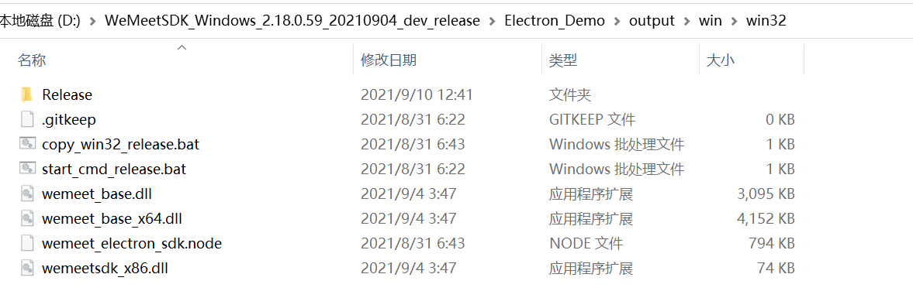
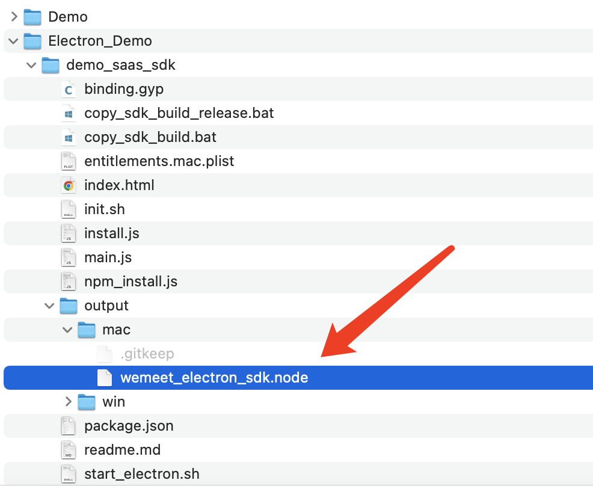
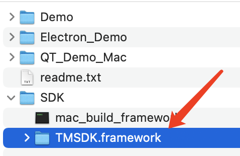
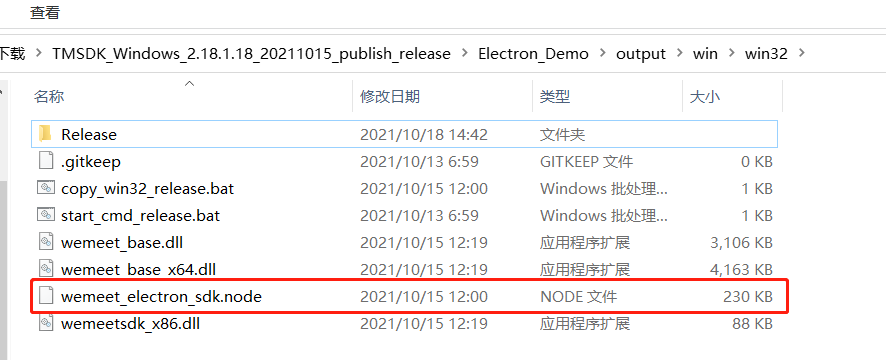
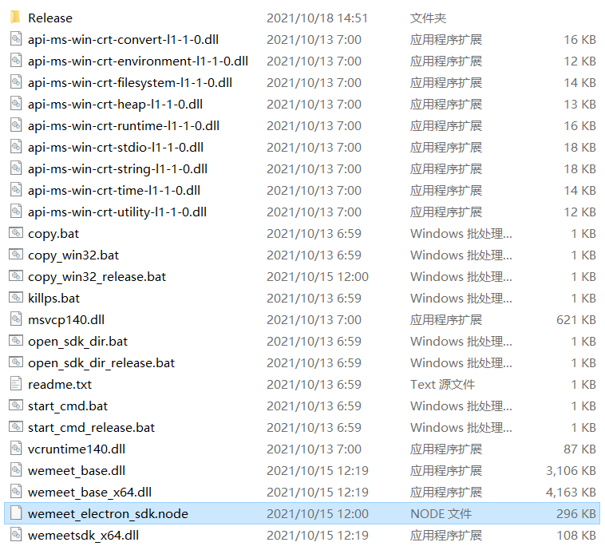

# Electron 接入手册

## 1. demo环境配置说明
### 1.1 环境要求
1. 操作系统：win7、win10、win11的32位和64位，MacOS 10.11及以上
2. nodejs

### 1.2 文件说明
为了简化 electron 的接入，我们封装了一个 node.js 的 addon，可以在 electron 中直接导入这个
addon，使用里面封装的接口即可。
这个 nodejs 的 addon 的名字是 wemeet_electron_sdk.node, windows 和 mac 都是这个名字

#### 1.2.1 Win32环境node文件



#### 1.2.2 Win64环境node文件


#### 1.2.3 Mac x86_64 & arm64位环境node文件



#### 1.2.4 Mac SDK 文件



> **说明：在windows和mac上wemeet_electron_sdk.node的依赖文件是不一样的，但是我们提供的 .node 文件导出的接口是一致的，所以编码接入的时候无需平台的差异性，打包的时候将对应平台的依赖文件对应目录即可。**

### 1.3 运行demo

运行demo需要配置对应平台的环境，根据下面的指引各自配置环境。

#### 1.3.1 32位 Windows
**一、拷贝SDK**

- 方法一： 按照如下表格拷贝依赖文件

| 名称   | 原路径   | 目的路径  |
| ----- | ------ | --------------------------------------- |
| api-ms-win*.dll  | SDK |   output/win/win32    |
| msvcp140*.dll  | SDK    | output/win/win32    |
| concrt140.dll   | SDK | output/win/win32 |
| vcomp140.dll | SDK | output/win/win32 |
| vcruntime140*.dll | SDK | output/win/win32 |
| ucrtbase.dll | SDK | output/win/win32 |
| wemeet_base.dll | SDK | output/win/win32 |
| wemeetsdk_x86.dll | SDK | output/win/win32 |
| Release文件夹 | SDK | output/win/win32 |

注意：大版本升级sdk需要删除原来sdk所有目录文件重新拷贝，避免旧包文件残留导致包校验失败
- 方法二:  直接执行output/win/win32/copy_win32_release.bat(bat文件中的内容也就是做了方法1的操作，写成了脚本)
```
rmdir /s /q Release
mkdir Release
xcopy /S /E /Y /Q /H /D ..\..\..\..\SDK\Release .\Release
copy  ..\..\..\..\SDK\api-ms-win*.dll .\
copy ..\..\..\..\SDK\msvcp140*.dll .\
copy ..\..\..\..\SDK\concrt140.dll .\concrt140.dll
copy ..\..\..\..\SDK\vcomp140.dll .\vcomp140.dll
copy ..\..\..\..\SDK\vcruntime140*.dll .\
copy ..\..\..\..\SDK\ucrtbase.dll .\ucrtbase.dll
copy ..\..\..\..\SDK\wemeet_base.dll .\wemeet_base.dll
copy ..\..\..\..\SDK\wemeetsdk_x86.dll .\wemeetsdk_x86.dll
```

减包注意（3.21.200包大小优化）： 打包可选择对Release\webview和Release\resources\webview目录删除，删除不影响接口调用，使用过程中会触发内置浏览器动态下载(首次初始化触发)。

**二、安装electron以及相关的依赖**

Electron_Demo目录下 
**copy ..\SDK\wemeetsdk_x86.lib .\wemeet_sdk\win\lib\x64\release\wemeetsdk_x86.lib**

执行npm install安装依赖，生成node

**三、拷贝node**

cp build/Release/wemeet_electron_sdk.node   output/win/win32/

**四、运行demo**

Electron_Demo目录下执行npm start


#### 1.3.2 64位 Windows

**一、拷贝SDK**

按照如下表格拷贝依赖文件

 | 名称   | 原路径   | 目的路径  |
| ----- | ------ | --------------------------------------- |
| api-ms-win*.dll  | SDK/Release/x64 |   output/tm-meeting-tmsdk/win-x64    |
| msvcp140*.dll  | SDK/Release/x64    | output/tm-meeting-tmsdk/win-x64    |
| vcruntime140*.dll | SDK/Release/x64 | output/tm-meeting-tmsdk/win-x64 |
| ucrtbase.dll | SDK/Release/x64 | output/tm-meeting-tmsdk/win-x64 |
| wemeet_base.dll | SDK | output/tm-meeting-tmsdk/win-x64 |
| wemeetsdk_x64.dll | SDK | output/tm-meeting-tmsdk/win-x64 |
| Release文件夹 | SDK | output/tm-meeting-tmsdk/win-x64 |

注意：大版本升级sdk需要删除原来sdk所有目录文件重新拷贝，避免旧包文件残留导致包校验失败

可以在output/tm-meeting-tmsdk/win-x64目录下执行以下命令
```
rmdir /s /q Release
mkdir Release
xcopy /S /E /Y /Q /H /D ..\..\..\..\SDK\Release .\Release
copy ..\..\..\..\SDK\Release\x64\api-ms-win*.dll .\
copy ..\..\..\..\SDK\Release\x64\msvcp*.dll .\
copy ..\..\..\..\SDK\Release\x64\vcruntime140.dll .\vcruntime140.dll
copy ..\..\..\..\SDK\Release\x64\vcruntime140_1.dll .\vcruntime140_1.dll
copy ..\..\..\..\SDK\Release\x64\ucrtbase.dll .\ucrtbase.dll
copy ..\..\..\..\SDK\Release\x64\wemeet_base.dll .\wemeet_base.dll
copy ..\..\..\..\SDK\wemeetsdk_x64.dll .\wemeetsdk_x64.dll
```
减包注意（3.21.200包大小优化）： 打包可选择对Release\webview和Release\resources\webview目录删除，删除不影响接口调用，使用过程中会触发内置浏览器动态下载(首次初始化触发)。

**二、安装electron以及相关的依赖**

Electron_Demo目录下
**cp ../SDK/wemeetsdk_x64.lib  wemeet_sdk/win/lib/x64/release/**

执行npm install安装依赖，生成node

**三、拷贝node**

cp build/Release/wemeet_electron_sdk.node   output/tm-meeting-tmsdk/win-x64

**四、运行demo**

Electron_Demo目录下执行npm start


#### 1.3.3 Mac 环境

1. 在demo_saas_sdk文件夹下启用终端

   方法一、执行命令（注：此时用到的framework、wemeet_electron_sdk.node默认都是双架构）

   1.1、按1.2.4中操作执行文件拷贝

   1.2、npm install 

   1.3、npm start

   方法二、执行start_electron.sh脚本（注：此时wemeet_electron_sdk.node文件会重新构建生成当前机器对应架构的。如：M1机器上生成arm64架构的，Intel机器上生成x86_64架构的）

2. 执行完1中步骤后，等待即可，无报错情况下会自动打开demo。

3. 执行成功过一次1中步骤后，再次运行demo可输入“npm start”指令或再次执行脚本。

   注：执行start_electron.sh脚本会重新生成wemeet_electron_sdk.node默认是对应机器架构的。

**Q:压缩包中`SDK/TMSDK.framework`是一个双架构的framework，可以在x86和arm64下运行，但是体积过大,如何拆分成单架构的framework?**

**A:将`TMSDK.framework`和`mac_build_framework`放在同级目录，双击运行`mac_build_framework`，等待即可，无报错情况下会在`Build/Products/Release/framework`下生成x86和arm64两个平台的架构包**

**Q:启动运行electron失败，提示架构不匹配，如何处理？**

**A:执行方法二，可以快速解决，生成对应机器的wemeet_electron_sdk.node。可以通过lipo -info xxx命令可以查看当前库的架构，确认是否和当前机器架构对应**

## 2. SDK 接入说明
### 2.1 申请 SDK Id & SDK Secret

为了让SDK 正常使用，需要为 SDK 配置独有的安全凭证，安全凭证包括 SDK Id 和SDK Secret ，对每一次请求进行验证。联系腾讯会议商务对接人进行信息登记进行 SDK。

### 2.2 SDK 接入环境配置

#### 2.2.1 32位 Windows

一. 安装32位的nodejs，安装electron

二. 新建electron工程

三. 在package.json加配置

javascript

```javascript
"scripts": {
  "start": "node start.js && electron ."
},
```

四. 拷贝SDK文件，参考章节 1.3.1：

五. 在js中导入 的wemeet_electron_sdk.node 文件

```javascript
// path_to_your_wemeet_electron_sdk.node 表示 wemeet_electron_sdk.node的路径
const wemeet_sdk = require('path_to_your_wemeet_electron_sdk.node')
// 这里导入的 wemeet_sdk 会在接下来的接口说明中使用
```

目录结构如下：



**注意，要保证`Release`目录已经拷贝到`wemeet_electron_sdk.node`的的同级目录下**

#### 2.2.2 64位 Windows

一. 安装64位的nodejs，安装electron

二. 新建electron工程

三. 在package.json加配置

javascript

```javascript
"scripts": {
  "start": "node start.js && electron ."
},
```

四. 拷贝SDK文件，参考章节 1.3.2：

五. 在js中导入 的wemeet_electron_sdk.node 文件

```javascript
// path_to_your_wemeet_electron_sdk.node 表示 wemeet_electron_sdk.node的路径
const wemeet_sdk = require('path_to_your_wemeet_electron_sdk.node')
// 这里导入的 wemeet_sdk 会在接下来的接口说明中使用
```

目录结构如下：



**注意，要保证`Release`目录已经拷贝到`wemeet_electron_sdk.node`的的同级目录下**

#### 2.2.3 Mac x86_64环境

一. 安装nodejs，安装electron

二. 新建electron工程

三. 将wemeet_electron_sdk.node拷贝到 `output/mac`目录下。

四. 在package.json加配置

```javascript
"scripts": {
  "start": "node start.js && electron ."
}
```

五. 修改start.js，拷贝SDK文件，参考demo的start.js：

Mac端：将SDK文件（即SDK/TMSDK.framework）拷贝至`node_modules/electron/dist/xxx.app/Contents/Frameworks`目录下(注：此时framework是一个双架构包，拆包操作请查看1.3.3)

六. 在js中导入 wemeet_electron_sdk.node 文件

```javascript
// path_to_your_wemeet_electron_sdk.node 表示 wemeet_electron_sdk.node的路径
const wemeet_sdk = require('path_to_your_wemeet_electron_sdk.node')
// 这里导入的 wemeet_sdk 会在接下来的接口说明中使用
```

#### 2.2.4 Mac arm64环境

一. 安装nodejs，安装electron

二. 新建electron工程

三. 将wemeet_electron_sdk.node拷贝到 `output/mac`目录下。

四. 在package.json加配置

```javascript
"scripts": {
  "start": "node start.js && electron ."
}
```

五. 修改start.js，拷贝SDK文件，参考demo的start.js：

Mac端：将SDK文件（即SDK/TMSDK.framework）拷贝至`node_modules/electron/dist/xxx.app/Contents/Frameworks`目录下(注：此时framework是一个双架构包，拆包操作请查看1.3.3)

六. 在js中导入 wemeet_electron_sdk.node 文件

```javascript
// path_to_your_wemeet_electron_sdk.node 表示 wemeet_electron_sdk.node的路径
const wemeet_sdk = require('path_to_your_wemeet_electron_sdk.node')
// 这里导入的 wemeet_sdk 会在接下来的接口说明中使用
```

## 3. 接口说明

> 注意：接口调用是异步过程，需要在对应的回调中处理接口调用的结果，其中**InitWemeetSDK**初始化的操作必须要等到该接口的回调之后再进行其他的接口调用，否则其他的接口调用都是无效的

本文档只列出接口的名称和参数，具体参数说明可以参考《TencentMeetingSDK（TMSDK）接口参考文档》

### 3.1 TMSDK 成员函数

#### 获取当前SDK版本号

```
wemeet_sdk.GetSDKVersion()
```
说明：返回string类型，可参考统一《TencentMeetingSDK（TMSDK）接口参考文档》说明。

#### 初始化 SDK

```
windows端：wemeet_sdk.InitWemeetSDK(sdk_id, sdk_token, data_path, app_name, app_icon, language, proxy_info, allow_home_view);
mac端：wemeet_sdk.InitWemeetSDK(sdk_id, sdk_token, data_path, app_name, language, proxy_info, allow_home_view);
说明：3.6.3以上版本新增语言设置可选项，详情参考《TencentMeetingSDK（TMSDK）接口参考文档》

3.12.1以上版本统一接口参数，都需要传app_icon参数，但是Mac端没有app_icon定制场景建议传默认值""空串
wemeet_sdk.InitWemeetSDK(sdk_id, sdk_token, data_path, app_name, app_icon, language, proxy_info, allow_home_view);
```

#### 反初始化SDK

```
wemeet_sdk.UninitWemeetSDK(uninit_json)
```

说明：\>= 3.12版本, 可参考统一《TencentMeetingSDK（TMSDK）接口参考文档》说明。

#### 检查初始化状态

```
wemeet_sdk.IsInitialized()
```

说明: 异步接口，调用InitWemeetSDK，接收到初始化成功回调后，返回true，没接收初始化成功回调前返回false，3.0.107加入。

#### 刷新sdk_token

```
wemeet_sdk.RefreshSDKToken(sdk_token)
```

说明：同步接口，参数是要刷新的sdk_token串。返回类型int，失败返回错误码，成功返回0。

#### 获取当前sdk_token

```
wemeet_sdk.GetCurrentSDKToken()
```

说明：同步接口，返回类型string，返回当前sdk登录使用的sdk_token串。3.0.107加入。

#### 打开日志目录

```
wemeet_sdk.OpenLogDirectory()
```

#### 收集日志信息

```
wemeet_sdk.CollectLogFiles(begin_time, end_time)
```

说明：\>= 3.12版本，begin_time、end_time为string类型，可参考统一《TencentMeetingSDK（TMSDK）接口参考文档》说明。

#### 上传日志

```
wemeet_sdk.ActiveUploadLogs(begin_time, end_time, description)
```

说明：\>= 3.21.100版本，begin_time、end_time为string类型，description为string类型，可参考统一《TencentMeetingSDK（TMSDK）接口参考文档》说明。

#### 设置代理

```
wemeet_sdk.SetProxyInfo(proxy_info)
```

说明：参数proxy_info为json格式的string类型，格式可参考统一《TencentMeetingSDK（TMSDK）接口参考文档》说明。

#### 获取代理

```
wemeet_sdk.GetProxyInfo()
```

说明：返回值参考SetProxyInfo。

#### 一键跳转指定页面

```
wemeet_sdk.HandleSchema(schema_url)
```

说明：参数schema_url为跳转链接，可参考统一《TencentMeetingSDK（TMSDK）接口参考文档》说明。

#### 添加人员操作，接入方可以邀请人加入预定会议、或邀请人员加入会议

```
wemeet_sdk.AddUsersWithParam(json_param)
```

说明：>= 3.6.401版本，json_param为json格式字符串，可参考统一《TencentMeetingSDK（TMSDK）接口参考文档》说明。

#### 短链入会解析

```
wemeet_sdk.ParseMeetingInfoUrl(scheme_url)
```

说明：\>= 3.12版本，scheme_url为string类型，可参考统一《TencentMeetingSDK（TMSDK）接口参考文档》说明。

### 3.2 AccountService 成员函数

#### 登录

``` 
wemeet_sdk.Login(sso_url);
```

#### 通过json串登录

```
wemeet_sdk.LoginByJSON(login_json)
```

说明：\>= 3.24.100版本, 可参考统一《TencentMeetingSDK（TMSDK）接口参考文档》说明。

#### 登出

``` 
wemeet_sdk.Logout();
```

#### 检查登录态

```
wemeet_sdk.IsAuthorized()
```

说明: 异步接口，调用登录，接收到登录成功回调后，返回true，没接收登录成功回调前返回false。

#### 登录态跳转

```
wemeet_sdk.JumpUrlWithLoginStatus(target_url)
```

#### 获取带登录态的url链接

```
wemeet_sdk.GetUrlWithLoginStatus(url)
```

说明：同步接口，参数url为不带登录态的url，返回类型string，返回带登录态的url。

### 3.3 PreMeetingService 成员函数

#### 入会

``` 
wemeet_sdk.JoinMeeting(meeting_code, user_display_name, password, invite_url, mic_on, camera_on, speaker_on, face_beauty_on)
```

#### 通过json串入会

```
wemeet_sdk.JoinMeetingByJSON(meeting_josn)
```

说明：参数meeting_josn为json格式的string类型，格式可参考统一《TencentMeetingSDK（TMSDK）接口参考文档》说明。

#### 快速会议

```
wemeet_sdk.QuickMeeting()
```

说明：>= 3.6.200版本。

#### 通过json串快速会议

```
wemeet_sdk.QuickMeetingByJSON(json_param)
```

说明：>= 3.6.300版本，参数json_param为json格式的string类型，格式可参考统一《TencentMeetingSDK（TMSDK）接口参考文档》说明。

#### 显示SDK自带的会前界面（显示home界面）

``` 
wemeet_sdk.ShowPreMeetingView();
```

显示home界面【即将移除】

``` 
wemeet_sdk.GoToHomeView();
```

#### 显示会议历史

```
wemeet_sdk.ShowHistoricalMeetingView();
```

#### 显示会议详情

```
wemeet_sdk.ShowMeetingDetailView(meeting_id, current_sub_meeting_id)
```

说明：>= 3.6.200版本，重载ShowMeetingDetailView接口，入参可参考统一《TencentMeetingSDK（TMSDK）接口参考文档》

```
wemeet_sdk.ShowMeetingDetailView(meeting_id, current_sub_meeting_id, start_time, is_history)
```

#### 显示加入会议页面

```
wemeet_sdk.ShowJoinMeetingView()
```

说明：展示加入会议页面。

#### 显示预定会议页面

```
wemeet_sdk.ShowScheduleMeetingView(meeting_type)
```

说明：参数meeting_type为会议类型，可参考统一《TencentMeetingSDK（TMSDK）接口参考文档》说明。

#### 显示上传日志界面

```
wemeet_sdk.ShowUploadLogsView()
```

说明：>= 3.21.100版本，展示上传日志界面。

#### 显示设置管理界面

```
wemeet_sdk.ShowMeetingSettingView()
```

说明：展示设置管理界面。

#### 显示投屏页面

```
wemeet_sdk.ShowScreenCastView()
```

说明：展示投屏页面。

#### 超声波解码

```
wemeet_sdk.DecodeUltrasoundScreenCastCode()
```

说明：\>= 3.12.3版本, 可参考统一《TencentMeetingSDK（TMSDK）接口参考文档》说明。

#### 无线投屏

```
wemeet_sdk.StartScreenCast(cast_param)
```

说明：cast_param为json格式字符串，详细可参考《TencentMeetingSDK（TMSDK）接口参考文档》说明。

#### 查询会议信息

```
wemeet_sdk.QueryMeetingInfo(meeting_info)
```

说明：>= 3.6.200版本，meeting_info为json格式字符串，详细可参考《TencentMeetingSDK（TMSDK）接口参考文档》说明。

#### 查询本地录制信息

```
wemeet_sdk.QueryLocalRecordInfo(meeting_id, period_id)
```

说明：\>= 3.12版本，meeting_id、period_id为int类型，可参考统一《TencentMeetingSDK（TMSDK）接口参考文档》说明。

#### 本地录制文件进行转码

```
wemeet_sdk.Transcode(path_id)
```

说明：\>= 3.12版本，path_id为int类型，可参考统一《TencentMeetingSDK（TMSDK）接口参考文档》说明。

#### 打开会议本地录制文件所在文件夹

```
wemeet_sdk.ShowRecordFolder(path_id)
```

说明：\>= 3.12版本，path_id为int类型，可参考统一《TencentMeetingSDK（TMSDK）接口参考文档》说明。

#### SDK预定会议界面中，开启定制化通讯录的回调

```
wemeet_sdk.EnableAddressBookCallback(enable, show)
```

说明：\>= 3.6.401版本，可参考统一《TencentMeetingSDK（TMSDK）接口参考文档》说明。

#### 设置是否显示SDK响铃邀请界面

```
wemeet_sdk.EnableRingInvitationView(enable)
```

说明：\>= 3.12.4版本, 可参考统一《TencentMeetingSDK（TMSDK）接口参考文档》说明。

#### 处理响铃邀请

```
wemeet_sdk.HandleRingInvitation(accept, invite_id, callback)
```

说明：\>= 3.12.4版本, 可参考统一《TencentMeetingSDK（TMSDK）接口参考文档》说明。

#### 获取近场投屏码

```
wemeet_sdk.DiscoverNearScreenCastCode(json_param)
```

说明：\>= 3.24.300版本, 可参考统一《TencentMeetingSDK（TMSDK）接口参考文档》说明。

### 3.4 InMeetingService 成员函数

#### 退出会议

```  
wemeet_sdk.LeaveMeeting(leave_meeting_type)
```

说明：可参考统一《TencentMeetingSDK（TMSDK）接口参考文档》说明。

#### 邀请回调开关

```
wemeet_sdk.SetNeedShareCallback(invite_on, invite_show)
```

说明：可参考统一《TencentMeetingSDK（TMSDK）接口参考文档》enableInviteCallback说明。

#### 会议信息回调开关

``` 
wemeet_sdk.SetNeedMeetingInfoCallback(info_on, info_show)
```

说明：可参考统一《TencentMeetingSDK（TMSDK）接口参考文档》enableMeetingInfoCallback说明。

#### 设置是否使用添加成员的回调

```
wemeet_sdk.EnableInviteUsersCallback(enable, show)
```

说明：\>= 3.6.401版本，可参考统一《TencentMeetingSDK（TMSDK）接口参考文档》说明。

#### 会中窗口置顶

```
wemeet_sdk.BringInMeetingViewTop()
```

说明：桌面端：>= 3.0.102版本，如果当前没有会中窗口，则不做任何操作。没有回调。可参考统一《TencentMeetingSDK（TMSDK）接口参考文档》说明。

#### 获取当前会议状态信息

```
wemeet_sdk.GetCurrentMeetingInfo()
```
说明：>= 3.6.300版本，返回string类型，可参考统一《TencentMeetingSDK（TMSDK）接口参考文档》说明。

#### 设置是否开启自定义组织架构信息

```
wemeet_sdk.EnableCustomOrgInfo(enable)
```

说明：\>= 3.6.401版本，可参考统一《TencentMeetingSDK（TMSDK）接口参考文档》说明。

#### 对相关成员设置自定义的组织架构信息

```
wemeet_sdk.SetCustomOrgInfo(json_param)
```

说明：\>= 3.6.401版本，json_param为json格式字符串，可参考统一《TencentMeetingSDK（TMSDK）接口参考文档》说明。

#### 操作会中窗口，支持【全屏】和【退出全屏】

```
wemeet_sdk.ManipulateWindow(action_param)
```

说明：>= 3.12.201版本, 可参考统一《TencentMeetingSDK（TMSDK）接口参考文档》说明。

#### 开关会议中字幕展示组件

```
wemeet_sdk.SwitchCaption(open)
```

说明：\>= 3.12.3版本, 可参考统一《TencentMeetingSDK（TMSDK）接口参考文档》switchCaption(bool open, Callback complete)说明。

#### 更新字幕相关设置选项

```
wemeet_sdk.UpdateCaptionSettings(json_setting)
```

说明：\>= 3.12.3版本, 可参考统一《TencentMeetingSDK（TMSDK）接口参考文档》updateCaptionSettings(string json_setting, Callback complete)说明。

#### 获取当前屏幕共享信息

```
wemeet_sdk.GetScreenShareInfo()
```

说明：\>= 3.12.3版本, 可参考统一《TencentMeetingSDK（TMSDK）接口参考文档》说明。

#### 获取会中窗口信息

```
wemeet_sdk.GetMeetingWindowInfo()
```

说明：\>= 3.12版本, 可参考统一《TencentMeetingSDK（TMSDK）接口参考文档》说明。

#### 用来设置共享屏幕入会后，结束共享时是否展示"结束共享"弹窗

```
wemeet_sdk.SetLeaveCastRoomActionType(int actionType)
```

说明：\>= 3.12.403版本, 可参考统一《TencentMeetingSDK（TMSDK）接口参考文档》说明。

#### 切换为会议的默认布局

```
wemeet_sdk.SwitchLayout(layout_json)
```

说明：\>= 3.12.404版本, 可参考统一《TencentMeetingSDK（TMSDK）接口参考文档》switchLayout(string layout_json, Callback complete)说明。

#### 订阅/退订会中事件

```
wemeet_sdk.SubscribeInMeetingActionEvent(action_type, subscribe, subscription_json)
```

说明：\>= 3.12.404版本, 可参考统一《TencentMeetingSDK（TMSDK）接口参考文档》说明。

#### 添加js回调

```
wemeet_sdk.AddJsCallback(call_back)
```

说明：这个函数是electron的sdk独有的函数，call_back 是一个js的function，参数是一个json字符串

## 4. 回调说明

除GetSDKVersion、GetCurrentSDKToken、RefreshSDKToken、GetUrlWithLoginStatus外，其它所有接口的调用都是通过异步回调返回的，这里异步回调的返回值是一个标准的json字符串，格式如下：

| Key   | 类型   | 说明                                    |
| ----- | ------ | --------------------------------------- |
| func  | string | 回调对应的调用函数名称，回调的标识      |
| code  | int    | 回调错误码，0为正常                     |
| msg   | string | 详细的错误信息                          |
| param | string | 回调需要带回的数据，也是一个json object |

回调的具体类别和参数在这里不作详细的罗列，可以参考《TencentMeetingSDK（TMSDK）接口参考文档》
