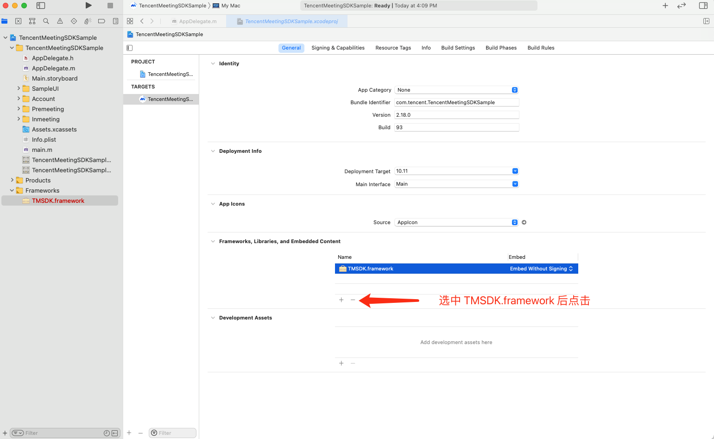
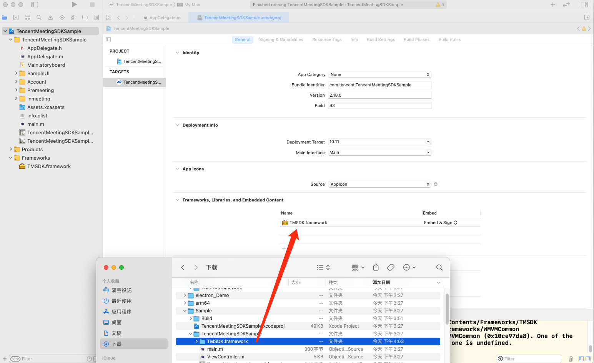
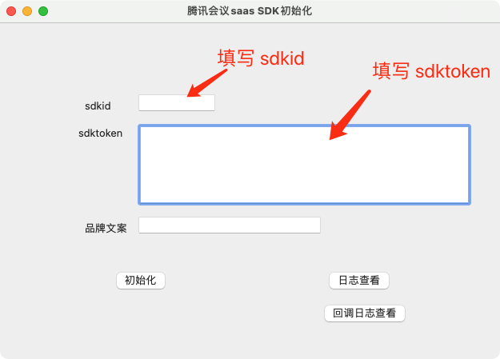
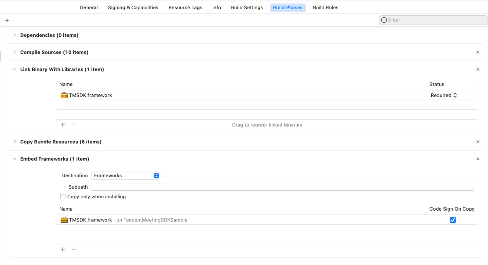

# MacOS SDK接入手册

# 1. 准备工作
## 1.1 环境版本提示
- 系统版本: macOS 10.11 +
- Xcode 10 +

## 1.2 SDK包组成
```
.
├── Docs <-- 文档
├── Sample <-- 示例程序
├── arm64 <-- SDK (M1)
├── electron_Demo <-- electron 示例程序
└── x86_64 <-- SDK(Intel)
```

## 1.3 Demo工程使用说明

Demo 工程主要用于展示 SDK 功能，API 调用示例， demo 工程 在 `Sample` 目录下。

### 1.3.1 原生 Demo App 编译与运行

1. 根据当前系统的硬件架构，将对应目录下的 `TMSDK.framework` 复制到 `Sample/TencentMeetingSDKSample` 目录下

2. 在 Xcode 中打开 `Sample` 下的 `TencentMeetingSDKSample.xcodeproj` 工程

3. 删除 Demo 工程中原有的 `TMSDK.framework` 链接


   
4. 将 `Sample/TencentMeetingSDKSample` 目录下的 `TMSDK.framework` 添加到工程的 Frameworks 中



5. 运行工程

### 1.3.2 运行和使用Demo App

运行起来后的 Sample App 界面如下，需要填写已经申请好的 `sdkid` 与 `sdktoken`，点击初始化进入后续流程。



## 1.4 集成步骤
### 1.4.1 准备工作

1. Xcode 10+
2. 被集成 App
3. TMSDK.framework

### 1.4.2 将SDK集成到工程

在工程的 Target->General->Frameworks, Libraries, and  Embebbed Content  中添加 `TMSDK.framework`,可参考 Demo 工程。

注：由于提供的是动态库，所以需要确保在 Target->Build Phases->Link Binary with Libraries、Target->Build Phases->Embed Frameworks 如下：



### 1.4.3 权限配置

在工程的  `Info.plist` 文件中添加以下键值对:

| **Key**                               | **Type** | **Value**                                          |
| ------------------------------------- | -------- | -------------------------------------------------- |
| Privacy - Microphone Usage Descriptio | String   | NSMicrophoneUsageDescription(使用麦克风的目的,  如 "使用xx功能时使用您的麦克风") |
| Privacy - Camera Usage Description    | String   | NSCameraUsageDescription(使用摄像头的目的，如 "使用xx功能时使用您的相机")    |
| Privacy - AppleEvents Sending Usage Description   | String   | NSAppleEventsUsageDescription(批注跟随 PowerPoint 翻页功能需要)    |

在工程的 entitlements 文件中配置以下键值对：

| **Key**     | **Type** | **Value**  |
| ------------ | -------- | ----- |
| Apple Events | Boolean   | YES |

# 2. SDK快速接入

以下文档为 SDK 快速接入参考，详细步骤可参考 Demo 工程。

## 2.1 初始化SDK
```objc
- (void)sdkInitialize {
    TMSDKInitParams *initParams = [[TMSDKInitParams alloc] init];
    initParams.sdkId = @"{your sdkId}";
    initParams.sdkToken = @"{your sdkToken}";
    initParams.appName = @"{your appName}";
    [[TMSDK shareSDK] initialize:initParams delegate:self];
}
```
## 2.2 账户登录、登录
### 2.2.1 设置回调
```objc
    TMSDKAccountService * service = [[TMSDK shareSDK] getAccountService];
    service.delegate = self;
```

```objc
#pragma mark - TMSDKAccountDelegate

- (void)onLogin:(TMSDKError)code msg:(NSString *)msg {
    //callback handle
}

- (void)onLogout:(int)type code:(TMSDKError)code msg:(NSString *)msg {
    //callback handle
}
```
### 2.2.2 登录的调用
```objc
   NSString *ssoUrl = @"{ssoUrl+idToken}";
   [[[TMSDK shareSDK] getAccountService] login:ssoUrl];
```
### 2.2.3 登出的调用
```objc
    [[[TMSDK shareSDK] getAccountService] logout];
```
## 2.3 显示会前主界面

```objc
    [[[TMSDK shareSDK] getPreMeetingService] showPremeetingView];
```

## 2.4 入会
### 2.4.1 设置回调
```objc
- (void)onJoinMeeting:(TMSDKError)code msg:(NSString *)msg meetingCode:(NSString *)meetingCode{
    //callback handle;
}
```
### 2.4.2 入会的调用
```objc
- (void)joinMeeting {
    TMSDKJoinParams *param = [TMSDKJoinParams new];
    param.meetingCode = self.meetingCodeTextField.stringValue;
    param.userDisplayName = self.userNameTextField.stringValue;
    param.password = self.passwordTextField.stringValue;
    param.inviteUrl = self.inviteUrlTextField.stringValue;
    param.cameraOn = self.cameraCheckBox.state == NSControlStateValueOn;
    param.micOn = self.micCheckBox.state == NSControlStateValueOn;
    param.faceBeautyOn = self.faceBeautyCheckBox.state == NSControlStateValueOn;
    [[[TMSDK shareSDK] getPreMeetingService] joinMeeting:param];
```
## 2.5 离会
### 2.5.1 设置回调
```objc
- (void)onLeaveMeeting:(int)type resultCode:(int)resultCode msg:(NSString *)msg meetingCode:(NSString *)meetingCode{
    //callback handle
}
```
### 2.5.2 离会的调用
```objc
    [[[TMSDK shareSDK] getInMeetingService] leaveMeeting:isEnd];
```

## 2.6 提取日志文件
```objc
    [[TMSDK shareSDK] showLogs];
```
## 2.7 投屏功能
```objc
    [[[TMSDK shareSDK] getPreMeetingService] showScreenCastView];
```

# 3. 常用定制化功能

## 3.1 定制会议中邀请回调
```objc
    [[[TMSDK shareSDK] getInMeetingService] enableInviteCallback:enable show:show];
```
## 3.2 定制会议中会议信息回调
```objc
    [[[TMSDK shareSDK] getInMeetingService] enableMeetingInfoCallback:enable show:show];
```


# 4. 更多功能
请参考《TencentMeetingSDK（TMSDK）接口参考》文档
