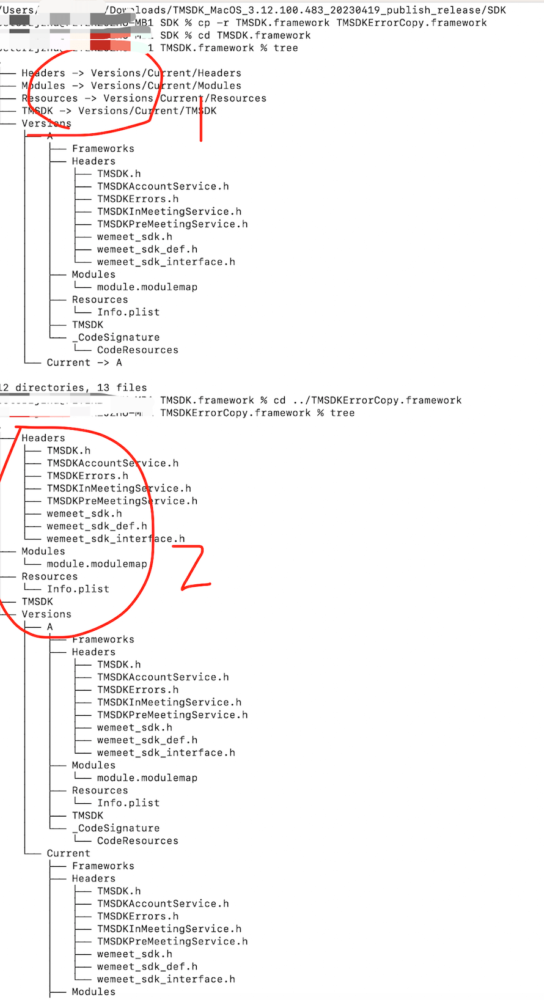

# FAQ

Q1.接入腾讯会议SDK的应用，导入TMSDK.framework到工程，运行时报错相关库找不到，比如Library not loaded: @rpath/tmsdk_wemeet_sdk.framework/Versions/A/tmsdk_wemeet_sdk

A：1、确认TMSDK.framework是否有问题，可以通过运行官方demo是否正常来判断。2、查看TMSDK.framework的库结构，建议拷贝TMSDK.framework库时使用cp -R 命令，确保库的拷贝操作正常并且保留原始目录的信息，下图中1是正确的库结构，图中2是错误的库结构。区别在于：如Headers在图中1是引用文件，在图中2是实体文件夹。

---

Q2. 接入腾讯会议 SDK 后，在 macOS 上使用 Electron >= 39.1.2 版本，在会议窗口（Qt 窗口）中按下系统快捷键（如 Cmd+C/V/Z/A 等）导致应用崩溃（EXC_BAD_ACCESS）

A：根本原因是Electron 39.1.2 基于 Chromium 142，该版本的安全补丁扩大了 performKeyEquivalent: 的拦截范围。当应用菜单中存在带 accelerator（快捷键）的菜单项时，Chromium 会拦截所有 NSWindow 的键盘事件（包括 SDK 的 Qt 窗口），与 Qt 5.x 的 QCocoaEventDispatcher 产生 NSEvent 双重释放，最终导致 EXC_BAD_ACCESS 崩溃。建议的解决方案是动态切换应用菜单，在 main.js 的 app.on('ready', ...) 中，根据 Electron BrowserWindow 的焦点状态动态切换菜单：
- BrowserWindow 获得焦点时：设置带 accelerator 的完整菜单，支持 Cmd+C/V/Z/A 等快捷键
- BrowserWindow 失去焦点时（Qt 窗口激活）：切换为不带 accelerator 的菜单，阻断 Chromium 的 performKeyEquivalent: 对 Qt 窗口键盘事件的拦截
