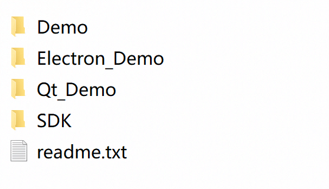
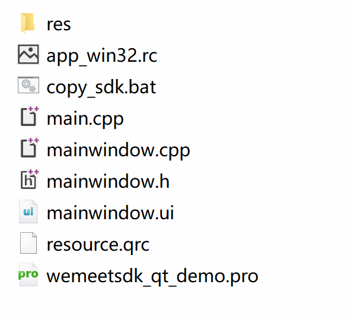
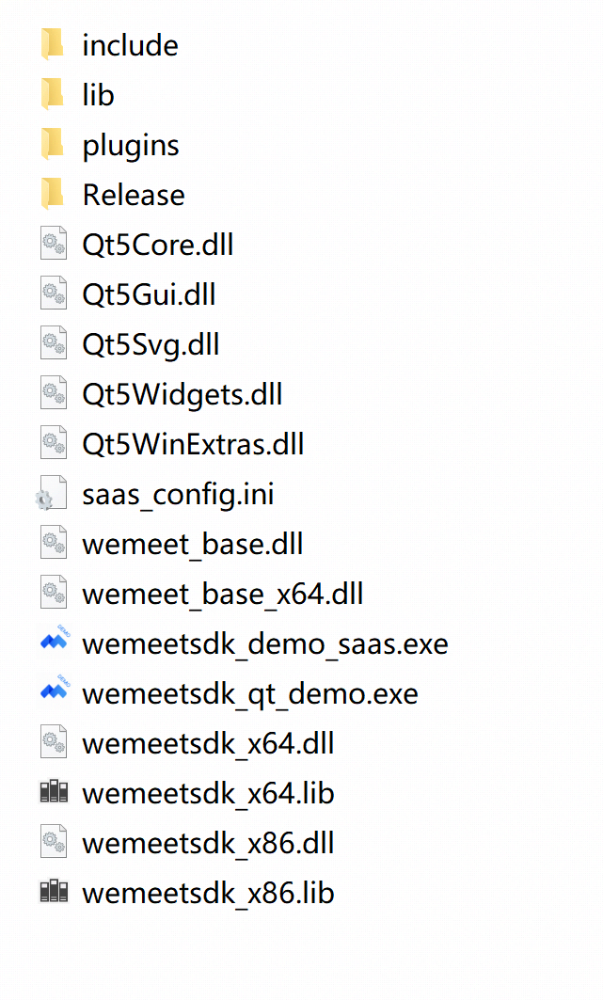
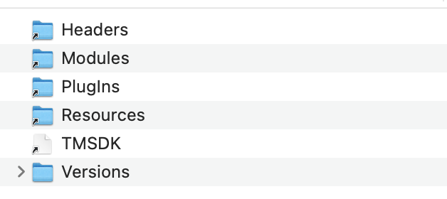
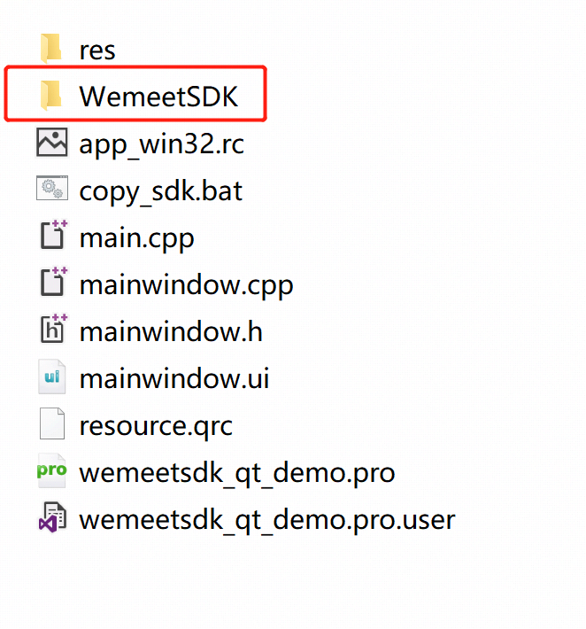
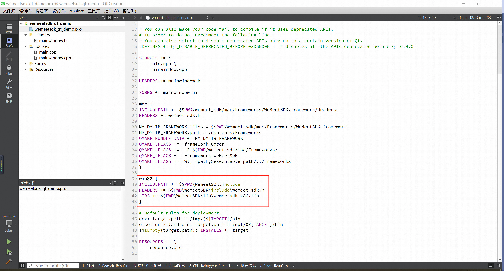
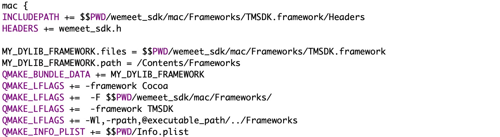

# QT 接入手册

## 1. demo环境配置说明
### 1.1 环境要求
1. 操作系统：win7与win10的32位和64位，MacOS x86_64和arm64
2. qt环境

### 1.2 文件说明
Demo使用qtcreator集成开发环境作为示例，根据使用习惯也可选择visual studio、xcode等集成开发环境

#### 1.2.1 Windows Demo解压后目录结构



#### 1.2.2 Qt_Demo工程文件


#### 1.2.3 Windows SDK文件



#### 1.2.4 Macos SDK文件


> **说明：在windows和mac平台上的依赖文件是不一样的，但是我们提供的SDK文件导出的接口是一致的，所以编码接入的时候无需平台的差异性，打包的时候将对应平台的依赖文件对应目录即可。**

### 1.3 构建运行demo

运行demo需要配置对应平台的环境，根据下面的指引各自配置环境。

#### 1.3.1 32位 Windows
**一、拷贝依赖文件**

  qt工程目录下新建WemeetSDK将文件说明中的windows SDK目录下include的所有内容拷贝到WemeetSDK/include文件下，wemeetsdk_x86.lib拷贝到WemeetSDK/lib文件下。


**二、配置qtcreator工程**

在.pro文件中添加SDK库的依赖


**三、运行demo**

执行qmake->执行构建，构建成功后拷贝相关依赖至生成目录中后可运行程序
- 文件说明中的windows SDK目录下Release所有文件
- wemeetsdk_x86.dll、wemeet_base.dll


#### 1.3.2 64位 Windows

**一、拷贝SDK**

  qt工程目录下新建WemeetSDK将文件说明中的windows SDK目录下include的所有内容拷贝到WemeetSDK/include文件下，wemeetsdk_x64.lib拷贝到WemeetSDK/lib文件下。

**二、安装qt以及相关的依赖**

在.pro文件中添加SDK库的依赖

**三、运行demo**

执行qmake->执行构建，构建成功后拷贝相关依赖至生成目录中后可运行程序
- 文件说明中的windows SDK目录下的Release和plugins目录
- wemeetsdk_x64.dll、wemeet_base_x64.dll两个文件
- 


#### 1.3.3 Mac 

**一、拷贝SDK**

根据自身cpu架构类型选择对应的SDK版本(x86_64/arm64),将对应的SDK拷贝到qt工程目录下的wemeet_sdk/mac/Frameworks目录下。

**二、运行demo**

选择对应的构建套件后进行构建，构建完成运行即可。


## 2. SDK 接入说明
### 2.1 申请 SDK Id & SDK Secret

为了让SDK 正常使用，需要为 SDK 配置独有的安全凭证，安全凭证包括 SDK Id 和SDK Secret ，对每一次请求进行验证。联系腾讯会议商务对接人进行信息登记进行 SDK。

### 2.2 SDK 接入环境配置

#### 2.2.1 32、64位 Windows
32位和64位构建时需添加不同的依赖，详细说明见上文

一. 安装相应平台编译环境对应的qt组件

二. qtcreator打开工程文件，配置构建组件

三. 拷贝SDK文件并添加依赖，参考章节 1.3.1


**注意，要保证`Release`目录及依赖库已经拷贝到工程输出路径的的同级目录下**


#### 2.2.2 Mac x86_64/arm64环境

一. 安装相应平台编译环境对应的qt组件

二. qtcreator打开工程文件，配置构建组件

三. 拷贝SDK文件并添加依赖，拷贝步骤参考章节 1.3.3，SDK依赖的添加参考demo的pro文件


依赖：



## 3. 接口说明

> 注意：接口调用是异步过程，需要在对应的回调中处理接口调用的结果，其中**InitWemeetSDK**初始化的操作必须要等到该接口的回调之后再进行其他的接口调用，否则其他的接口调用都是无效的

本文档只列出接口的名称和参数，具体参数说明可以参考《TencentMeetingSDK（TMSDK）接口参考文档》

### 1、初始化 SDK

```
windows端：wemeet_sdk.InitWemeetSDK(sdk_id, sdk_token, data_path, app_name, app_icon);
mac端：wemeet_sdk.InitWemeetSDK(sdk_id, sdk_token, data_path, app_name);
```

### 2、登录

``` 
wemeet_sdk.Login(sso_url);
```

### 3、入会

``` 
wemeet_sdk.JoinMeeting(meeting_code, user_display_name, password, invite_url, mic_on, camera_on, speaker_on, face_beauty_on)
```

### 4、显示home界面

``` 
wemeet_sdk.GoToHomeView();
```

### 5、登出

``` 
wemeet_sdk.Logout();
```

### 6、退出会议

```  
wemeet_sdk.LeaveMeeting(end_meeting)
```

### 7、会议信息回调开关

``` 
wemeet_sdk.SetNeedShareCallback(invite_on, invite_show)
```

#### 8、邀请回调开关

```
wemeet_sdk.SetNeedMeetingInfoCallback(info_on, info_show)
```

#### 9、无线投屏

```
wemeet_sdk.ScreenCasting()
```

#### 10、打开日志目录

```
wemeet_sdk.OpenLogDirectory()
```

#### 11、检查登录态

```
wemeet_sdk.IsAuthorized()
```

#### 12、显示会议历史

```
wemeet_sdk.ShowHistoricalMeetingView();
```

#### 13、显示会议详情

```
wemeet_sdk.ShowMeetingDetailView(meeting_id, current_sub_meeting_id)
```

#### 14、登录态跳转

```
wemeet_sdk.JumpUrlWithLoginStatus(target_url)
```

#### 15、反初始化

```
wemeet_sdk.ReleaseWemeetSDK()
```

## 4. 回调说明

所有接口的调用接口都是通过异步回调返回的，这里异步回调的返回值是一个标准的json字符串，格式如下：

| Key   | 类型   | 说明                                    |
| ----- | ------ | --------------------------------------- |
| func  | string | 回调对应的调用函数名称，回调的标识      |
| code  | int    | 回调错误码，0为正常                     |
| msg   | string | 详细的错误信息                          |
| param | string | 回调需要带回的数据，也是一个json object |

回调的具体类别和参数在这里不作详细的罗列，可以参考《TencentMeetingSDK（TMSDK）接口参考文档》

