# iOS 屏幕共享功能集成指南

> 本文档面向已完成 SDK 基础接入（初始化、登录、入会）的 iOS 开发者，详细说明如何在应用中集成"屏幕共享"扩展（Broadcast Upload Extension），实现将设备屏幕内容实时共享给会议中其他参会者的能力。

---

## 目录

1. [功能介绍](#1-功能介绍)
2. [环境要求](#2-环境要求)
3. [前置准备](#3-前置准备)
4. [集成步骤](#4-集成步骤)
5. [初始化时指定屏幕共享扩展（可选）](#5-初始化时指定屏幕共享扩展可选)
6. [验证与调试](#6-验证与调试)
7. [常见问题 FAQ](#7-常见问题-faq)

---

## 1. 功能介绍

屏幕共享（Screen Cast / Screen Share）允许用户在会议过程中，将自己 iOS 设备当前屏幕的实时画面（以及可选的系统/应用内音频）共享给会议中的其他参会者，从而更高效地进行演示、讲解和协作。

iOS 系统出于隔离性与安全性考虑，屏幕录制/广播能力必须通过系统级的 **App Extension（Broadcast Upload Extension）** 完成，无法在主 App 进程内直接实现。因此，SDK 侧的屏幕共享能力分为两部分：

- **主 App**：负责发起/结束屏幕共享、展示共享入口、渲染他人共享的画面。
- **Broadcast Upload Extension（独立进程）**：负责接收系统 ReplayKit 采集到的屏幕视频/音频帧数据，并通过 SDK 提供的能力上传至会议中。

两者是两个独立的进程，因此集成过程本质上是：**新建一个 Extension Target → 让它依赖 SDK 提供的 Extension 组件 → 配置好 Bundle ID 规则，使主 App 能正确找到并启动这个 Extension**。

---

## 2. 环境要求

| 项目                 | 要求                                                                           |
| ------------------ | ---------------------------------------------------------------------------- |
| 操作系统               | 终端设备系统需为 **iOS 12.0** 或以上版本（Broadcast Upload Extension 依赖的系统能力从 iOS 12 开始提供） |
| SDK 主库最低支持         | iOS 12                                                                       |
| 屏幕共享扩展最低支持         | iOS 12.0+                                                                    |
| 开发工具               | Xcode（建议使用与当前 SDK 版本适配的最新稳定版本）                                               |
| 自定义扩展 Bundle ID 能力 | 需 SDK 版本 ≥ 3.12.1（低于该版本仅支持默认命名规则，见 [3.2](#32-extension-bundle-id-命名规则)）      |


> 若 App 最低支持版本低于 iOS 12，屏幕共享入口在 iOS 12 以下设备上需做兼容隐藏或降级处理，避免用户点击后无响应。

---

## 3. 前置准备

### 3.1 获取 SDK 与开发者账号权限

1. 联系腾讯会议商务/技术支持获取最新版SDK 包，确认其中包含屏幕共享扩展所需依赖的 Framework（如 `TencentMeetingBroadcastExtension.framework`）。
2. 登录 [Apple 开发者网站](https://developer.apple.com/account/)，为以下两个 Bundle ID 分别创建 Identifier：
   - 主 App 的 Bundle ID
   - 屏幕共享 Extension 的 Bundle ID（命名规则见下一小节）
3. 如两个 Identifier 均需要用到系统能力权限（例如 Access WiFi Information），请在开发者后台为对应 Identifier 勾选启用，并重新下载关联的 Provisioning Profile。

### 3.2 Extension Bundle ID 命名规则

屏幕共享 Extension 的 Bundle ID 有两种命名方式，二选一：

**方式一：使用默认命名规则（推荐，无需额外初始化配置）**

Extension 的 Bundle ID 固定为：

```
主 App 的 Bundle ID + .WemeetExtension
```

例如，主 App 的 Bundle ID 为 `com.example.myapp`，则 Extension 的 Bundle ID 应设置为：

```
com.example.myapp.WemeetExtension
```

SDK 内部按照该规则来查找并启动屏幕共享 Extension，使用默认规则时无需在初始化代码中额外指定。

**方式二：使用自定义 Bundle ID（SDK 版本 ≥ 3.12.1）**

若受限于企业内部命名规范，或需要与已有的其他 Broadcast Upload Extension 共用同一个扩展，可以自定义 Extension 的 Bundle ID，但需要在 SDK 初始化时，通过 `TMInitParam` 的 `extensionBundleId` 字段显式告知 SDK 该扩展的真实 Bundle ID，具体见第 [5](#5-初始化时指定屏幕共享扩展可选) 节。

> ⚠️ **注意**：不建议使用过于通用的扩展名（例如系统默认生成的 `BroadcastUploadExtension`），容易与其他已集成的 SDK/框架发生重名冲突，导致屏幕共享启动异常。

---

## 4. 集成步骤

### 4.1 新建 Broadcast Upload Extension Target

1. 打开主 App 的 Xcode 工程。
2. 依次点击 **File > New > Target**。

   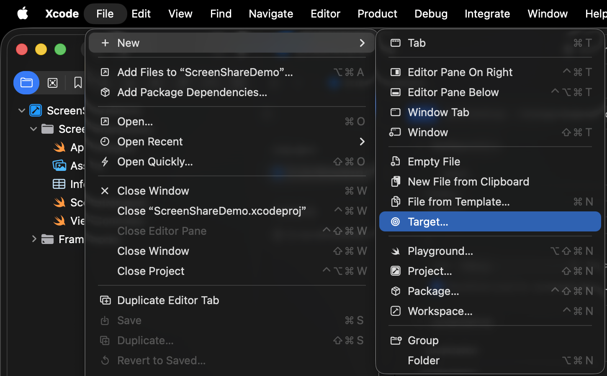
3. 在弹出的模板选择窗口中，搜索并选择 **Broadcast Upload Extension** 模板，点击 **Next**。

   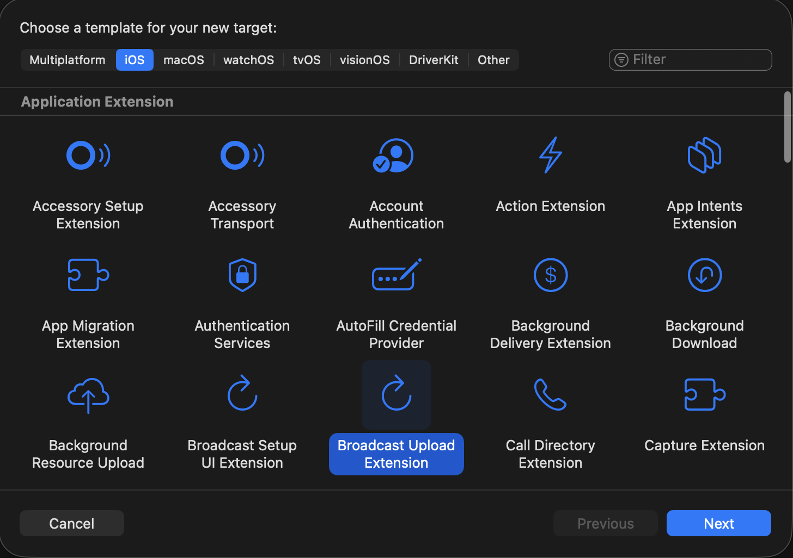
4. 填写 Extension 名称（如 `WemeetExtension`），确认 Bundle ID 是否符合第 [3.2](#32-extension-bundle-id-命名规则) 节的命名规则，点击 **Finish** 完成创建。

   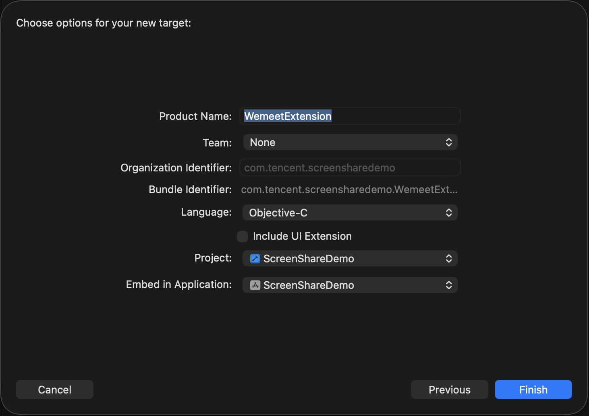
5. 创建完成后，工程导航栏中会新增一个 Extension Target，并自动生成 `SampleHandler.h` / `SampleHandler.m` 等默认文件。

   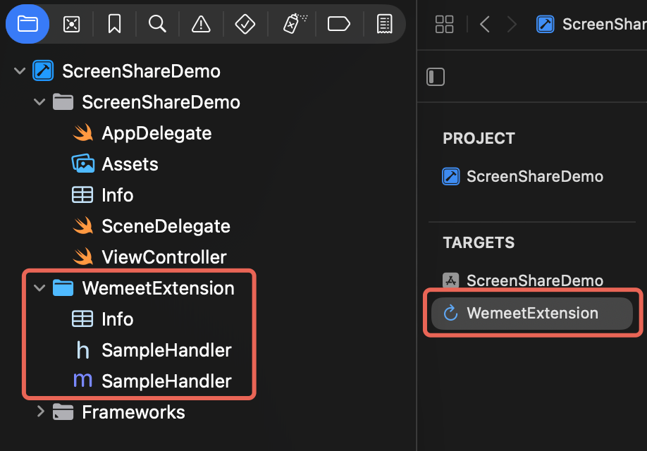

### 4.2 设置 Extension 支持的最低 iOS 版本

在 Extension 对应 Target 的 **General** 页签中，将 **Minimum Deployments** 设置为 **12.0**（与第 [2](#2-环境要求) 节的环境要求一致）。

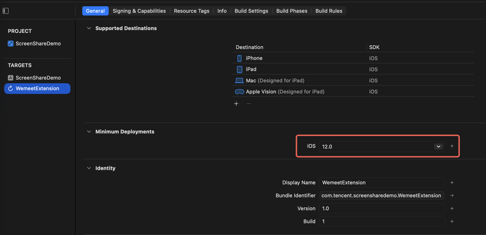

### 4.3 确认 Extension 的 Bundle ID

在 Extension Target 的 **Signing & Capabilities** 页签中，核对 **Bundle Identifier** 字段（该字段与 General 页签中的 Bundle Identifier 保持同步），确保其符合第 [3.2](#32-extension-bundle-id-命名规则) 节选定的命名规则（默认规则或自定义规则）。

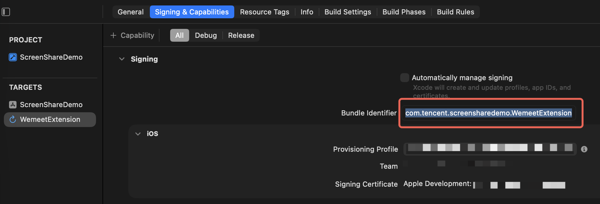

### 4.4 添加 SDK 依赖库到 Extension Target

1. 在 TARGETS 列表中选中屏幕共享 Extension（如 `WemeetExtension`）。
2. 打开 **General** 页签，在 **Frameworks, Libraries, and Embedded Content** 区域中，点击 **+**，添加 SDK 包中提供的屏幕共享扩展依赖库（如 `TencentMeetingBroadcastExtension.framework`）。

   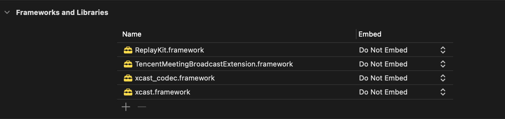
3. 将该依赖库的 **Embed** 选项设置为 **Do Not Embed**（该库已随主 App 一并打包，Extension 无需重复内嵌，否则可能导致符号冲突或包体积异常）。

   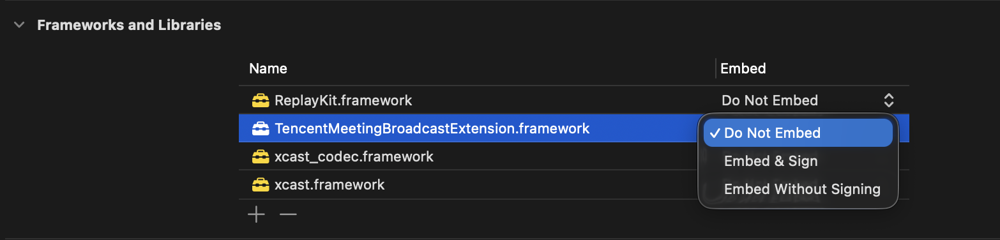

### 4.5 集成 SampleHandler 代码

`SampleHandler` 是 Broadcast Upload Extension 的入口类，系统 ReplayKit 会通过它回调屏幕录制生命周期方法（开始/暂停/恢复/结束）以及持续推送采集到的视频/音频帧（`processSampleBuffer`）。

1. 删除 Xcode 自动生成的默认 `SampleHandler.h` / `SampleHandler.m` 内容。
2. 从 SDK Demo 工程的 Extension 目录中，将官方提供的 `SampleHandler.h` 和 `SampleHandler.m` 文件复制到当前 Extension Target 中，并确认已勾选加入到 Extension Target（Target Membership）。

   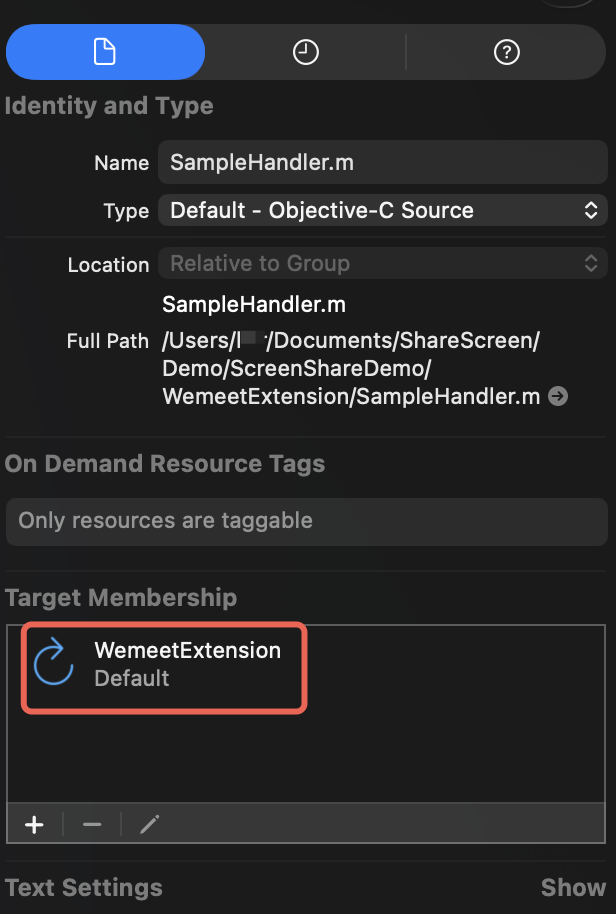
3. `SampleHandler` 内部已实现以下 ReplayKit 生命周期方法，接入方通常无需修改：
   | 方法                               | 作用                                                                    |
   | -------------------------------- | --------------------------------------------------------------------- |
   | `broadcastStartedWithSetupInfo:` | 屏幕广播开始时回调，用于初始化推流通道                                                   |
   | `broadcastPaused`                | 广播暂停时回调，停止投递采样数据                                                      |
   | `broadcastResumed`               | 广播恢复时回调，恢复投递采样数据                                                      |
   | `broadcastFinished`              | 广播结束时回调，释放资源                                                          |
   | `processSampleBuffer:withType:`  | 持续回调，携带视频帧（`RPSampleBufferTypeVideo`）或音频帧（App 音频/麦克风音频），交由 SDK 内部编码上传 |
4. 若SampleHandler 中包含App Group 相关的初始化标识（用于主 App 与 Extension 进程间共享状态），请按SDK Demo 中的注释，替换为你自己在开发者后台申请的 App Group（如涉及）。

   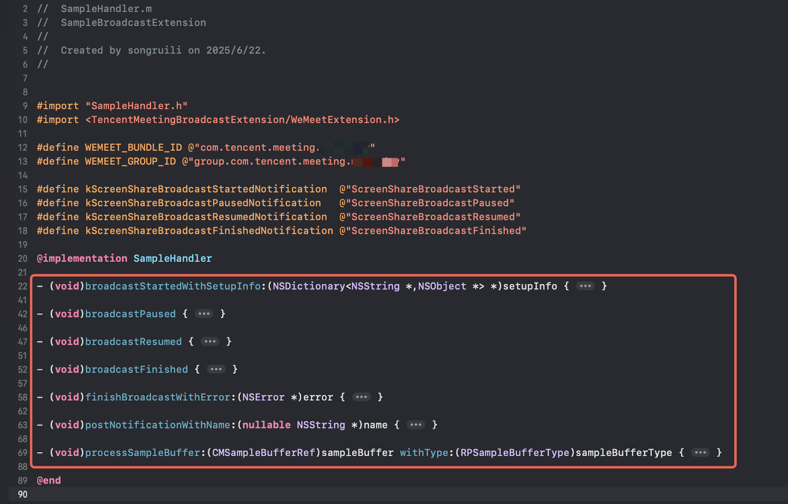

### 4.6 检查 Extension 的 Info.plist 配置

打开 Extension 的 `Info.plist`，确认 `NSExtension` 相关配置未被误改（默认由模板生成，一般无需手动修改）：

- `NSExtensionPointIdentifier` 应为 `com.apple.broadcast-services-upload`
- `RPBroadcastProcessMode` 建议保持默认的 `RPBroadcastProcessModeSampleBuffer`

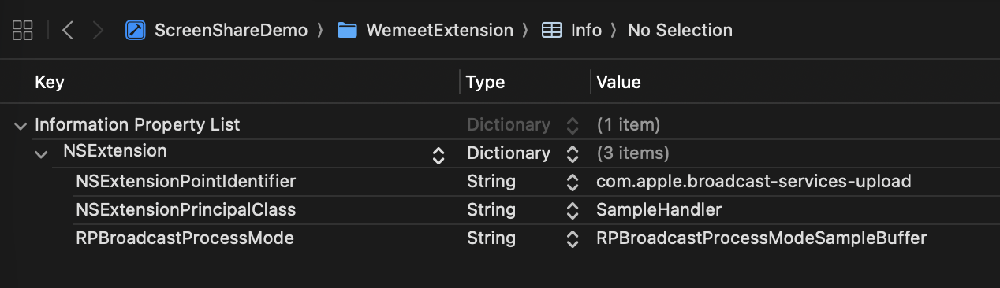

### 4.7 编译运行，验证效果

1. 选择主 App Target 进行 **Build & Run**。
2. 完成登录、入会后，在会中界面找到"共享屏幕"入口并点击。
3. 系统会弹出屏幕录制授权/选择面板，选择当前 App 对应的 Extension（按照第 4.1 步命名的名称），点击"开始直播/开始广播"。

   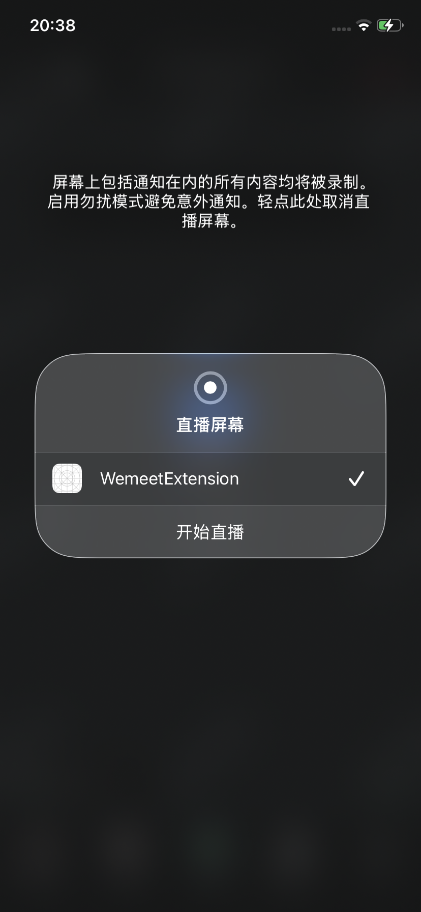
4. 首次使用时，系统会请求屏幕录制权限，用户同意后开始共享；会中其他参会者应能看到实时画面更新。

   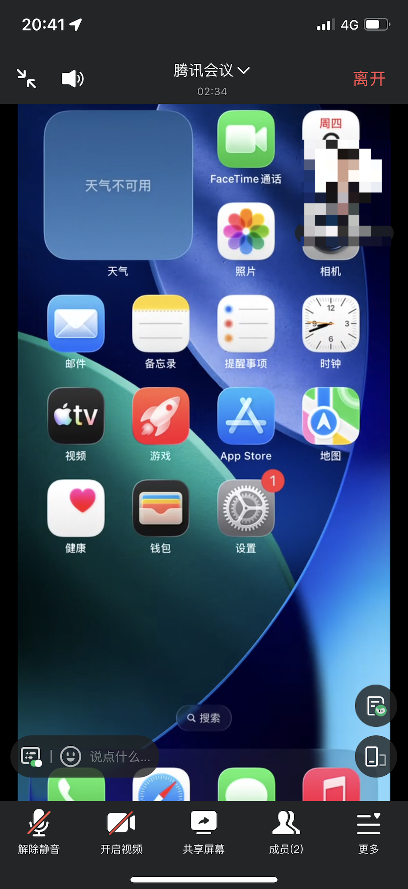

---

## 5. 初始化时指定屏幕共享扩展（可选）

若第 [3.2](#32-extension-bundle-id-命名规则) 节选择的是**自定义 Bundle ID 方案**（SDK 版本 ≥ 3.12.1），需要在 SDK 初始化参数中显式指定 Extension 的 Bundle ID，SDK 才能正确找到并启动它：

```objc
TMInitParam *initParams = [TMInitParam new];
initParams.sdkId = @"";
initParams.sdkToken = @"";
initParams.appName = @"";
// 自定义屏幕共享扩展的 Bundle ID（与实际创建的 Extension Target 一致）
initParams.extensionBundleId = @"com.tencent.screensharedemo.WemeetExtension"; // 仅做示例

[[TencentMeetingSDK instance] initialize:initParams delegate:self];
```

> 若使用默认命名规则（`主App BundleID + .WemeetExtension`），可省略 `extensionBundleId` 字段，SDK 会按默认规则自动查找。

---

## 6. 验证与调试

集成完成后，建议按以下清单逐项验证：

1. 主 App 与 Extension 的 Bundle ID 命名符合规则（默认规则或已在初始化时正确指定 `extensionBundleId`）。
2. Extension 的最低支持版本已设置为 iOS 12.0。
3. Extension 已正确依赖 SDK 提供的 Framework，且 Embed 设置为 Do Not Embed。
4. `SampleHandler` 已替换为 SDK Demo 提供的实现（或已正确整合多SDK 逻辑）。
5. 真机上可以在系统广播选择面板中看到该 Extension，并能正常开始/结束共享。
6. 会议中其他参会者能正常看到共享画面，画面无明显卡顿、花屏。

---

## 7. 常见问题 FAQ

**Q1：共享屏幕点击后倒计时3 秒，随后没有画面更新，共享无效？**

A：优先检查 Extension 命名与依赖配置：

- 建议使用较为独特的扩展名（如 `WemeetExtension`），避免使用系统默认生成的通用扩展名（如 `BroadcastUploadExtension`），因为它容易与工程中其他 SDK 已存在的同名扩展冲突。
- 扩展的 Bundle ID 需符合"主 App Bundle ID + .WemeetExtension"的规则（或已通过 `extensionBundleId` 指定自定义规则），否则 SDK 无法定位到该 Extension 并唤起它。

**Q2：App 中已经集成了其他视频会议 SDK，接入本SDK 后屏幕共享有时无法正常工作？**

A：iOS 系统限制同一个 App 只能存在一个生效的 Broadcast Upload Extension。请统一使用同一个 Extension，并在初始化参数中通过 `extensionBundleId` 指定其 Bundle ID，避免重复创建导致相互覆盖。

**Q3：Archive 后通过 App Store Connect 导出的产物启动崩溃，但 Ad Hoc 打包安装正常？**

A：多为打包过程中修改了 SDK 内部 Framework 的版本号，导致相应模块未被正确加载。请检查打包设置中**不要勾选** "Manage Version and Build Number" 选项。

**Q4：初始化和登录都收到成功回调，但调用入会接口后既没有弹框也没有收到任何回调？**

A：请确认没有在 SDK `initialize` 之前调用了任何业务接口（如提前调用了账号服务的 `isLogin`），账号/会议相关服务均为单例，若在初始化前调用，会导致后续监听未正确生效。所有 SDK 接口需在初始化完成之后调用。
