# iOS屏幕共享接入文档

## 概述

本文档介绍如何在iOS应用中集成腾讯会议SDK的屏幕共享功能。iOS屏幕共享功能基于Apple的ReplayKit框架实现，通过Broadcast Upload Extension进行屏幕内容采集。

## 技术原理

由于iOS系统的安全限制，主应用无法直接进行屏幕采集。屏幕共享功能的实现原理如下：

- **架构设计**：利用iOS原生的`ReplayKit`框架创建`Broadcast Upload Extension`（录屏扩展进程）
- **数据采集**：扩展进程由系统启动，负责采集屏幕内容
- **数据传输**：扩展进程将采集的屏幕数据传输给主应用
- **内容推送**：主应用接收扩展进程的屏幕数据并在会议中进行屏幕共享

### 集成要求
- iOS 12.0及以上版本（屏幕共享扩展要求）
- 已完成宿主App会议SDK集成

## 集成步骤

### 1. 创建Broadcast Upload Extension
1. 在Xcode中打开项目，选择`File -> New -> Target...`  

2. 选择`Broadcast Upload Extension`，点击Next  
    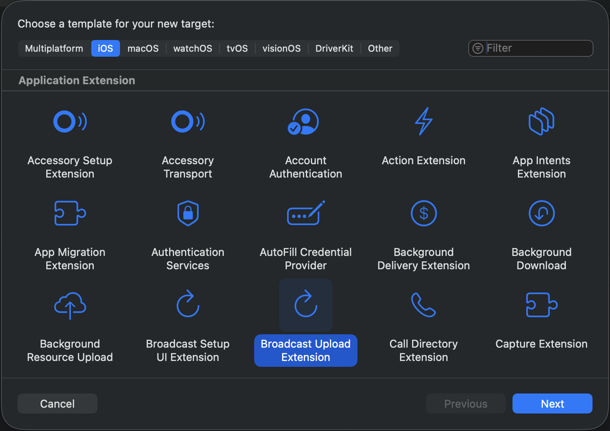

3. 配置Extension信息：  
    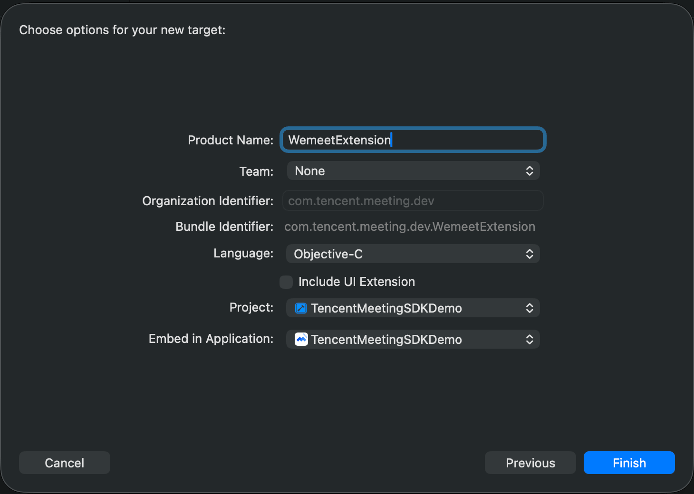
    - Product Name: 建议使用`WemeetExtension`(也可以自定义，然后手动修改bundle id)
    - Language: 建议选中`Objective-C`

4. 点击Finish完成创建

### 2. 配置Bundle ID

**重要：Extension的Bundle ID必须遵循规则：**
Exntension的Bundle ID必须以主应用的Bundle ID为前缀，并且以`.WemeetExtension`为后缀
- 例如主应用Bundle ID：`com.yourcompany.yourapp`
- Extension Bundle ID应该是：`com.yourcompany.yourapp.WemeetExtension`

### 3. 集成TencentMeetingBroadcastExtension.framework
   1. 在Extension Target的`General -> Frameworks and Libraries`中：点击`+`按钮
    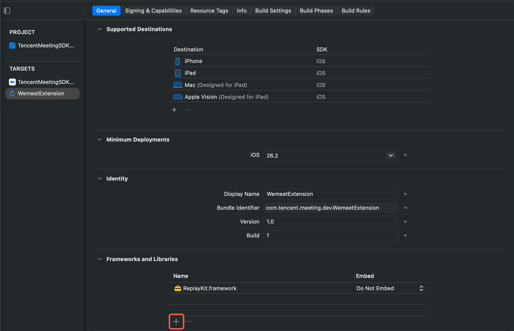
   2. 点击左下角`Add Other...`, 点击弹框的`Add Files...`
    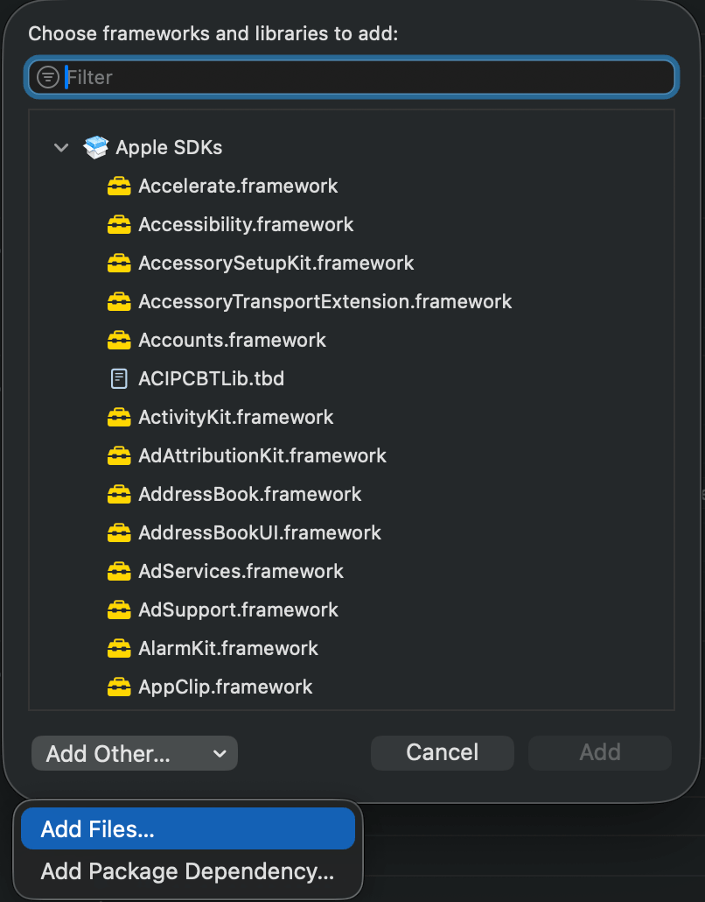
   3. 添加`TencentMeetingBroadcastExtension.framework`
    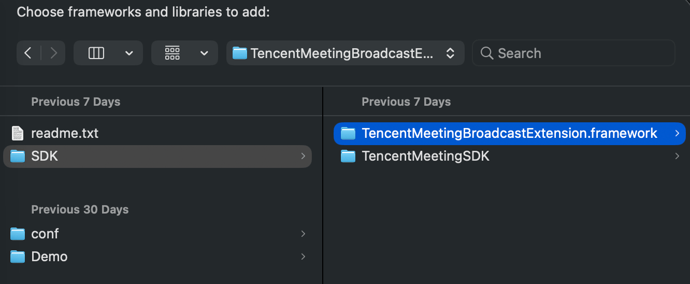
   4. 将Framework的`Embed`设置为`Do Not Embed`
    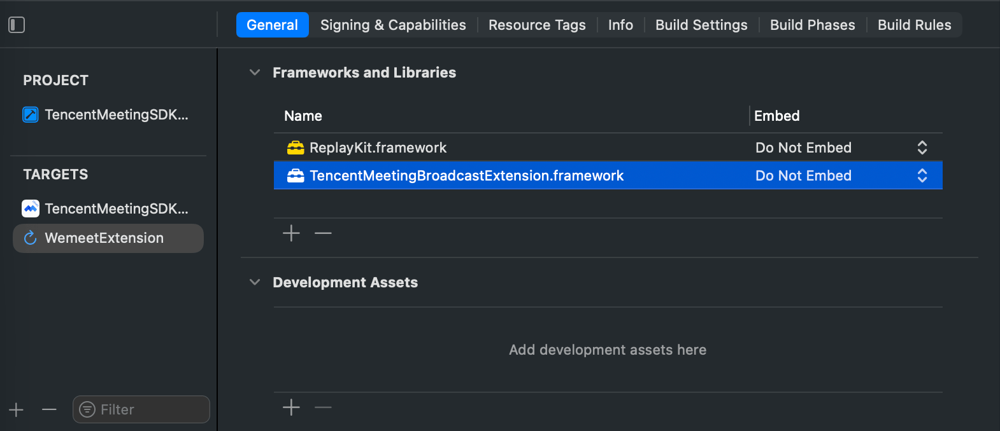

### 4. 复制SampleHandler

从Demo中复制`SampleHandler.m`和`SampleHandler.h`文件到Extension目录，覆盖原有文件
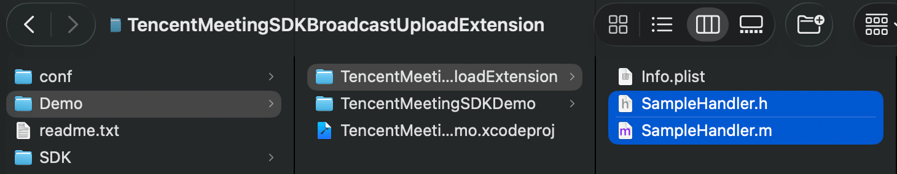

### 5. 集成后验证
1. 屏幕共享只能在会议中使用，需要先加入会议
    - 点击底部工具栏`共享屏幕`
    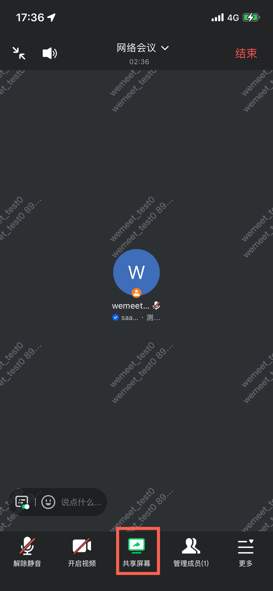
    - 在弹出的ActionSheet中点击`共享屏幕`
    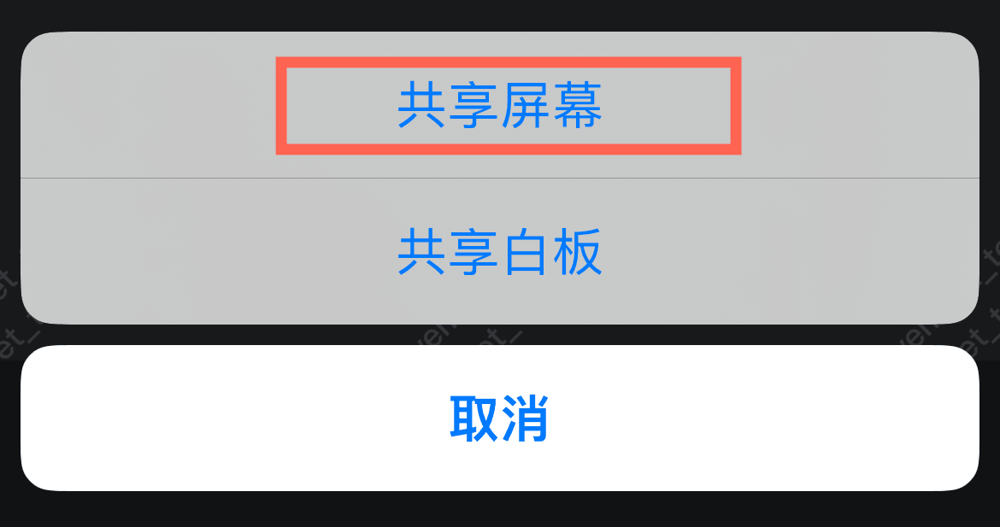
2. 会中共享屏幕时，用户需要从弹出的录屏浮层手动点击`开启直播`，浮层会根据bundle id自动选中Extension
    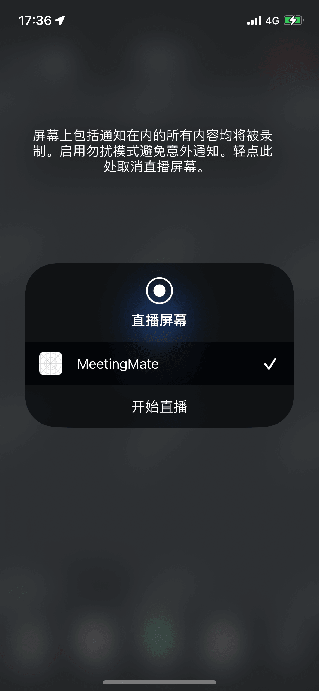
3. 启动屏幕共享后：系统会在屏幕顶部显示红色状态栏，或左上角显示录制红点，提示用户正在录屏。会中页面会进入共享屏幕状态
    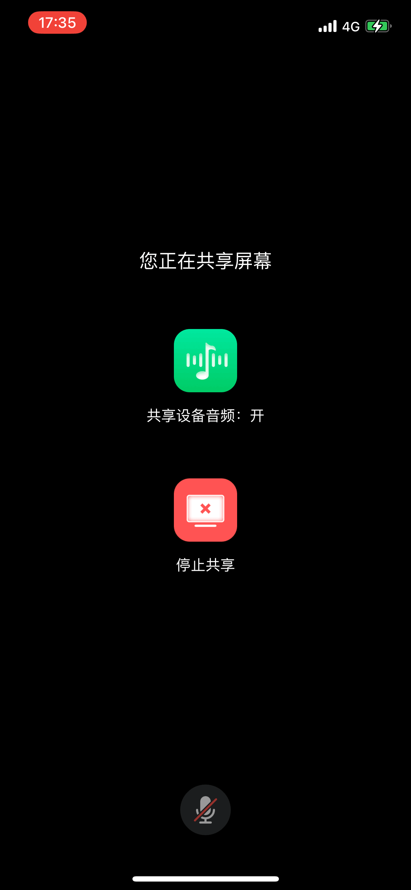
4. 结束屏幕共享有两种方式：
    - 点击屏幕顶部红色状态栏/左上角红点，弹框点击`停止`
    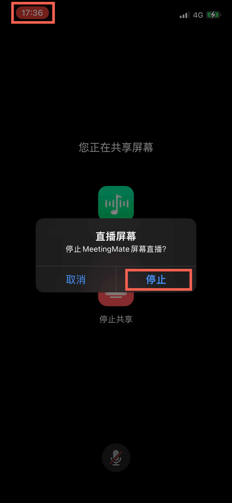
    - 会中页面点击停止共享
5. 结束屏幕共享后：
    - 屏幕顶部红色状态栏/左上角红点消失
    - 会中页面退出共享屏幕状态

## 版本历史

| 版本 | 日期 | 更新内容 |
|------|------|----------|
| 1.0.0 | 2026-01-28 | 初始版本，基于腾讯会议SDK3.30版本编写 |

## 技术支持

如需技术支持，请联系腾讯会议SDK技术团队或查阅详细API文档。

## 参考资料

- [iOS接入手册](./iOS接入手册.md)
- [接入问题FAQ](./接入问题FAQ.md)
- [TencentMeetingSDK（TMSDK）接口参考文档](../Common/TencentMeetingSDK（TMSDK）接口参考文档.md)