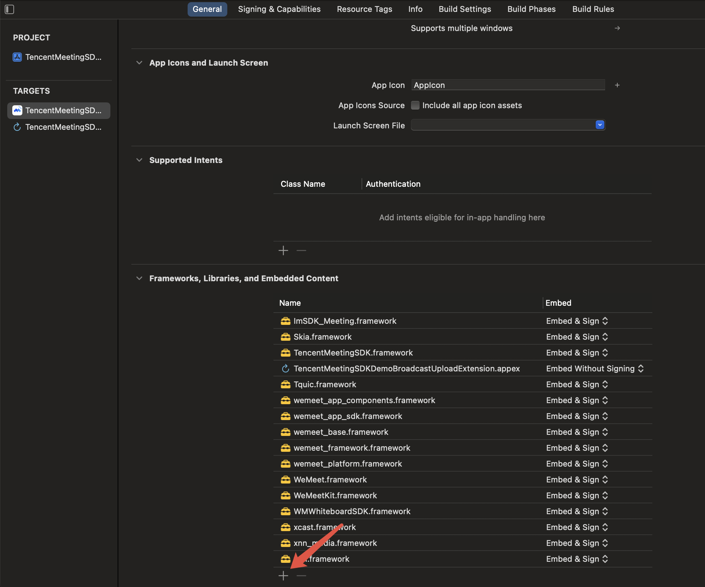
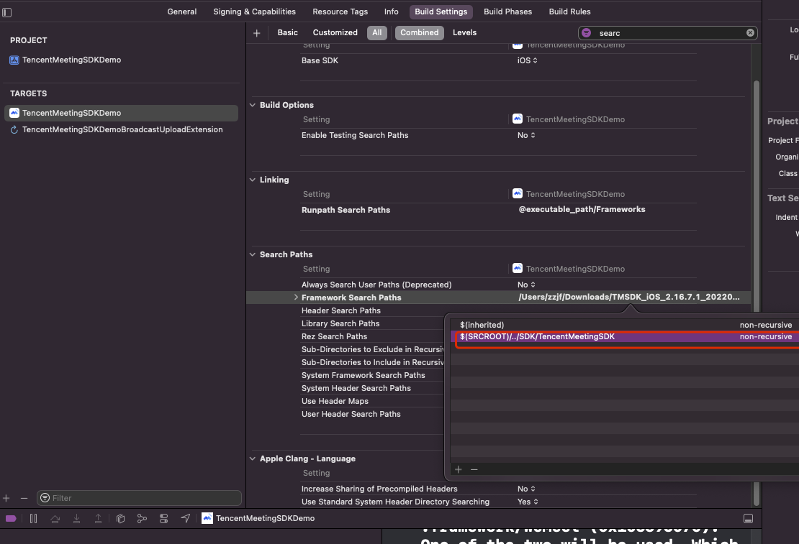

# Demo使用

## 1. 获取SDK
请联系售后人员获得SDK

## 2. 打开Demo工程
打开Demo/TencentMeetingSDKDemo.xcodeproj
## 3. 配置SDK账号

在Demo工程中对应源码配置SDK Id、SDK Token、SSO Url，账号信息可以联系腾讯会议工作人员；

| 配置      | Demo源码               |      |
| --------- | ---------------------- | ---- |
| SDK Id    |  ViewController+Init.m  |      |
| SDK Token |  ViewController+Init.m  |      |
| SSO Url   |  ViewController+Login.m |      |

## 4. 配置开发者账号

去苹果开发者网站，配置开发者账号，需要配置SDK Demo和SDK Demo屏幕共享扩展两个Identifiers，权限Access WiFi Infomation；

注意(因为主App启动屏幕共享扩展的需要根据扩展的Bundle Id来决定启动那个扩展)：
SDK Demo的bundle id为XXX.XXX.XXX
SDK Demo屏幕共享扩展的bundle id规定为XXX.XXX.XXX.WemeetExtension

## 5. Xcode点击运行


# SDK接入

## 1. 环境版本提示

+ SDK版本：V2.18
+ 支持 iOS 10.0+
+ 屏幕共享扩展支持 iOS 12.0+

## 2. 配置Framework
> 腾讯会议SDK低于3.6.1版本，请参看第8步

- 工程的主target，在General、Frameworks, libraies, and Embedded Content，将腾讯会议的SDK（路径在SDK/TencentMeetingSDK/)集成到工程中，注意每个动态库设置为Embed & Sign。




- 配置Framework搜索路径



## 3. 初始化

````
- (void)SDKInit:(NSString *)SDKId SDKToken:(NSString *)SDKToken {
    TMInitParam* initParams = [TMInitParam new];
    initParams.sdkId = @"";
    initParams.sdkToken = @"";
    initParams.appName = @"";
    [[TencentMeetingSDK instance] initialize:initParams delegate:self];
    
    [[[TencentMeetingSDK instance] getInMeetingService] enableInviteCallback:YES show:YES;
    [[[TencentMeetingSDK instance] getInMeetingService] enableMeetingInfoCallback:YES show:YES];
}

#pragma mark - TMSDKProtocol
- (void)onSDKInitializeResult:(TMSDKResult)code msg:(NSString *)msg; {
    NSLog(@"SDK init complete, code is %ld", code);
    if (code == kTMSDKErrorSuccess) {
        [[[TencentMeetingSDK instance] getInMeetingService] setDelegate:self];
        [[[TencentMeetingSDK instance] getPreMeetingService] setDelegate:self];
    }
}

````

## 4.登录和登出

```

- (void)login:(NSString *)SSOUrl forceKickOtherDevice:(BOOL)forceKickOtherDevice {
    [[[TencentMeetingSDK instance] getAccountService] login:SSOUrl forceKickOtherDevice:YES];
}

- (void)logout {
    [[[TencentMeetingSDK instance] getAccountService] logout];
}

#pragma mark - TMAuthenticationProtocol
- (void)onLogin:(TMSDKResult)code msg:(NSString *)msg {
    NSLog(@"SDK login complete, code is %ld, msg is %@", (long)code, msg);
    if (code == kTMSDKErrorSuccess) {
        self.loginButton.enabled = NO;
        self.logoutButton.enabled = YES;
    }
}

- (void)onLogout:(TMLogoutType)type code:(TMSDKResult)code msg:(NSString *)msg {
    NSLog(@"SDK logout complete, type is %ld, code is %ld", type, (long)code);
    if (code == kTMSDKErrorSuccess) {
        self.loginButton.enabled = YES;
        self.logoutButton.enabled = NO;
    }
}

```

## 5. 入会和离会

```
- (void)joinMeeting:(NSArray<UITextField *> *)textFields {
    TMJoinParam *joinParam = [TMJoinParam new];
    joinParam.meetingCode = @"";
    joinParam.userDisplayName = @"";
    joinParam.password = @"";
    joinParam.inviteUrl = @"";
    joinParam.cameraOn = YES;
    joinParam.micOn = YES;
    joinParam.speakerOn = YES;
    joinParam.faceBeautyOn = YES;
    [[[TencentMeetingSDK instance] getPreMeetingService] joinMeeting:joinParam];
}

- (void)leaveMeeting:(NSArray<UITextField *> *)textFields {
    [[[TencentMeetingSDK instance] getInMeetingService] leaveMeeting:YES];
}

#pragma mark - TMPreMeetingProtocol
- (void)onJoinMeeting:(TMSDKResult)code msg:(NSString *)msg meetingCode:(NSString *)meetingCode {
    NSLog(@"SDK join complete, code is %ld, msg is %@, meetingCode is %@", (long)code, msg, meetingCode);
    if (code != kTMSDKErrorSuccess) {
    }
}

- (void)onShowScreenCastViewResult:(TMSDKResult)code msg:(NSString *)msg {
    NSLog(@"SDK show screen cast complete, code is %ld, msg is %@", (long)code, msg);
    if (code != kTMSDKErrorSuccess) {
    }
}

- (void)onActionResult:(TMSDKActionType)actionType code:(TMSDKResult)code msg:(nonnull NSString *)msg {
    NSString *content;
    switch (actionType) {
        case kTMSDKActionTypeShowPreMeetingView:
            content = [NSString stringWithFormat:@"展示会前界面结果：%ld 描述信息：%@", (long)code, msg];
            break;
        case kTMSDKActionTypeShowScreenCastView:
            content = [NSString stringWithFormat:@"无线投屏结果：%ld 描述信息：%@", (long)code, msg];
            break;
        case kTMSDKActionTypeShowHistoricalMeetingView:
            content = [NSString stringWithFormat:@"展示历史会议界面结果：%ld 描述信息：%@", (long)code, msg];
            break;
        case kTMSDKActionTypeShowMeetingDetailView:
            content = [NSString stringWithFormat:@"展示会议详情结果：%ld 描述信息：%@", (long)code, msg];
            break;
        case kTMSDKActionTypeShowJoinMeetingView:
            content = [NSString stringWithFormat:@"展示加入会议界面结果：%ld 描述信息：%@", (long)code, msg];
            break;
        case kTMSDKActionTypeShowScheduleMeetingView:
            content = [NSString stringWithFormat:@"展示预定会议界面结果：%ld 描述信息：%@", (long)code, msg];
            break;
        case kTMSDKActionTypeShowMeetingSettingView:
            content = [NSString stringWithFormat:@"展示会议设置界面结果：%ld 描述信息：%@", (long)code, msg];
            break;
    }
    NSLog(@"onActionResult, action is %ld, code is %ld, msg is %@",(long)actionType, (long)code, msg);
    if (code != kTMSDKErrorSuccess) {
        [self showMessageOnCurrentVC:[NSString stringWithFormat:@"onActionResult, action is %ld, code is %ld, msg is %@",(long)actionType, (long)code, msg]];
    }

#pragma mark - TMInMeetingProtocol
- (void)onLeaveMeeting:(TMLeaveType)type code:(TMSDKResult)code msg:(NSString *)msg meetingCode:(NSString *)meetingCode {
    NSLog(@"SDK leave complete, type is %ld, code is %ld, meetingCode is %@", (long)type, (long)code, meetingCode);
    if (code != kSDKErrorSuccess) {
        [self showAlert:[NSString stringWithFormat:@"SDK leave complete, type is %ld, code is %ld, meetingCode is %@", (long)type, (long)code, meetingCode]];
    }
}

- (void)onInviteMeeting:(NSString *)invite_info {
    NSLog(@"invite_info: %@", invite_info);
    [self showMessage:invite_info];
}

- (void)onShowMeetingInfo:(NSString *)meeting_info {
    NSLog(@"meeting_info: %@", meeting_info);
    [self showMessage:meeting_info];
}
```

## 6. 屏幕共享扩展接入

- 新建Broadcast Upload Extesion，注意最低支持iOS版本为iOS 12.0


- 设置屏幕共享扩展依赖TencentMeetingBroadcastExtension.framework，主页Embed设置为Do Not Embed


屏幕共享扩展Bundle Id规则:

1.使用默认的Bundle id

SDK Demo的bundle id为XXX.XXX.XXX

SDK Demo屏幕共享扩展的bundle id规定为XXX.XXX.XXX.WemeetExtension

2.使用自定义的Bundle id（SDK版本大于3.12.1）

自定义屏幕共享拓展的bundle id为XXX.XXX.XXX

初始化SDK时，设置TMInitParam的extensionBundleId为XXX.XXX.XXX

- 从Demo中将SampleHandler.m和SampleHandler.h复制过来

- 运行，点击屏幕共享

## 7.Bugly接入(2.18.2新增)

> 适用于腾讯会议SDK版本不小于2.18.2

​	SDK新增bugly crash 共享上报机制，目的是为了更方便的监控SDK 内部的crash，先决条件是用户必须接入了bugly。

​	共享上报机制并不会收集宿主应用的crash信息，只是借助于接入用户的APP 中的bugly 上报机制，利用bugly 提供的一项特性，将用户bugly crash 上报中的属于SDK部分的crash 上报给SDK 开发者。便于SDK能快速获得SDK的异常问题，早介入排查，早修复问题。

​	使用流程：1.确定应用已经接入bugly 2.提供appid(指bugly qq产品上显示的appid) 给技术支持。3.提供bundle id 给技术支持。

## 8.支持iPad分屏

参考Demo中的WeMeetSceneDelegate.h和WeMeetSceneDelegate.m，依次调用appMultiWindowLayoutTypeChangedFromSize、discardSceneSession和discardSceneSessionsExcept。

```
- (void)windowScene:(UIWindowScene *)windowScene
didUpdateCoordinateSpace:(id<UICoordinateSpace>)previousCoordinateSpace
interfaceOrientation:(UIInterfaceOrientation)previousInterfaceOrientation
    traitCollection:(UITraitCollection *)previousTraitCollection {
    if (![[self class] isIpadDevice]) {
        return;
    }
    
    if (windowScene.windows.count == 0) {
        return;
    }
    CGSize toSize = windowScene.coordinateSpace.bounds.size;
    CGSize fromSize = previousCoordinateSpace.bounds.size;
    if (CGSizeEqualToSize(toSize, fromSize)) {
      return;
    }
    NSLog(@"%@", [NSString stringWithFormat:@"didUpdateCoordinateSpace from [%@] to [%@]",
                                        NSStringFromCGSize(fromSize), NSStringFromCGSize(toSize)]);
    
    /// 1. viewWillTransitionToSize:withTransitionCoordinator:
    /// 2. windowScene:didUpdateCoordinateSpace:interfaceOrientation:traitCollection:
    /// 3. send change to vm layer
    /// 仅App主window会发出通知。个别场景需要用到。
    [[TencentMeetingSDK instance] appMultiWindowLayoutTypeChangedFromSize:fromSize toSize:toSize];
}
```

## 9.低版本配置Framework

> 适用于腾讯会议SDK版本低于3.6.1

在App的主工程的主target中添加TencentMeetingSDK.framework，设置Embed为Embed & Sign；


在App的主工程的主target中Build Phases中添加New Run Script Phase


新添加的Phase要在Embed Frameworks后面，添加以下脚本

```
chmod +x ./handler.sh && ./handler.sh
```

handlers.sh脚本在Demo中有一份，handlers.sh脚本要跟xcodeproj文件放在一个目录下，handler.sh内容为

```
PRODUCTS_DIR=${TARGET_BUILD_DIR}/${WRAPPER_NAME}
TencentMeetingSDKFrameworksPath=${PRODUCTS_DIR}/Frameworks/TencentMeetingSDK.framework/Frameworks

# resign Frameworks
function resign_embed_frameworks(){
  for f in $(find ${1} -name '*.framework')
  do
    codesign --force --sign "${EXPANDED_CODE_SIGN_IDENTITY}" --preserve-metadata=identifier,entitlements --timestamp=none "$f"
    if [ -d ${f}/'Frameworks' ]; then
      resign_embed_frameworks ${f}/'Frameworks'
    fi
  done
}

# copy to
if [[ -d ${TencentMeetingSDKFrameworksPath} ]]; then
  cp -r ${TencentMeetingSDKFrameworksPath}/* ${PRODUCTS_DIR}/Frameworks
  rm -rf ${TencentMeetingSDKFrameworksPath}
  resign_embed_frameworks ${PRODUCTS_DIR}
fi
```
# 更多功能

请参考《TencentMeetingSDK（TMSDK）接口参考》文档

