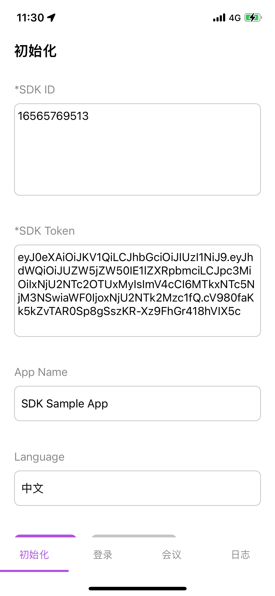
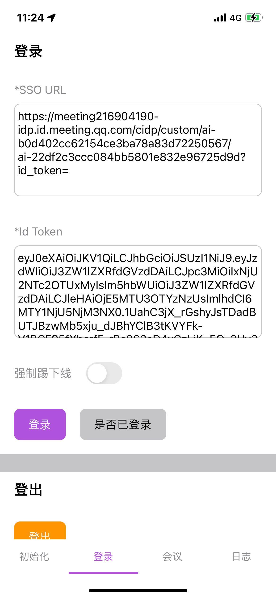
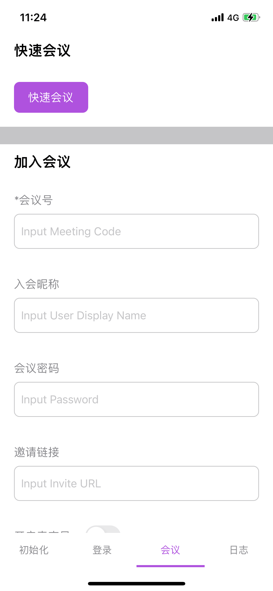
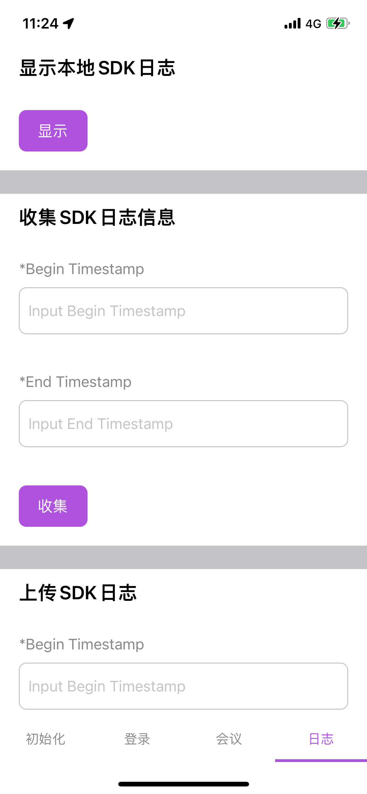

# 一分钟跑通iOS端SDK Sample

## 环境要求
| 环境和工具 | 要求 | 备注 |
|-|-|-|
|MacOS| 推荐Sonoma 14.6.1以上 |
|Xcode| 推荐Xcode 15.4以上版本 | 项目文件为Xcode14版本 |
|iOS| iOS 13以上，arm64 |  |
|Cocoapods| 推荐1.16.2 |  |

## 第三方库
|第三方库|版本|
|-|-|
|Masonry|1.1.0|
|MBProgressHUD|1.2.0|
|IQKeyboardManager|6.5.11|

## 运行步骤
### 1. 解压SDK包后的目录结构
主要文件和目录如下：
|文件/目录|说明|
|-|-|
|SDKSample/iOS/| 演示工程目录 |
|readme.txt| 说明文件 |
|SDK/TencentMeetingSDK/| SDK主App Framework |
|SDK/TencentMeetingBroadcastExtension.framework| 录屏Extension Framework |

### 2. 配置工程及运行SDKSample
1. Terminal转到`SDKSample/iOS`目录
   > cd ${SDK_DIR}/SDKSample/iOS
2. 使用Cocoapods安装三方组件
   > pod install
3. 打开演示项目
   > open SDKSample.xcworkspace
4. 设置证书
   修改`SDKSample`和`SampleBroadcastExtension` Target的`Signing & Capabilities`设置，更换`Bundle Identifier`和证书。需要注意: Extension的bundle id必须为 SDKSample bundle id + ".WemeetExtension"
5. 连接手机并选为Destination, 快捷键`CMD+R`运行示例工程

### 3.运行效果图
1. 初始化
2. 登录
3. 会议
4. 日志

## SDK Sample工程结构说明
代码结构：
|目录|说明|
|-|-|
|Builder| 工厂类，组装表格Cell和数据 |
|Cell| 各种样式的Cell |
|Model| 表格的数据模型：表格、分节，行 |
|View| 自定义视图，tabBar |
|ViewController| 页面控制器 |

主要页面：
|页面控制器类|说明|
|-|-|
|InitializeViewController| SDK初始化功能 |
|LoginViewController| SDK登录功能 |
|LogViewController| SDK日志功能 |
|MeetingViewController| SDK会议功能 |
|MainTabBarController| 集成页面容器 |
