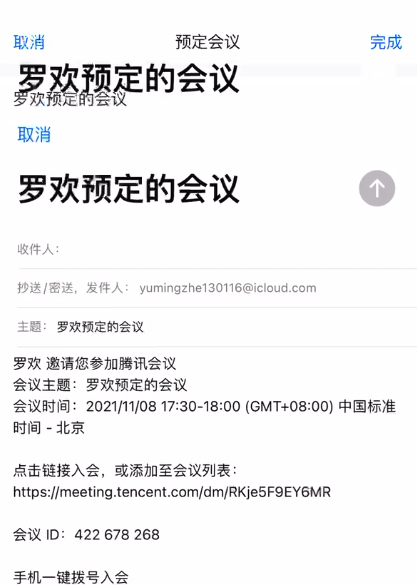

### SaaS SDK 接入问题 FAQ

### 2.18.1

Q1.接入腾讯会议SDK的应用，Archive后的产物，点击Distribute APP，使用AppStore Connect导出的启动时会崩溃。但是用Adhoc打包ipa安装又是正常的。

A：根本原因是打包过程中，修改了SDK内部的framework的版本号，导致了相对应的部分模块没有加载而crash。打包时请注意下面的选项：Manage Version and Build Number。


Q2.初始化和登录都有收到成功回调，调用入会接口没看弹框也没收到回调

A: 未初始化SDK前，先调用了accountService的isLogin函数，导致accountService里面的监听在第一次初始化的时候未生效，而accountService是一个单例，监听的方法写在了后续SDK init时也不会调用。请检查是否在TMSDK init方法前调用AccountService的方法，如isLogin方法，所有的SDK方法需要在TMSDK初始化之后才能使用。

Q3.接入SDK 后，会中横竖屏问题。

A: 横竖屏设置的优先级顺序是：Appdelegate/Info.plist=>TabBarController=>NavigationController=>ViewController。目前SDK在NavigationController=>ViewController这个已经设置支持会中页面MeetingViewController转屏,需要在Info.plist和TabBarController设置支持转屏
```

1、在你们的自定义的UITabBarController，添加以下方法
// 支持的方向
- (UIInterfaceOrientationMask)supportedInterfaceOrientations {
    UIViewController *topVC = self.selectedViewController;
    NSMutableArray<NSString *> *classList = [NSMutableArray new];
    [classList addObject:@"MeetingViewController"];
    [classList addObject:@"UserInfoViewController"];
    [classList addObject:@"HandsupViewController"];
    [classList addObject:@"MeetingSettingViewController"];
    [classList addObject:@"WMFaceBeautySettingViewController"];
    [classList addObject:@"RedPacketSendViewController"];
    [classList addObject:@"RedPacketDetailViewController"];
    [classList addObject:@"WMWatchLiveViewController"];
    BOOL needLandscape = NO;
    for (NSString *item in classList) {
        if ([topVC isKindOfClass:NSClassFromString(item)]) {
            needLandscape = YES;
            break;
        }
    }
    if (needLandscape) {
        return UIInterfaceOrientationMaskAll;
    } else {
        return UIInterfaceOrientationMaskPortrait;
    }
}
2、在你们的自定义的UITabBarController，添加以下方法
- (BOOL)shouldAutorotate {
    UIViewController *topVC = self.selectedViewController;
    NSMutableArray<NSString *> *classList = [NSMutableArray new];
   	[classList addObject:@"MeetingViewController"];
    [classList addObject:@"UserInfoViewController"];
    [classList addObject:@"HandsupViewController"];
    [classList addObject:@"MeetingSettingViewController"];
    [classList addObject:@"WMFaceBeautySettingViewController"];
    [classList addObject:@"RedPacketSendViewController"];
    [classList addObject:@"RedPacketDetailViewController"];
    [classList addObject:@"WMWatchLiveViewController"];
    BOOL needLandscape = NO;
    for (NSString *item in classList) {
        if ([topVC isKindOfClass:NSClassFromString(item)]) {
            needLandscape = YES;
            break;
        }
    }
    return needLandscape;
}
```


Q4.预定会议后的邮件UI异常问题。



A:检查下主APP 中是否含有**FDFullscreenPopGesture** 这个库

Q5.共享屏幕没反应，倒计时3秒  然后没有录屏效果。

A：请检查extension。建议用WemeetExtension，原来的扩展名(BroadcastUploadExtension)太通用，有可能会重名。需要后缀改成WemeetExtension，扩展的后缀要是主app的bundle id + .WemeetExtension

Q6.masonry 导致的crash问题。

A: 使用这个版本，  pod 'Masonry', :git => 'https://github.com/SnapKit/Masonry.git', :commit => '8bd77ea' # fixbug use this commit

Q7.crash 日志：`Terminating app due to uncaught exception 'UIViewControllerHierarchyInconsistency', reason: 'child view controller:<UserInfoPopoverViewController: 0x10c01e460> should have parent view controller:(null) but actual parent is:<UIViewController: 0x10850dca0>'terminating with uncaught exception of type`

A: SDK 内部已做兼容处理。

Q8.从会中页面进入美颜等二级页面，控制器UI层级异常。

A: 请检查是否含有 **FDFullscreenPopGesture**这个第三方库。

