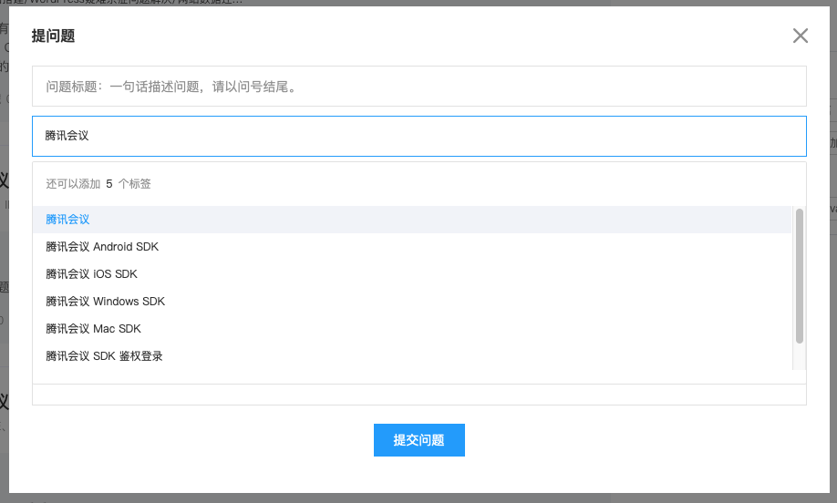

# 概述
腾讯会议（Tencent Meeting，TM）SDK 是为参与腾讯会议生态系统建设的合作方开发者接入并访问腾讯会议资源和服务提供的一组开发工具包。

合作伙伴可以通过二次开发，将腾讯会议 SDK 集成至企业内部的 OA 系统中。

目前，腾讯会议 SDK 已支持包含 Mac、Windows、iOS、Android 等主流平台以及 QT、Electron 等框架。

如需了解更多详情，请联系销售或拨打 4009100100 转5咨询。

# 快速入门

部分会前功能需要接入方通过REST API的形式来实现：[文档地址](https://cloud.tencent.com/document/product/1095/42407)

# 账户鉴权和登录指引
[SDK鉴权与登录说明](Docs/Common/SDK鉴权与登录说明.md)

# 各端接入文档
| 终端 | 相关文档 |
|--- |--- |
| Android | [接入手册](Docs/Android/Android接入手册.md) |
| iOS | [接入手册](Docs/iOS/iOS接入手册.md) |
| MacOS | [接入手册](Docs/MacOS/MacOS接入手册.md) |
| Windows | [接入手册](Docs/Windows/Windows接入手册.md) |

# 统一接口参考
[TencentMeetingSDK（TMSDK）接口参考文档](Docs/Common/TencentMeetingSDK（TMSDK）接口参考文档.md)

# 接入过SDK旧版如何迁移新版

对于之前接入过2.3.x旧版SDK的客户，快速迁移到新版SDK上来，了解有哪些改动点，可参考下面的指南：

[SDK旧版迁移新版接入指南](Docs/Common/SDK旧版迁移新版接入指南.md)

# 问题反馈

## 反馈途径
- 在云+社区反馈：[社区入口](https://cloud.tencent.com/developer/tag/10945?entry=ask)
- 在该Github的Issue中提交反馈: [Issues入口](https://github.com/Tencent-Meeting/TencentMeetingSDK/issues)

## 反馈格式

### 标题
【平台】-【版本号】：【描述的问题】

### 内容
【现象描述】：如聊天界面点击xxx不显示xxx

【出现规律】：必现/偶现/当xxx时，出现

【机型】：如iPhone 12

【之前版本有无此问题】：如2.3.10之前没有，2.3.12有

【日志】：如有请附上相关日志

【截图】：为方便我们定位，如有截图更好

### 注意事项！！！
提问中不要包含各种秘钥等敏感信息，Secret、SDK Token和ID Token等信息请去掉签名部分，避免被其他人获取利用。

## 云+社区反馈步骤

1. 进入到社区入口并登录后，点击右上角提问按钮
2. 问题标签搜索`腾讯会议`然后选对应的标签
3. 按照上面`反馈格式`提交提问和问题反馈

